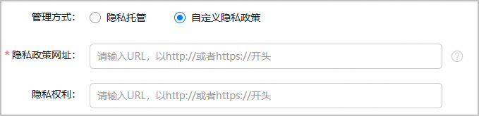
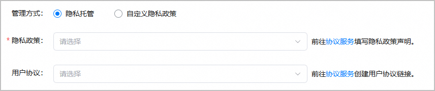
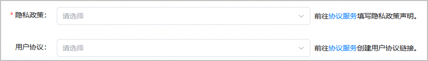
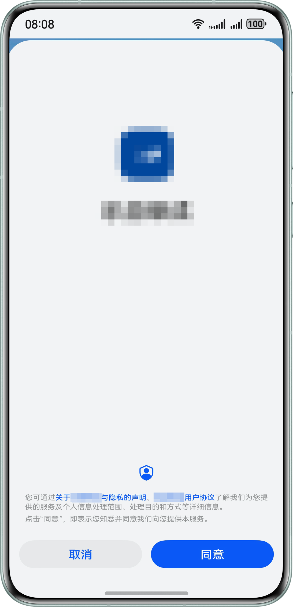
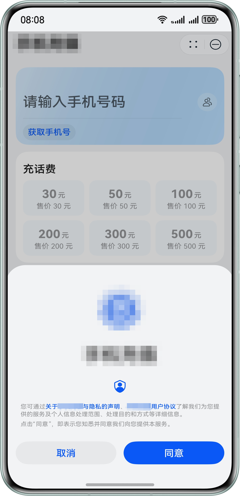

发布应用/元服务时，您需要提供隐私政策，以便用户了解应用的数据收集和使用情况。

* **HarmonyOS应用**：支持选择自定义隐私政策，或者使用隐私声明托管服务生成隐私声明。
  + 如果已经有专门描述隐私政策和用户隐私权利的网站：在发布时，可以直接填写网址，无需参考本章节进行隐私声明托管。

    
  + 如果没有：当应用发布地区包含中国大陆区域，且分发设备为手机、平板或PC/2in1时，可以使用AppGallery Connect的隐私声明托管服务，基于标准化模板生成自己的隐私声明。在发布时，选择创建的内容即可。具体请参见[配置隐私政策（HarmonyOS应用）](/docs/distribute/agc/agc-help-privacy-policy-0000002316794885/agc-help-privacy-policy-app-0000002282162168)和[配置用户协议](/docs/distribute/agc/agc-help-privacy-policy-0000002316794885/agc-help-privacy-user-agreement-0000002282265450)。“用户协议”非必须配置项，您可以根据实际情况进行选择是否配置。

    
* **元服务**：必须使用AppGallery Connect的隐私声明托管服务，基于标准化模板生成自己的隐私声明。在发布时，选择创建的内容即可。具体请参见[配置隐私政策（元服务）](/docs/distribute/agc/agc-help-privacy-policy-0000002316794885/agc-help-privacy-policy-atomic-0000002317135133)和[配置用户协议](/docs/distribute/agc/agc-help-privacy-policy-0000002316794885/agc-help-privacy-user-agreement-0000002282265450)。“用户协议”非必须配置项，您可以根据实际情况进行选择是否配置。

  

  若账号下的部分元服务无需使用隐私托管服务，请联系华为申请。在收到申请后，华为将在1-3个工作日内安排对接人员。申请方法如下：
  + 申请邮箱地址：agconnect@huawei.com。
  + 邮件标题：[托管隐私声明禁用清单]-[应用类型]-[应用名称]-[应用包名]-[应用ID]-[Developer ID]，应用包名等查询方法可参见[查看应用信息](/docs/distribute/agc/agc-help-app-0000002235710234/agc-help-view-app-info-0000002282674569)。
  + 邮件正文：请说明申请原因。

如果在应用/元服务中使用了隐私托管服务，则首次打开应用/元服务，会默认显示标准化隐私弹窗，请勿在应用/元服务中自行实现弹窗展示隐私声明，否则发布审核将被驳回。

| 应用隐私弹窗 | 元服务隐私弹窗 |
| --- | --- |
|  |  |

当您使用隐私托管服务完成隐私声明配置后，您可以在应用/元服务中集成AppGallery Kit的[隐私管理服务](/docs/dev/app-dev/application-services/store-kit-guide/store-privacy)实现查询隐私链接、查询隐私签署状态、停止隐私协议和拉起标准化隐私弹窗等功能。
