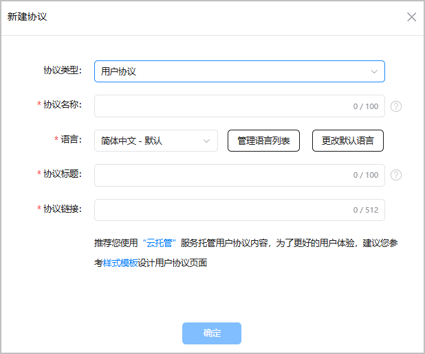
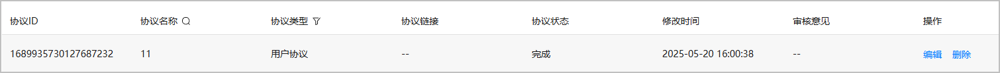

配置的用户协议会在首次使用HarmonyOS应用/元服务时弹框展示。

1. 登录[AppGallery Connect](https://developer.huawei.com/consumer/cn/service/josp/agc/index.html)，点击“APP与元服务”。
2. 选择要发布的应用。
3. 左侧导航选择“服务 > 协议服务”。
4. 进入“协议服务”界面，点击“新建协议”。
5. 在弹出窗口，“协议类型”选择“用户协议”，填写协议相关信息。

   
6. 点击“确定”，生成用户协议。
7. 返回协议列表，可以对协议进行如下操作：
   * 点击“编辑”：修改用户协议的配置。
   * 点击“删除”：删除对应的用户协议。

     

     已与在架版本关联的用户协议不支持删除。

   
