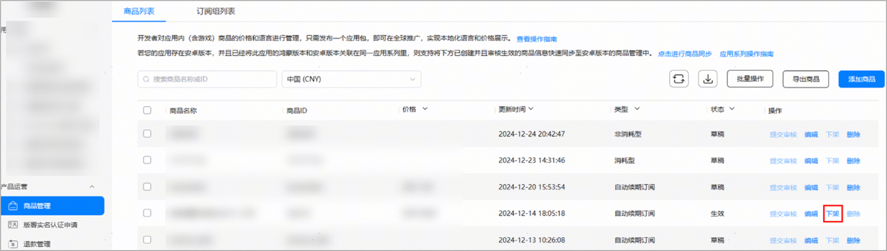
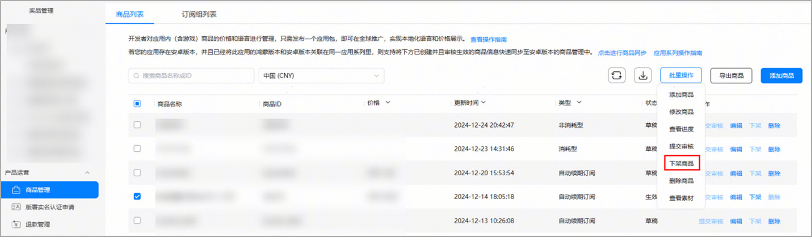
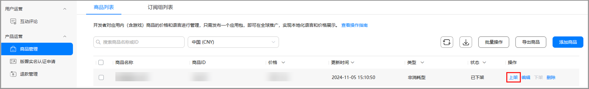

当商品提交审核并通过后，则被开放购买，如需停止该商品的对外售卖，可选择下架该数字商品。

#### 下架单个数字商品

1. 登录AppGallery Connect，选择“APP与元服务”。
2. 在应用列表中点击需要下架数字商品的应用。
3. 在“运营”页签下的左侧导航栏中，选择“产品运营 > 商品管理”。
4. 在“商品列表”页签，找到要下架的数字商品，并点击“下架”。

#### 批量下架数字商品

1. 登录AppGallery Connect，选择“APP与元服务”。
2. 在应用列表中点击需要下架数字商品的应用。
3. 在“运营”页签下的左侧导航栏中，选择“产品运营 > 商品管理”。
4. 在“商品列表”页签，找到要下架的数字商品，勾选要下架的数字商品，点击“批量操作>下架商品”。

* 下架后的商品将被禁止购买。
* 下架后，原已生效的自动续期订阅仍然有效，老用户将正常续费。
* 如有进行中的优惠活动将立即结束。

#### 重新上架数字商品

对于已下架的数字商品，支持重新上架操作。

1. 登录AppGallery Connect，选择“APP与元服务”。
2. 在应用列表中点击需要上架数字商品的应用。
3. 在“运营”页签下的左侧导航栏中，选择“产品运营 > 商品管理”。
4. 在“商品列表”页签，找到要上架的数字商品，勾选要上架的数字商品，点击“上架”。

