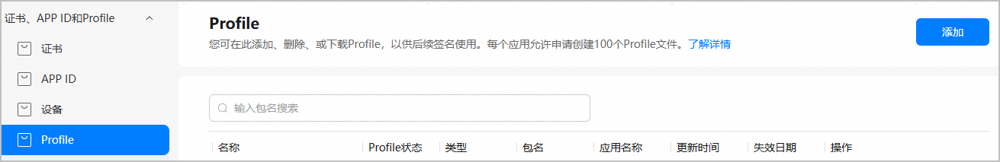
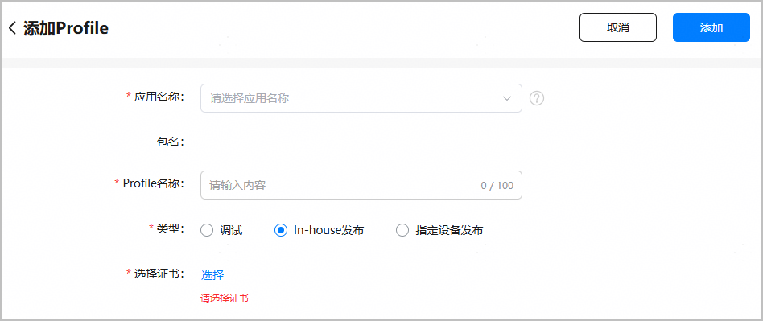
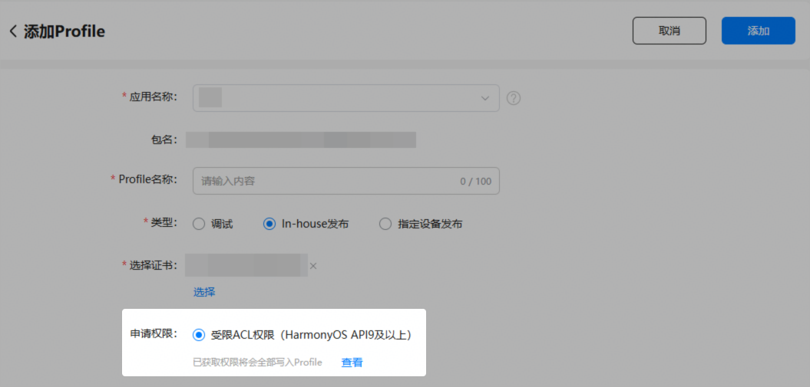
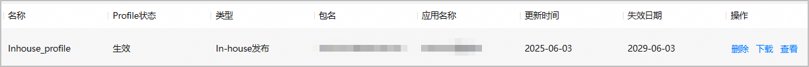

申请ACL权限的入口已调整至项目下的“ACL权限”页签，创建Profile时仅支持添加已获取的ACL权限。如需使用ACL权限，请先参考[申请ACL权限](https://developer.huawei.com/consumer/cn/doc/app/agc-help-apply-acl-0000002394212138)获取ACL权限，再创建Profile。

在发布In-house应用时，您需要使用In-house发布证书和In-house发布Profile手动签名后，才能编译构建正式发布包。请参考本文档申请并下载In-house发布Profile。

一个应用下申请的调试Profile和In-house发布Profile总数不得超过100个。

#### 前提条件

* 已[申请In-house发布证书](https://developer.huawei.com/consumer/cn/doc/app/agc-help-inhouse-cert-0000002248337770)。
* 已[创建HarmonyOS应用](https://developer.huawei.com/consumer/cn/doc/app/agc-help-create-app-0000002247955506)并[为应用申请In-house分发权限](https://developer.huawei.com/consumer/cn/verified/enterpriseDistribute)。
* （如需使用ACL权限）已[申请并获取ACL权限](https://developer.huawei.com/consumer/cn/doc/app/agc-help-apply-acl-0000002394212138)。
* 当前账号角色已[获取“访问发布类Profile”权限](https://developer.huawei.com/consumer/cn/doc/app/agc-help-manageaccount-0000002306610129#ZH-CN_TOPIC_0000002306610129__li626645853313)。

#### 操作步骤

1. 登录[AppGallery Connect](https://developer.huawei.com/consumer/cn/service/josp/agc/index.html)，选择“证书、APP ID和Profile”。
2. 在左侧导航栏选择“证书、APP ID和Profile > Profile”，进入“Profile”页面，点击右上角“添加”。

   
3. 在“添加Profile”页面，填写应用名称、Profile名称等必填信息。

   

   | 参数 | 说明 |
   | --- | --- |
   | 应用名称 | 选择需要申请Profile的应用名称。  如弹出“当前应用未申请In-house发布，去申请”提示，表示当前应用尚未获取In-house分发权限，请先[完成权限申请与审批](https://developer.huawei.com/consumer/cn/verified/enterpriseDistribute)。 |
   | 包名 | 选择应用名称后自动填充。 |
   | Profile名称 | 不超过100个字符。 |
   | 类型 | 选择“In-house发布”。 |
   | 选择证书 | 点击“选择”，选择In-house发布证书。 |
4. （可选）如果您之前为应用/元服务申请并获取了ACL权限，还需将权限添加至Profile内，才能真正使用权限。若不涉及使用ACL权限，可忽略此步骤。

   选择应用名称后，“添加Profile”页面下方将显示“申请权限”栏。选中“受限ACL权限（HarmonyOS API9及以上）”选项，应用/元服务获取的所有ACL权限都将被添加至Profile内。

   

   点击“查看”，可在弹出的“选择受限ACL权限”窗口查看当前应用/元服务已获取的ACL权限。

   

   若应用/元服务尚未获取任何ACL权限、或者您想增加更多ACL权限，可点击界面下方的“去申请”，前往“ACL权限”页面申请获取，具体操作请参见[申请ACL权限](https://developer.huawei.com/consumer/cn/doc/app/agc-help-apply-acl-0000002394212138#section156171230179)。获取ACL权限后，再参考本文档添加最新权限到Profile内。

   
5. 点击右上角“添加”，In-house发布Profile申请成功，“Profile”页面展示Profile名称、类型等信息。点击“下载”，将生成的Profile保存至本地，供后续发布签名使用。

   

   Profile申请成功即为“生效”状态。若Profile状态变为“失效”或“已吊销”，表示当前Profile已不可用，您需要重新申请Profile。

   
