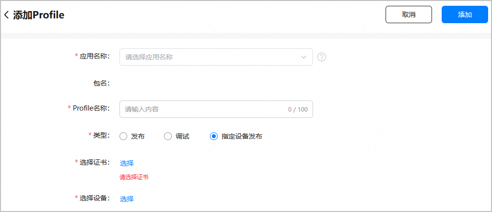
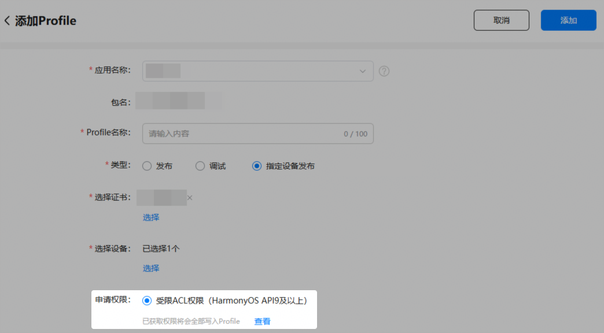
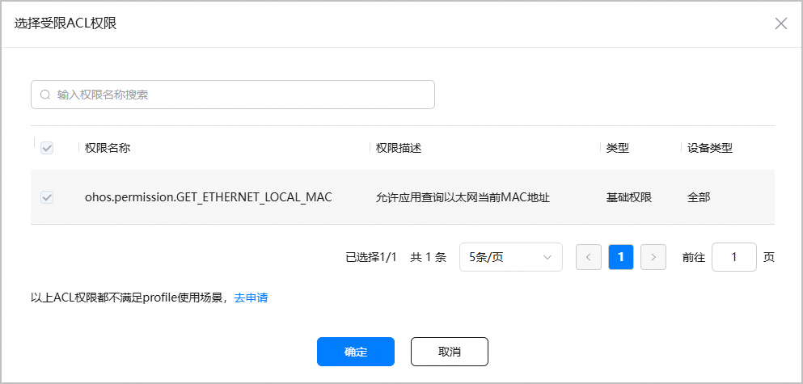
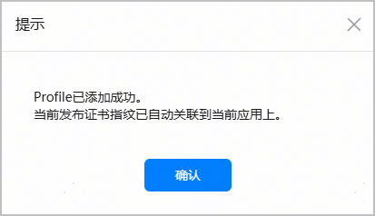
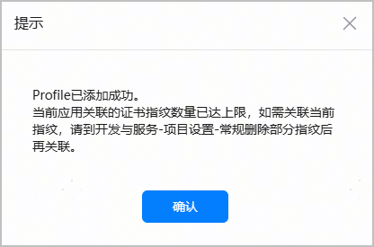
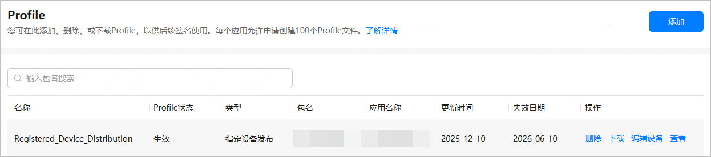
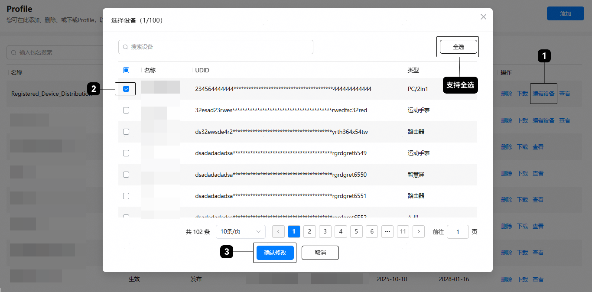

申请ACL权限的入口已调整至项目下的“ACL权限”页签，创建Profile时仅支持添加已获取的ACL权限。如需使用ACL权限，请先参考[申请ACL权限](/docs/distribute/agc/agc-help-acl-0000002427651937/agc-help-apply-acl-0000002394212138)获取ACL权限，再创建Profile。

在进行指定设备发布时，您需要使用发布证书和指定设备发布Profile手动签名后，才能编译构建包。请参考本文档申请并下载指定设备发布Profile。

一个应用最多可申请100个Profile文件。

#### 前提条件

* 已[创建HarmonyOS应用](/docs/distribute/agc/agc-help-app-0000002235710234/agc-help-create-app-0000002247955506)。
* 已[申请发布证书](/docs/distribute/agc/agc-help-cert-0000002270829389/agc-help-release-cert-0000002283336729)，并[注册测试设备](/docs/distribute/agc/agc-help-device-0000002235870042/agc-help-add-device-0000002283189937)。
* （如需使用ACL权限）已[申请并获取ACL权限](/docs/distribute/agc/agc-help-acl-0000002427651937/agc-help-apply-acl-0000002394212138)。
* 当前账号角色已[获取“访问发布类Profile”权限](/docs/distribute/agc/agc-help-developid-0000002235870038/agc-help-manageaccount-0000002306610129#ZH-CN_TOPIC_0000002306610129__li626645853313)。

#### 操作步骤

1. 登录[AppGallery Connect](https://developer.huawei.com/consumer/cn/service/josp/agc/index.html)，选择“证书、APP ID和Profile”。
2. 在左侧导航栏选择“证书、APP ID和Profile > Profile”，进入“Profile”页面，点击右上角“添加”。

   
3. 在“添加Profile”页面，填写应用名称、Profile名称等必填信息。

   

   | 参数 | 说明 |
   | --- | --- |
   | 应用名称 | 选择需要申请指定设备发布Profile的应用名称。 |
   | 包名 | 选择应用名称后自动填充。 |
   | Profile名称 | 不超过100个字符。 |
   | 类型 | 选择“指定设备发布”。 |
   | 选择证书 | 点击“选择”，选择一个发布证书。  说明：  企业开发者（In-house应用分发）可以选择[In-house发布证书](/docs/distribute/agc/agc-help-cert-0000002270829389/agc-help-inhouse-cert-0000002248337770)。 |
   | 选择设备 | 点击“选择”，选择一个或多个测试设备。最多可选择100个设备，已删除的设备不可选。  说明：  指定设备发布功能当前仅支持手机、PC/2in1或平板设备。 |
4. （可选）如果您之前为应用/元服务申请并获取了ACL权限，还需将权限添加至Profile内，才能真正使用权限。若不涉及使用ACL权限，可忽略此步骤。

   选择应用名称后，“添加Profile”页面下方将显示“申请权限”栏。选中“受限ACL权限（HarmonyOS API9及以上）”选项，应用/元服务获取的所有ACL权限都将被添加至Profile内。

   

   点击“查看”，可在弹出的“选择受限ACL权限”窗口查看当前应用/元服务已获取的ACL权限。

   

   若应用/元服务尚未获取任何ACL权限、或者您想增加更多ACL权限，可点击界面下方的“去申请”，前往“ACL权限”页面申请获取，具体操作请参见[申请ACL权限](/docs/distribute/agc/agc-help-acl-0000002427651937/agc-help-apply-acl-0000002394212138#section156171230179)。获取ACL权限后，再参考本文档添加最新权限到Profile内。

   
5. 点击右上角“添加”，指定设备发布Profile申请成功，同时Profile关联的发布证书对应的指纹已自动添加到当前应用。

   如果应用集成的华为开放能力依赖公钥指纹，后续您**无需**再为其手动配置公钥指纹。如不涉及指纹配置，请忽略此提示。

   

   如提示当前应用添加的证书指纹数量达到上限，则请先[删除部分不需要的公钥指纹](/docs/distribute/agc/agc-help-cert-0000002270829389/agc-help-cert-fingerprint-0000002278002933#section459617810019)，再[手动配置公钥指纹](/docs/distribute/agc/agc-help-cert-0000002270829389/agc-help-cert-fingerprint-0000002278002933#section7398154810570)。

   
6. 点击“下载”，将生成的Profile保存至本地，供后续签名使用。

   

   Profile申请成功即为“生效”状态。若Profile状态变为“失效”或“已吊销”，表示当前Profile已不可用，您需要重新申请Profile。

   
7. （可选）“生效”状态的指定设备发布Profile还支持修改Profile绑定的测试设备。点击“编辑设备”，重新选择测试设备即可。

   

   * 修改测试设备后，会生成新的指定设备发布Profile，请在生效后重新下载新Profile。
   * 如后续需添加新的测试设备，请先参考[注册设备](/docs/distribute/agc/agc-help-device-0000002235870042/agc-help-add-device-0000002283189937)将新设备添加到AppGallery Connect设备列表，再点击“编辑设备”新增选择该设备，之后重新下载指定设备发布Profile即可。

   
