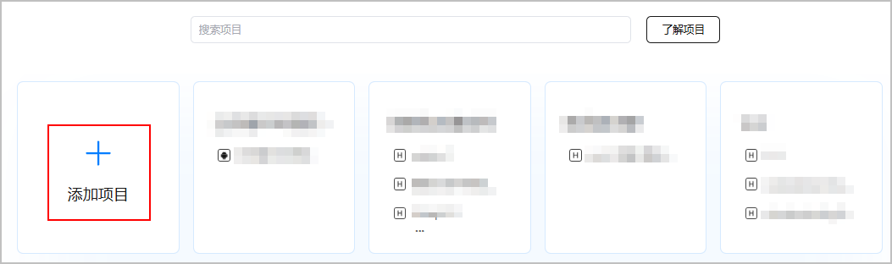
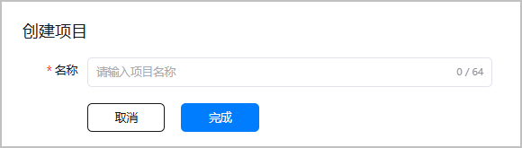

项目是资源、应用的组织实体。资源包括服务器、数据库、存储，以及您的应用、终端用户的数据等。在您使用部分服务时，您是数据的控制者，数据将按照您[设置的数据处理位置](/docs/distribute/agc/agc-help-project-0000002270709469/agc-help-data-location-0000002277923065)来存储在指定区域。

通常，您不需要自己管理资源，而是管理好您的应用。您可以选择将一个应用的不同形态（HarmonyOS应用或者元服务）放在同一个项目中。但是，您不应该将不同应用放在一个项目中，因为这可能会产生隐私合规问题。

#### 前提条件

您已[注册华为开发者账号](https://developer.huawei.com/consumer/cn/doc/start/registration-and-verification-0000001053628148)。

#### 操作步骤

1. 登录[AppGallery Connect](https://developer.huawei.com/consumer/cn/service/josp/agc/index.html#/)，点击“开发与服务”。
2. 在项目页面中点击“添加项目”。

   
3. 在“创建项目”页面中输入项目名称后，点击“完成”。

   

   点击“完成”后，如果系统提示“您所在团队创建的项目数已经达到上限，请清理不需要的项目”，表示团队创建的项目数超过300个，请进入“开发与服务”，点击需要删除的项目卡片，点击“项目设置”页面下方的“删除项目”清理多余的项目。

   

此时该项目中还没有应用，您可以在项目下[添加应用/元服务](https://developer.huawei.com/consumer/cn/doc/app/agc-help-app-0000002235710234)。
