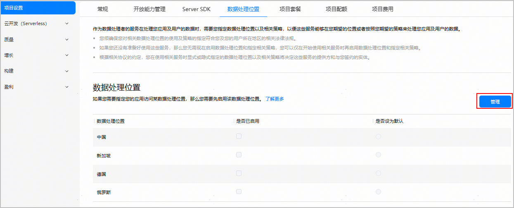
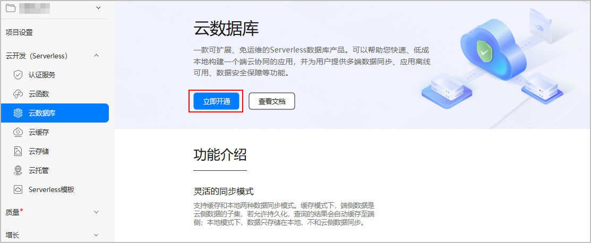
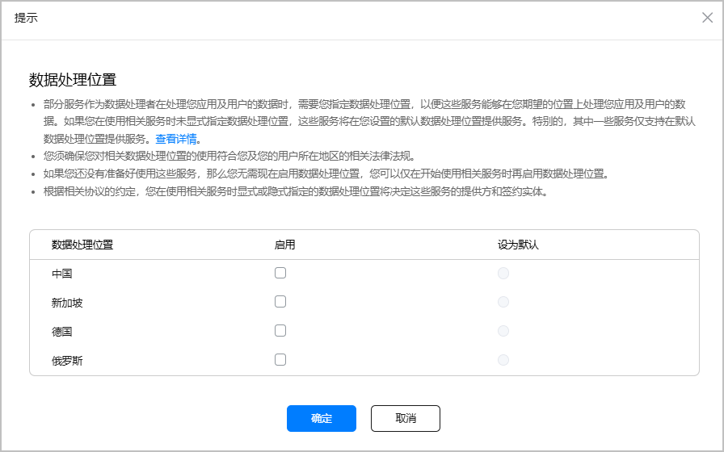
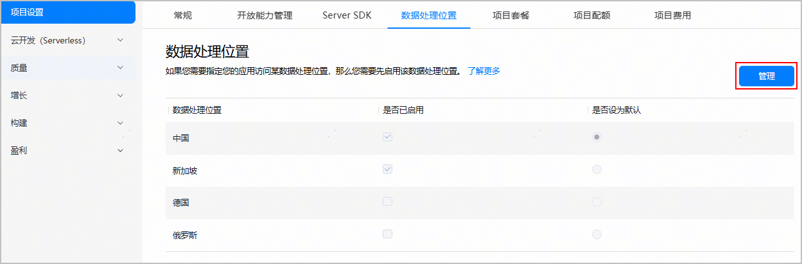
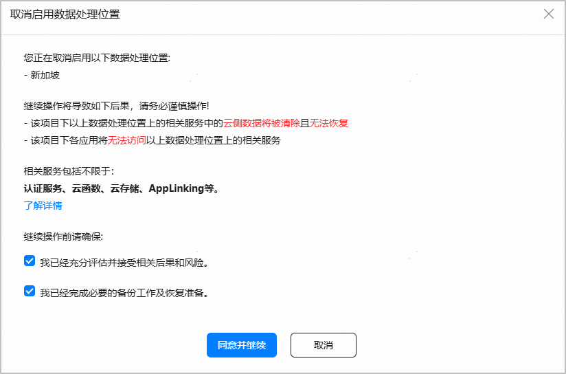
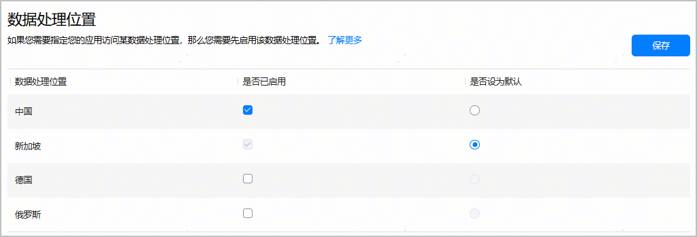
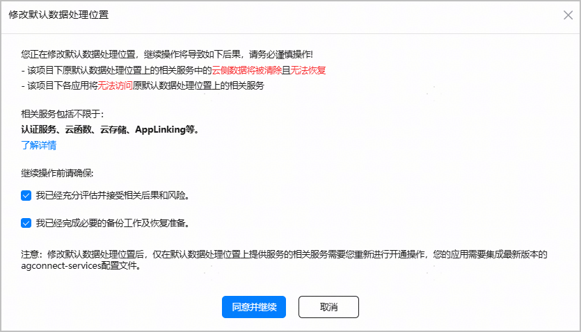
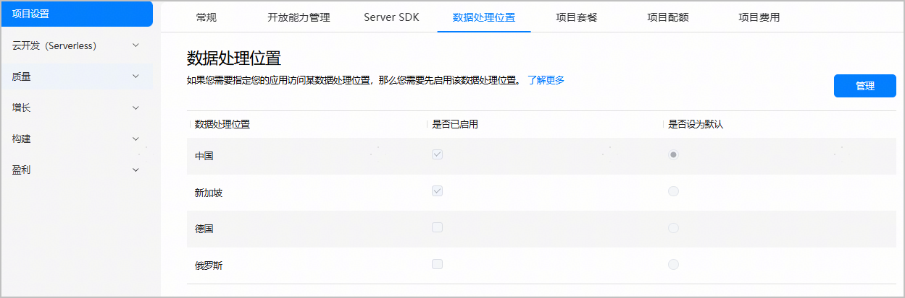
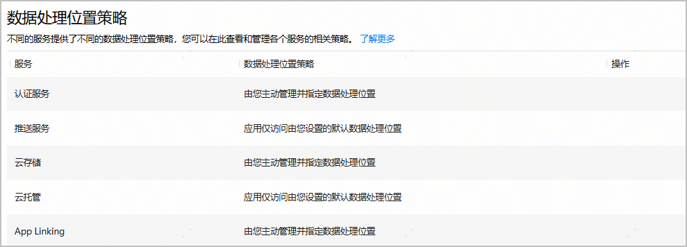

#### 简介

AppGallery Connect的部分服务在处理您的应用及用户的数据时，需要您指定数据处理位置，以便这些服务能够在您期望的位置上处理您的应用及用户的数据。

如果您在使用这些服务时未指定数据处理位置，这些服务将在您为项目设置的默认数据处理位置处理您的应用及用户的数据。

需要您指定数据处理位置的服务及其相关策略如下：

| 服务名称 | 应用是否可访问所有已启用的数据处理位置 | 应用是否仅能访问默认数据处理位置 | 取消已启用的数据处理位置时是否自动清理云侧数据 | 修改默认数据处理位置时是否自动清理云侧数据 |
| --- | --- | --- | --- | --- |
| 认证服务 | √ | - | - | - |
| 云函数 | √ | - | - | - |
| 云数据库 | √ | - | - | - |
| 云存储 | √ | - | - | - |
| 云托管 | - | √ | - | √ |
| App Linking | √ | - | 动态链接配置数据以及其他指标数据不会被清理。 | 动态链接配置数据以及其他指标数据不会被清理。 |

如上表所示，部分服务在**修改默认数据处理位置**或**取消已启用的数据处理位置**时会自动清理云侧数据且无法找回。因此，请谨慎设置数据处理位置，尽量避免修改默认数据处理位置和取消已启用的数据处理位置等操作。如果涉及此类操作，请务必提前自行做好相关备份，充分评估由此产生的后果。

#### [h2]数据处理位置的分布

AppGallery Connect在全球范围内提供了四个数据处理位置供您选择：

* 中国
* 德国
* 俄罗斯
* 新加坡

#### [h2]如何选择数据处理位置

在指定数据处理位置时（包括设置项目的默认数据处理位置），您需要考虑以下因素：

* 有关法律和政策的遵从。包括但不限于您的用户所在区域或国家的相关法律法规，以及联合国、中国、美国和其他国家的出口和制裁法律法规。
* 您的用户与数据处理位置的距离。距离的远近会影响网络时延。

#### 设置数据处理位置

您可以在以下两个场景设置项目的数据处理位置：

场景一：

在“项目设置 > 数据处理位置”页面设置数据处理位置。您可以设置一个或多个数据处理位置，设置步骤如下：

1. 登录[AppGallery Connect](https://developer.huawei.com/consumer/cn/service/josp/agc/index.html#/)，点击“开发与服务”。
2. 在项目列表中点击您需要设置数据处理位置的项目。
3. 进入“项目设置 > 数据处理位置”页面，点击“管理”。

   
4. 阅读上方提示信息后，在“是否已启用”栏为您的项目勾选一个或多个数据处理位置，并在“是否设为默认”栏将其中一个设置为默认数据处理位置。

   

   * 仅支持将已启用的数据处理位置设置为默认数据处理位置。
   * 当您只启用一处数据处理位置时，您必须将其设置为默认数据处理位置。
   * 当您设置多个数据处理位置后，您即可在多个位置处理您的应用及用户的数据。
5. 设置完成后，点击“保存”。

场景二：

在首次开通服务时设置数据处理位置。您可以设置一个或多个数据处理位置，设置步骤如下（此处以开通云数据库服务为例）：

1. 在云数据库服务界面，点击“立即开通”。

   
2. 仔细阅读弹出提示框的文字说明后，在“启用”栏为您的项目勾选一个或多个数据处理位置，并在“设为默认”栏将其中一个设置为默认数据处理位置。

   

   * 仅支持将已启用的数据处理位置设置为默认数据处理位置。
   * 当您只启用一处数据处理位置时，您必须将其设置为默认数据处理位置。

   
3. 设置完成后，点击“确定”。

#### 管理数据处理位置

如果您想要启用新的数据处理位置、取消已启用的数据处理位置，或是修改默认数据处理位置，您可参考以下步骤：

1. 登录[AppGallery Connect](https://developer.huawei.com/consumer/cn/service/josp/agc/index.html#/)，点击“开发与服务”。
2. 在项目列表中点击需要变更数据处理位置的项目。
3. 进入“项目设置 > 数据处理位置”页面，点击“管理”。

   
4. 在“数据处理位置”页面，您可：
   * 启用新数据处理位置：在想要启用的数据处理位置对应的“启用”栏进行勾选，完成后点击“保存”。
   * 取消已启用的数据处理位置：在想要取消启用的数据处理位置的对应“启用”栏去勾选，完成后点击“保存”。在确认弹窗中，阅读提示信息，确认并勾选操作提示项，点击“同意并继续”。若放弃修改，点击“取消”。

     

     + 默认数据处理位置不支持直接取消启用，如果您想取消该数据处理位置，您必须先修改默认数据处理位置。
     + 取消已启用的数据处理位置后，该数据处理位置上的部分服务的数据将被清除且无法恢复，该项目下各应用将无法访问该数据处理位置上的相关服务。相关服务的数据清理策略请参考文中[对照表](#ZH-CN_TOPIC_0000002277923065__table12660104611327)。

     
   * 修改默认数据处理位置：在“是否设为默认”栏勾选新的默认数据处理位置，完成后点击“保存”。

     

     + 在“是否设为默认”栏勾选新的默认数据处理位置前，请先启用该数据处理位置。
     + 默认数据处理位置修改时间间隔不得低于1小时。

     

5. （可选）如果您修改了默认数据处理处理位置，界面会弹出提示框。请阅读弹框内容，确认并勾选操作提示项，点击“同意并继续”。若放弃修改，点击“取消”。

   

   修改默认数据处理位置后：

   * 如果您的服务只在默认数据处理位置上提供服务，则修改默认数据处理位置后原有的AppGallery Connect云侧数据将被清除且无法恢复。
   * 项目下各应用的已发布版本将可能无法访问数据处理位置相关服务。
   * 修改默认数据处理位置后，仅在默认数据处理位置上提供服务的相关服务需要您重新开通。支持多数据处理位置的服务修改默认数据处理位置时，不需要重新开通服务。

   

#### 查看已设置的数据处理位置

设置完项目的数据处理位置后，您可以在“项目设置 > 数据处理位置”页面查看已设置的数据处理位置。

#### 管理数据处理位置策略

AppGallery Connect中的不同服务提供了不同的数据处理位置策略，当前AppGallery Connect提供两种数据处理位置策略：

* “由您主动管理并指定数据处理位置”策略：针对支持多数据处理位置的服务，即您的应用可访问所有已启用的数据处理位置。
* “应用仅访问由您设置的默认数据处理位置”策略：针对支持单数据处理位置的服务，即您的应用仅能访问默认数据处理位置。

您可以在“项目设置 > 数据处理位置 > 数据处理位置策略 ”栏查看您所开通服务的对应数据处理位置策略，如下图所示。

