#### 版本号规范

* 测试版本的VersionCode必须高于发布过的全网版本的VersionCode。
* 测试版本的VersionCode不能低于发布过的测试版本的VersionCode。
* 如已安装的测试版本的VersionCode和正式版本的VersionCode相同，则当测试版本转为正式发布后，会自动更新到正式版本。
* 正式版本上架后，同版本名称（VersionName）同版本号（VersionCode）的公开测试版本会自动下架。
* 正式版本上架后，更低版本号（VersionCode）的公开测试版本会自动下架。

#### 发布测试版本

首先，您需创建并发布测试版本。最多支持1个公开测试版本在架。

1. 登录[AppGallery Connect](https://developer.huawei.com/consumer/cn/service/josp/agc/index.html)，选择“APP与元服务”。
2. 在应用列表页的“HarmonyOS”页签，点击应用名称，进入“分发”页面。
3. 在左侧导航栏选择“应用测试/元服务测试 > 版本列表”，进入“版本列表”页面，点击右上角“创建测试版本”。

   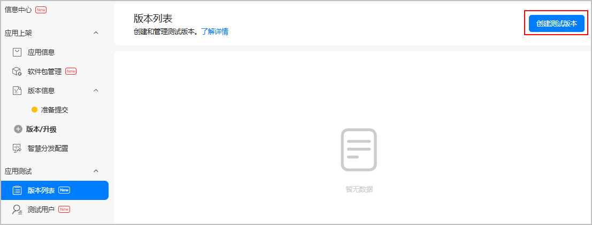

4. 在弹出的“创建测试版本”窗口，选择“公开测试”，填写“版本描述”，点击“确定”。

   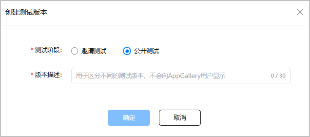

   | 参数 | 说明 |
   | --- | --- |
   | 版本描述 | 自定义测试版本描述，以便于您区分不同的测试版本，不会向用户展示。不超过30个字符。 |

5. 系统自动进入版本信息配置页面，您可以开始配置版本基础信息。

   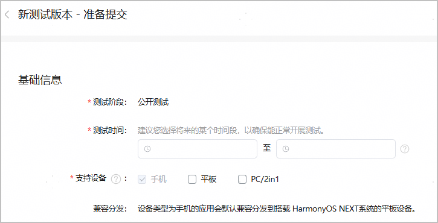

   | 参数 | 说明 |
   | --- | --- |
   | 测试阶段 | 创建版本时选择，不可修改。 |
   | 测试时间 | 公开测试版本的开始时间和结束时间，只有当前时间到达开始时间时，测试用户才能下载公开测试版本。测试时间到期后，测试用户将无法下载公开测试版本。  公开测试的测试时间当前最大有效期为30天。 |
   | 支持设备 | 默认勾选创建应用时选择的设备类型，支持在此处增加设备类型。  选择“手机”时，即便包里未声明平板，测试版本也会默认以兼容的方式分发到HarmonyOS NEXT平板。 |

6. 配置发布国家或地区。

   在“发布国家或地区”栏，勾选应用需要发布的国家或地区。**当前公开测试版本仅支持分发中国大陆地区。**

   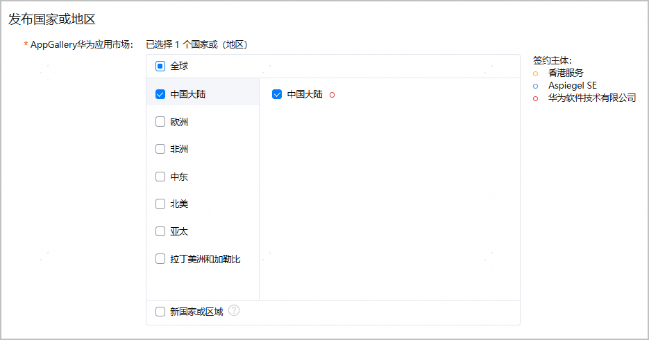
7. 配置软件版本。

   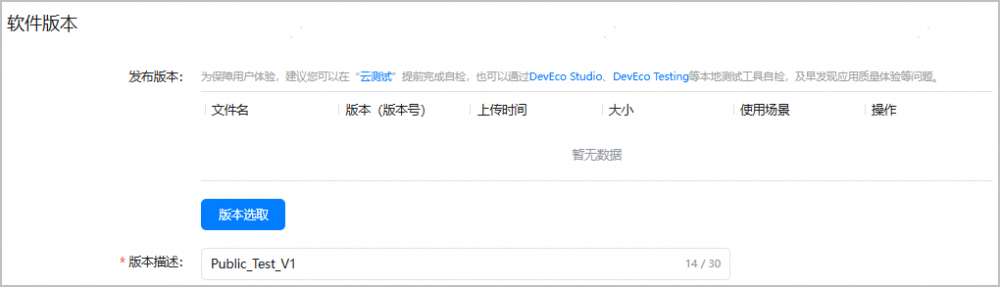

   | 参数 | 说明 |
   | --- | --- |
   | 发布版本 | 点击“版本选取”，选择您之前在“软件包管理”菜单上传的软件包，点击“选取”。一个测试版本只允许选取一个软件包。具体操作可参考[选择待发布软件包](/docs/distribute/agc/agc-help-release-app-0000002271695230/agc-help-release-app-choose-pkg-0000002278981434)。 |
   | 版本描述 | 创建测试版本时自定义的版本描述，支持修改。不超过30个字符。 |

8. 配置可本地化基础信息。

   此处默认继承全网版本的信息或最近一个测试版本填写的信息。如需调整，请在当前测试版本提交前重新审视并修改，此处可本地化基础信息的修改不影响全网版本的应用信息。

   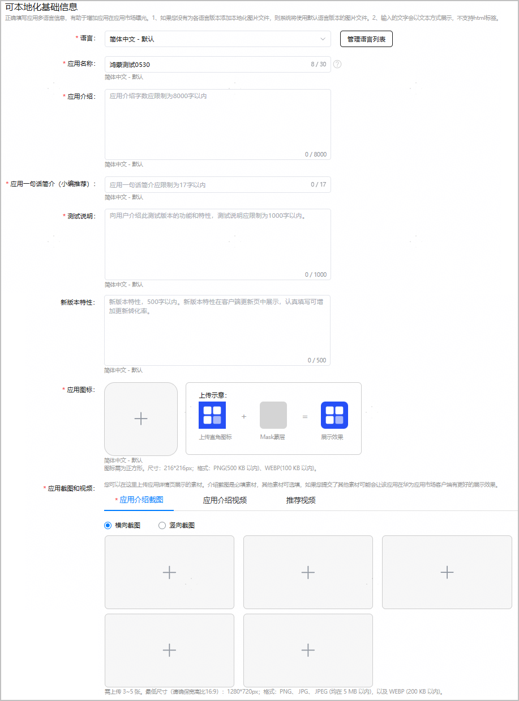

   | 参数 | 说明 |
   | --- | --- |
   | 语言 | 默认显示创建应用时设置的默认语言。如需为当前应用添加其他语言，点击“管理语言列表”，在“语言选择”弹窗中勾选语言，点击“确认”。 |
   | 应用名称 | 创建应用时填写的名称，支持更改。 |
   | 应用介绍 | 简单描述该应用的功能、产品定位等，不超过8000字符。 |
   | 应用一句话简介（小编推荐） | 简单介绍该应用，应突出应用的主要特色，以帮助提升应用下载率。中文限制17个字以内，其他语言限制80个字以内。  说明：  若软件包使用场景为“仅测试”，则一句话简介为非必填。若软件包使用场景为“测试和正式上架”，则一句话简介为必填。 |
   | 测试说明 | 介绍此测试版本的功能和特性，不超过1000字符。  可在此预留您的联系方式，用于收集用户测试过程中发现的相关问题。 |
   | 新版本特性 | 描述新版本的特性，500字以内。  新版本特性将在华为应用市场客户端更新页中展示，认真填写可增加应用的下载量 。 |
   | 应用图标 | 上传应用图标，各设备类型的图标规范请参见[素材规范](/docs/distribute/agc/agc-help-appendix-0000002312305161/agc-help-app-visual-asset-spec-0000002277607976)。 |
   | 应用截图和视频 | 上传应用详情页展示的素材，具体素材规范请参见[素材规范](/docs/distribute/agc/agc-help-appendix-0000002312305161/agc-help-app-visual-asset-spec-0000002277607976)。  说明：  * 元服务不展示此选项。 * 若软件包使用场景为“仅测试”，则本选项为非必填。若软件包使用场景为“测试和正式上架”，则本选项为必填。 |

9. 配置应用内资费。

   选择应用内资费类型，即用户在使用应用过程中的付费类型，如因使用道具、开通会员等进行的付费。支持多选。

   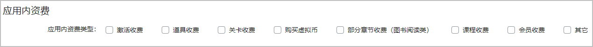
10. 设置内容分级。

    点击“设置”，按实际情况填写调查问卷，填写完成将获取当前应用的年龄分级结果。具体操作可参考[配置内容分级](/docs/distribute/agc/agc-help-release-app-0000002271695230/agc-help-release-app-rating-0000002313511005)。

    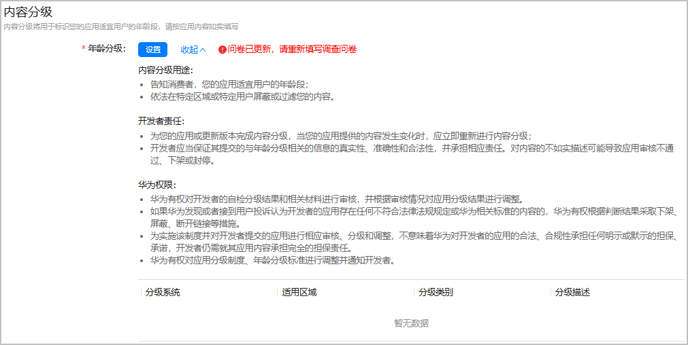
11. 配置隐私声明。

    HarmonyOS应用支持选择自定义隐私政策或者使用隐私声明托管服务生成隐私声明，元服务仅支持使用隐私声明托管服务生成隐私声明。
    * 自定义隐私政策

      

      + 隐私政策网址：该网站将供用户访问，从而了解服务是如何处理敏感的用户数据和设备数据。
      + 隐私权利：提供用户实施其权利的相关网站，例如：删除、修改、导出个人数据的入口。
    * 使用隐私声明托管服务生成隐私声明

      使用隐私声明托管服务，可基于AGC提供的标准化模板生成隐私政策和用户协议。请先点击“协议服务”前往对应菜单生成隐私政策或者用户协议，具体操作可参见[管理隐私声明](https://developer.huawei.com/consumer/cn/doc/app/agc-help-privacy-policy-0000002316794885)。隐私政策或者用户协议生成后，您才可在“隐私政策”或者“用户协议”下拉框中选择到。

      

12. 录入隐私标签信息。

    

    只有支持手机、PC/2in1或平板的HarmonyOS应用才需配置隐私标签信息录入。

    您可以根据应用是否收集用户的信息数据选择是否在华为应用市场的应用详情页展示隐私标签，告知用户您的应用如何使用个人数据。具体操作可参考[配置隐私标签信息](/docs/distribute/agc/agc-help-release-app-0000002271695230/agc-help-release-app-privacy-tag-0000002316420993)。

    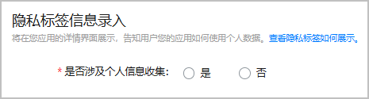
13. 配置AI功能声明。

    按照法律法规要求，应用程序在上架或者上线审核时，应用程序服务提供者应说明是否提供人工智能生成合成服务。详细内容参见[人工智能生成合成内容标识常见问题](/docs/distribute/app-dist/app-market/x50000/x50111/x50111-10)。
    * 如果软件包中不包含人工智能生成合成内容，“AI生成合成服务”选择“不涉及”，配置结束。
    * 如果软件包中包含人工智能生成合成内容，“AI生成合成服务”选择“涉及”，继续配置，选择涉及的AI生成合成服务类型并前往“版权信息>授权书及其他材料”上传AI生成标识材料和相关资质文件，具体要求请参见[配置版权信息](/docs/distribute/agc/agc-help-release-app-0000002271695230/agc-help-release-app-copyright-0000002278981450)。

    
14. 配置版权信息。

    在“版权信息”区域，上传发布所需的资质材料。具体操作可参考[配置版权信息](/docs/distribute/agc/agc-help-release-app-0000002271695230/agc-help-release-app-copyright-0000002278981450)。

    

    修改版权信息后，测试版本与全网版本的版权信息都会同步变更，请谨慎操作。

    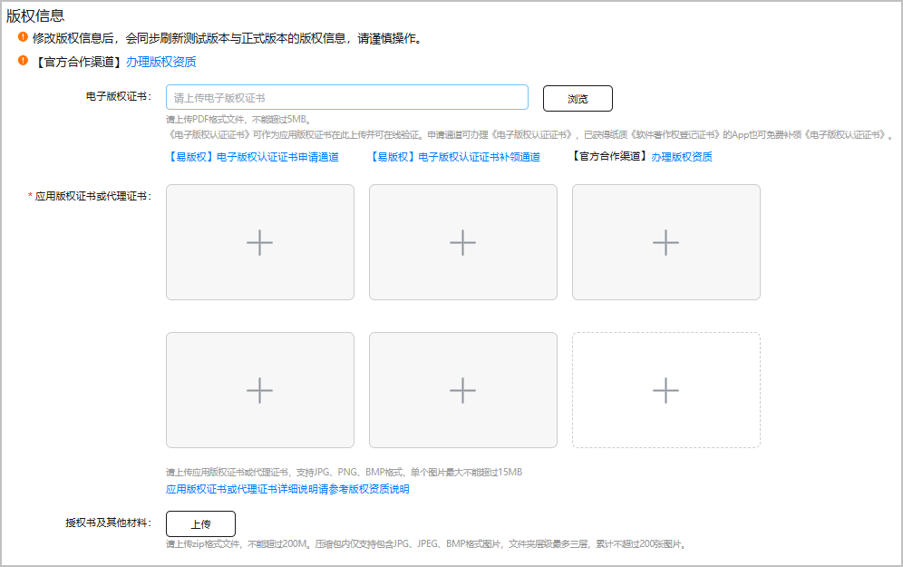
15. 配置应用内商品。

    您可为应用/元服务添加数字商品，具体操作请参见[管理数字商品](https://developer.huawei.com/consumer/cn/doc/app/digital-products-manage-0000001959074881)。

    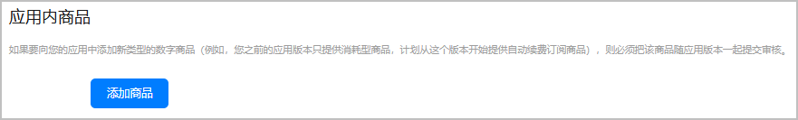
16. 配置备案信息。

    根据[《工业和信息化部关于开展移动互联网应用程序备案工作的通知》](https://www.miit.gov.cn/zwgk/zcwj/wjfb/tz/art/2023/art_920db564162e4312916a01bed6540ad8.html)要求，APP主办者应当依照[《中华人民共和国反电信网络诈骗法》](https://www.miit.gov.cn/jgsj/zfs/fl/art/2022/art_d30139b442a141f48f05775d8c0b3cee.html)第二十三条“设立移动互联网应用程序应当按照国家有关规定向电信主管部门办理许可或者备案手续”相关规定履行备案手续。未履行备案手续的，不得从事APP互联网信息服务。

    请您参考[APP核准（APP备案）指引](/docs/distribute/app-dist/app-market/x50000/x50130)，填写应用在工信部认证的备案信息。审核人员会对您填写的备案信息进行核验，核验通过后才允许上架，请如实填写。

    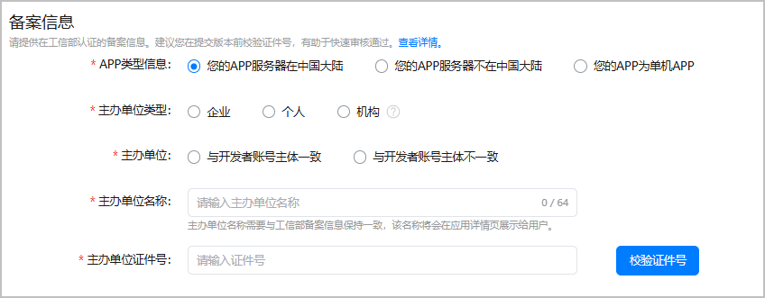
17. （可选）配置版号信息。

    如测试版本为游戏类HarmonyOS应用、且支持设备包含手机、PC/2in1或者平板，请按要求填写游戏版号信息。

    

    修改版号信息后，测试版本与全网版本的版号信息都会同步变更，请谨慎操作。

    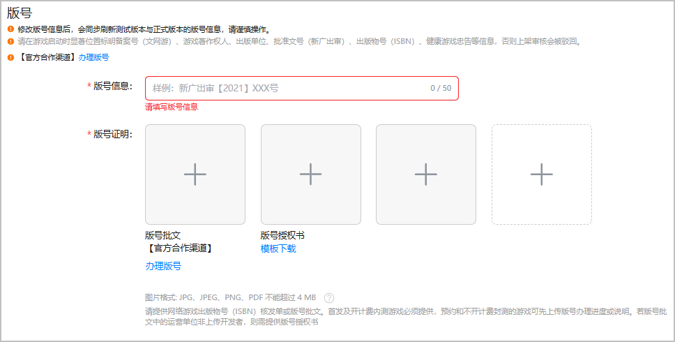

    * 版号信息：必填，您需要向相关单位申请游戏版号，版号不超过50字符。
    * 版号证明：必选，需上传“版号批文”或“版号授权书”，图片格式支持JPG、JPEG、PNG、PDF。默认展示三个图片上传框，您可点击虚线框内的“+”号继续添加。最多添加5张图片，每张图片不超过4MB。如您的版号资质图片超过了最大支持数量，建议您将图片进行拼接后再上传。若您上传了版号授权书，还需填写“授权书有效期”。

      
18. 填写应用审核信息。

    在“应用审核信息”栏，填写审核相关的信息。该部分信息仅会展示给审核人员查看。
    * 您可在“备注”栏填写对审核过程会有所帮助的、有关您服务的额外信息，包括在测试中需要的特别设置等。
    * 如审核过程涉及身份验证，还需提供测试账号供华为审核人员完成服务中登录、查看、购买等功能的审核。

    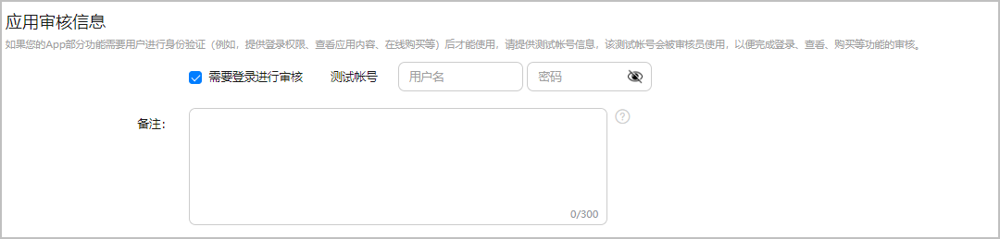
19. 配置联系方式。

    账号归属地为中国大陆地区的开发者，还需预留应用负责人的联系方式，以便于华为审核人员与您联系沟通。

    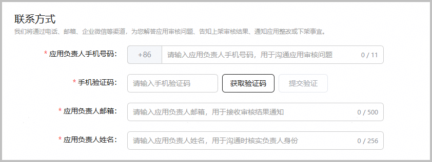
20. 配置测试发布。

    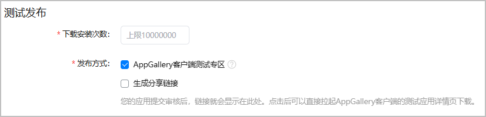

    | 参数 | 说明 |
    | --- | --- |
    | 下载安装次数 | 自定义下载次数，上限1000万。  注意：  下载安装次数使用完后，公开测试版本将不在“应用尝鲜”专区可见。 |
    | 发布方式 | 测试版本的发布方式，支持多选。  * AppGallery客户端测试专区：测试版本将在AppGallery客户端测试专区（即“应用尝鲜”专区）面向全网所有用户展示。 * 生成分享链接：可通过分享链接下载安装测试版本。测试版本提交审核后，分享链接会显示在此处。 |

21. 点击页面右上角“提交”，将测试版本提交审核。提交成功后，可在“版本列表”页面查看版本审核状态。

    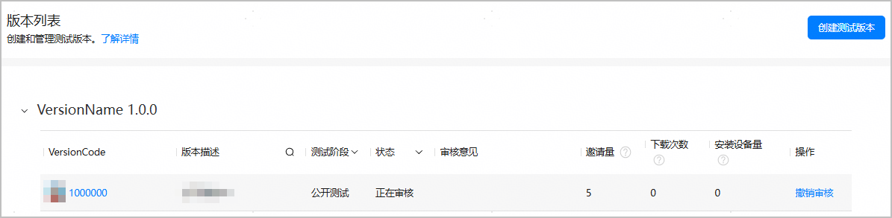

    版本状态共包含以下几种：
    * 正在审核：测试版本提交成功之后的状态。您可以撤销审核，撤销审核后，版本状态变为“准备提交”。
    * 等待生效：审核通过后，还没到测试时间，状态为“等待生效”，下方展示测试时间。您可以手动停止测试，停止测试后，状态变为“已失效”。
    * 正在测试：审核通过后，到达测试时间，状态为“正在测试”，下方展示测试时间。您可以主动停止测试，停止测试后，状态变为“已失效”。
    * 审核不通过：测试版本审核驳回后，状态为“审核不通过”，状态旁会显示审核不通过的原因。
    * 已失效：开发者手动停止测试、华为运营后台停止测试、或者到达测试截止时间时，状态会变为“已失效”，状态旁会显示已失效的原因。

    当创建了多个测试版本时，“版本列表”页面会将各测试版本按VersionName归类展示。

    * 未上传软件包的测试版本全部归类在“VersionName 未知”栏。
    * 上传软件包之后，AGC根据包VersionName将测试版本归类到对应的“VersionName”栏。例如，包VersionName为3.0.0的测试版本展示在“VersionName 3.0.0”栏。
    * 每个“VersionName”栏下展示各个测试版本的VersionCode。

    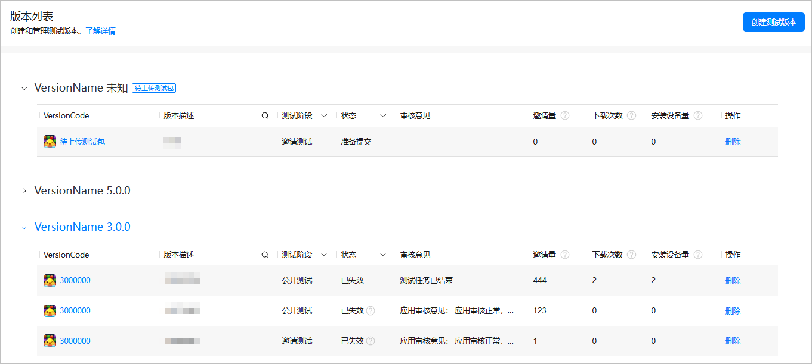

    已失效状态的测试版本可批量删除，勾选需要删除的公开测试版本后点击“批量删除”。

    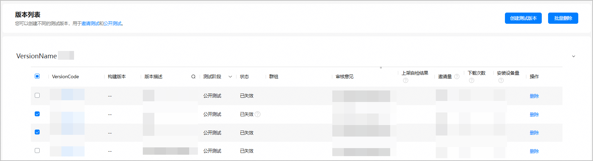

#### （可选）修改测试时间

当测试版本的状态为“等待生效”或“正在测试”时，您还可修改测试时间，如提前启动测试，延长测试时间等。

1. 在左侧导航栏选择“应用测试/元服务测试 > 版本列表”，进入“版本列表”页面，点击需要修改测试时间的测试版本。
2. 在“基础信息”栏，点击“测试时间”后的“修改”。

   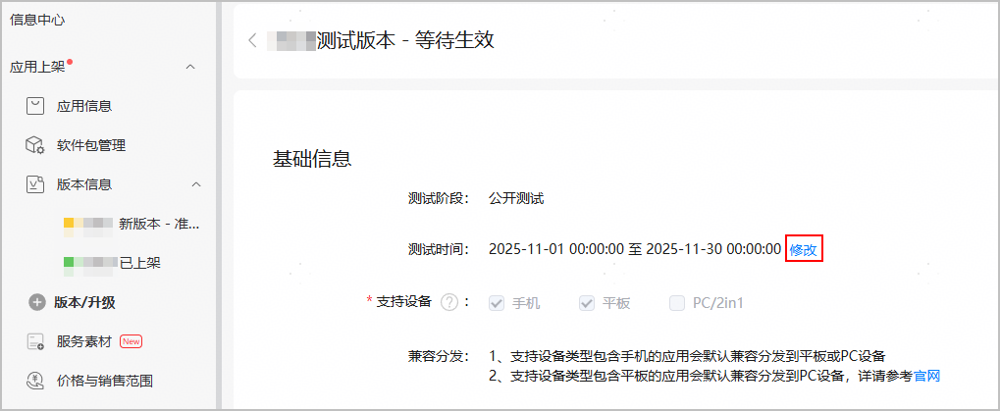

3. 在弹出的“修改测试时间”窗口，选择新的测试开始时间和测试结束时间，点击“保存”。

   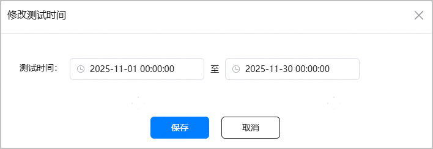

   

   * “正在测试”状态的测试版本不支持修改测试开始时间。
   * 若将“等待生效”状态的测试版本的测试开始时间修改为当前时间之前，点击“保存”后，测试版本的状态会立即变为“正在测试”。

#### （可选）修改下载安装次数

当公开测试版本的状态为“等待生效”或“正在测试”时，支持修改下载安装次数。

1. 在左侧导航栏选择“应用测试/元服务测试 > 版本列表”，进入“版本列表”页面，点击需要修改的公开测试版本。
2. 在公开测试版本详情页“测试发布”栏，点击“下载安装次数”后的“修改”。

   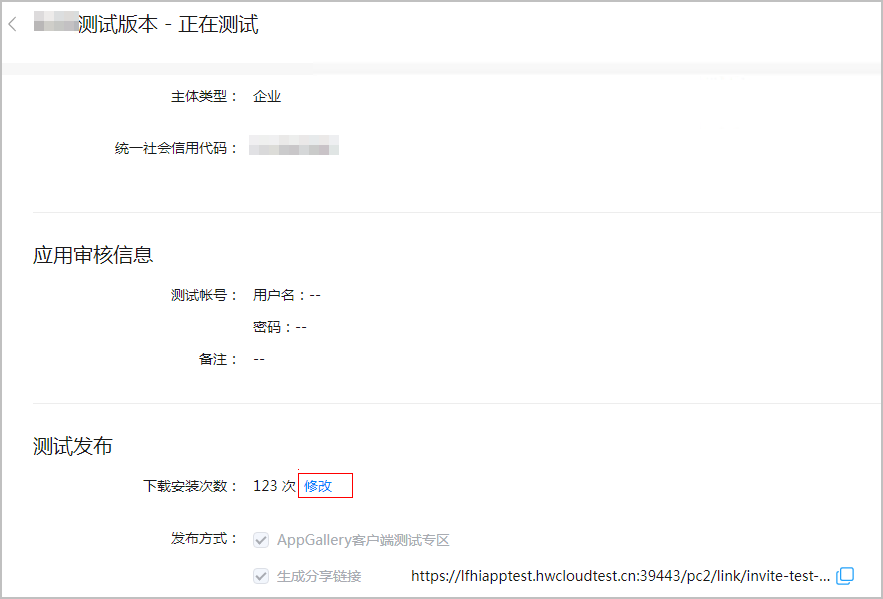

3. 在弹出的“修改下载安装次数”窗口，输入新的下载安装次数，点击“保存”。修改立即生效。

   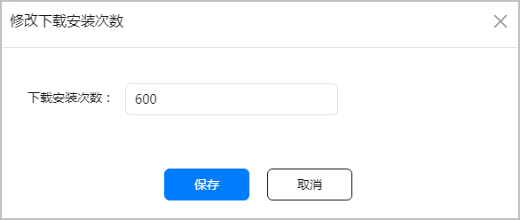
