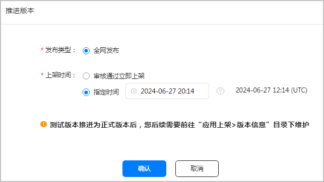
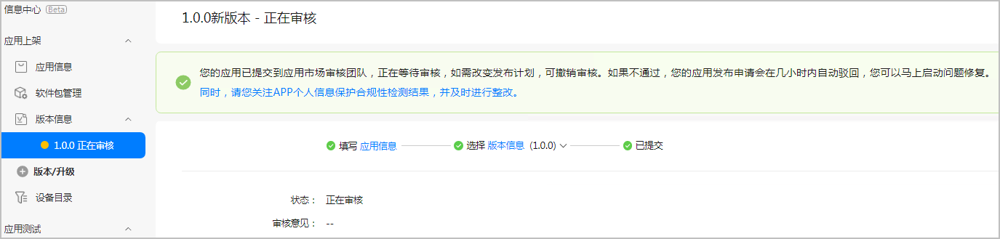
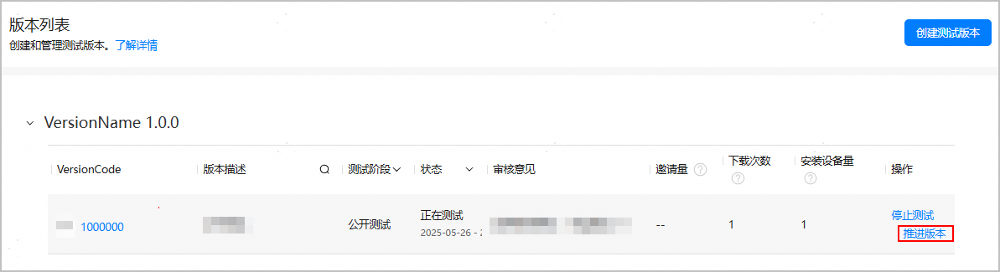
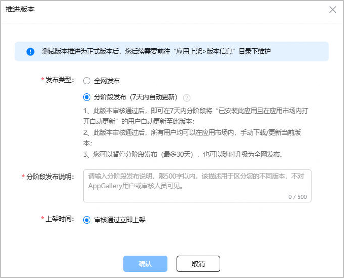
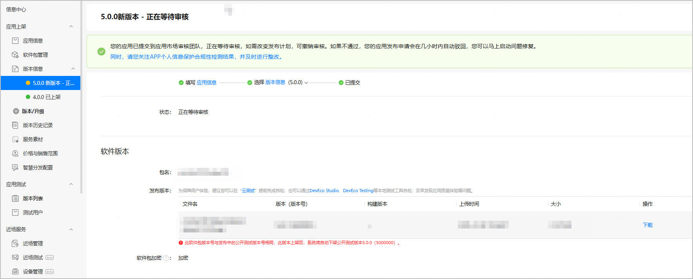
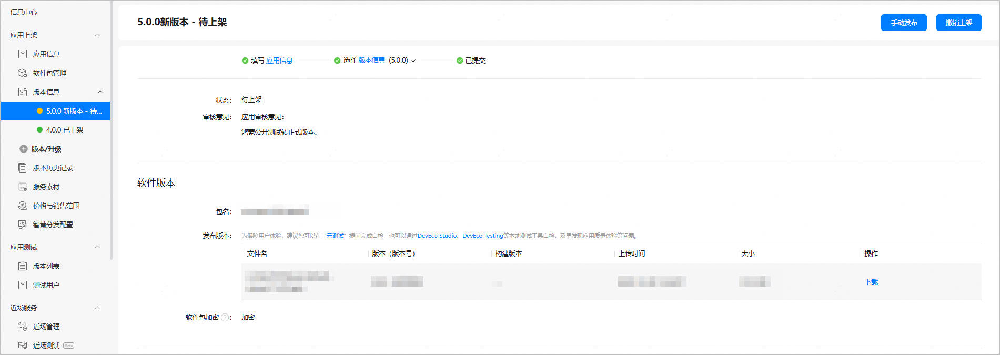
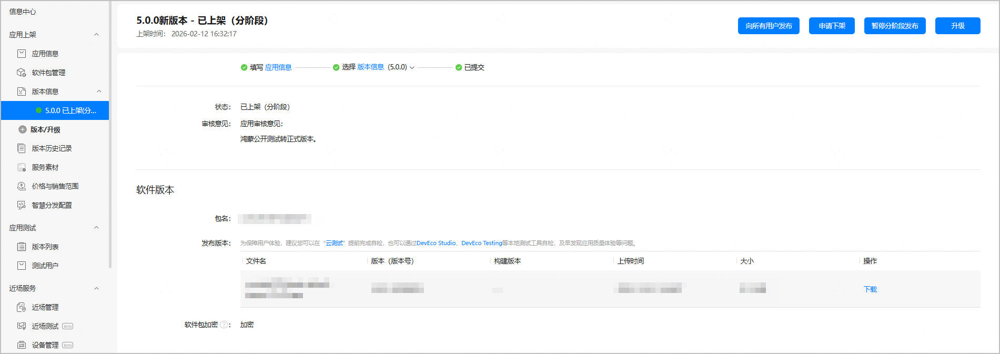

公开测试版本在经过充分测试后，若已达到正式发布的标准，您可以直接将该版本推进为正式版本。推进版本会自动上架，无需重复提交华为审核。

#### 约束限制

* 只有公开测试阶段的版本，才支持推进为正式版本。
* 公开测试版本必须处于“正在测试”状态。
* 公开测试版本选择的软件包使用场景必须是“测试和正式上架”。
* 公开测试版本的VersionCode必须大于当前在架的正式版本的VersionCode。
* 当前应用不能有处于“待上架”或“待审核”状态的正式版本。
* 公开测试版本发布国家必须包含中国大陆地区。
* 同时有分阶段发布版本和全网版本在架时，不支持推进版本。
* 公开测试版本转正式版本后，不再受设置的下载安装次数上限的约束。

#### 测试版本推进为全网版本

1. 在左侧导航栏选择“应用测试/元服务测试 > 版本列表”，进入“版本列表”页面。
2. 找到需要推进的公开测试版本，点击“操作 ”列的“推进版本”。

   
3. 在弹出的“推进版本”窗口，发布类型选择“全网发布”，“上架时间”选择“审核通过立即上架”或者“指定时间”，点击“确认”。

   指定时间是您的本地时间。在您设置时间之后，系统会自动转换成UTC标准时间并显示在后面。

   
4. 测试版本转为全网版本，并处于“正在审核”状态。您可前往“应用上架 > 版本信息”页面查看。

   等待大约几分钟后，全网版本状态将自动变为“已上架”。

   

#### 测试版本推进为分阶段发布版本

若应用当前存在全网在架版本，且您的公开测试的VersionCode大于等于在架版本的VersionCode，则支持将公开测试版本版本推进为分阶段发布版本。

1. 在左侧导航栏选择“应用测试/元服务测试 > 版本列表”，进入“版本列表”页面。
2. 找到需要推进的公开测试版本，点击“操作 ”列的“推进版本”。

   
3. 在弹出的“推进版本”窗口，填写发布信息后，点击“确认”。

   

   | 参数 | 说明 |
   | --- | --- |
   | 发布类型 | 选择“分阶段发布（7天内自动更新）”。 |
   | 分阶段发布说明 | 填写您本次分阶段发布的备注信息，如发布特性等，要求1-500字符。  此说明不对用户或华为审核人员展示，仅展示在版本信息页面，供您自己参考。 |
   | 上架时间 | 支持选择“审核通过立即上架”或“指定时间”。  指定时间：此处选择的为本地时间，如果您的应用被审核通过，则会在您设定的时间自动进行上架。 |
4. 测试版本转为分阶段发布版本，并处于“正在等待审核”状态。您可前往“应用上架 > 版本信息”页面查看。

   若上架时间选择“审核通过立即上架”，审核通过后，分阶段发布版本状态将自动变为“已上架（分阶段）”。

   若上架时间选择“指定时间”，审核通过后，当前本地时间未到设定“指定时间”，分阶段发布版本状态将自动变为“待上架”；当前本地时间已到设定“指定时间”，分阶段发布版本状态将自动变为“已上架（分阶段）”。

   

   
