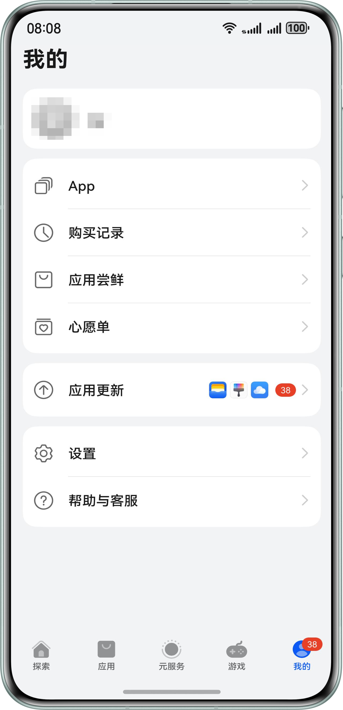

测试版本发布、且到达测试时间后，用户便可以参与公开测试。AGC提供了多种参与测试的方式。

* [在AppGallery客户端测试专区下载安装测试版本](#section1329995241112)：公开测试版本在AppGallery客户端测试专区（即“应用尝鲜”专区）面向全网所有用户展示，用户前往专区下载安装。
* [通过分享链接下载安装测试版本](#section768281215123)：将创建测试版本时生成的分享链接提供给用户，用户点击链接参与测试。

#### 在AppGallery客户端测试专区下载安装测试版本

若测试版本配置的“发布方式”勾选了“AppGallery客户端测试专区”，则公开测试版本将在AppGallery客户端测试专区（即“应用尝鲜”专区）面向全网所有用户展示，用户前往专区下载安装即可。

当该测试版本被下载安装的次数达到您设置的“下载安装次数”上限后，AppGallery客户端测试专区（即“应用尝鲜”专区）内将不再显示该测试版本。

#### 通过分享链接下载安装测试版本

若测试版本配置的“发布方式”勾选了“生成分享链接”，您还可以直接将该分享链接提供给用户。用户使用系统浏览器打开链接后，即可下载安装公开测试版本。
