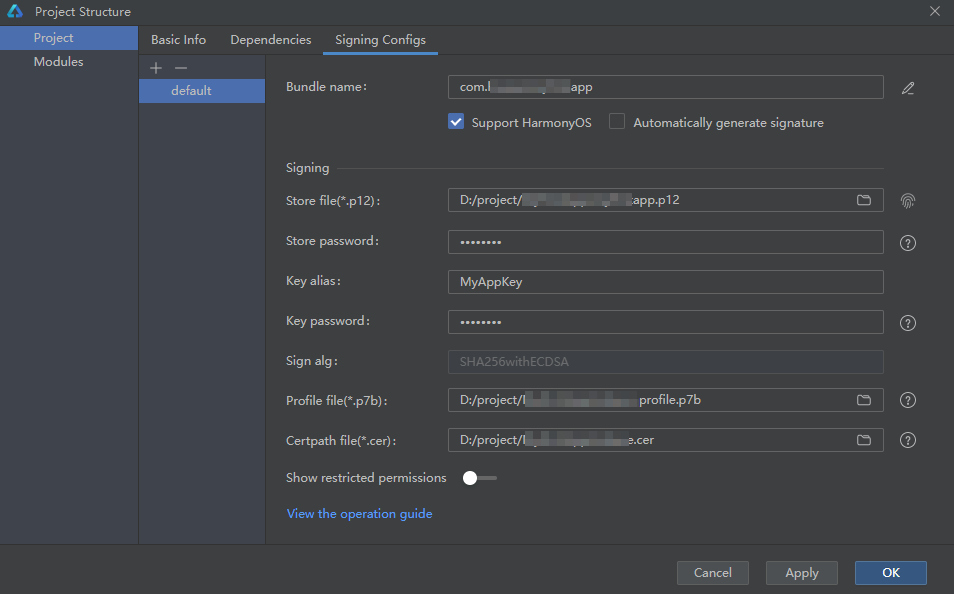
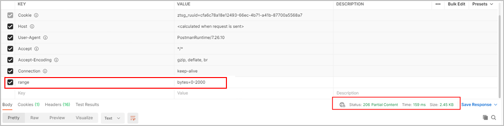
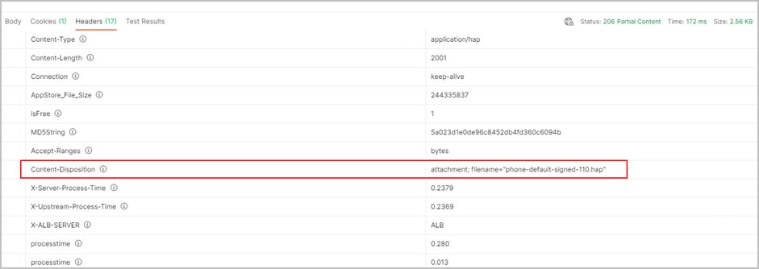
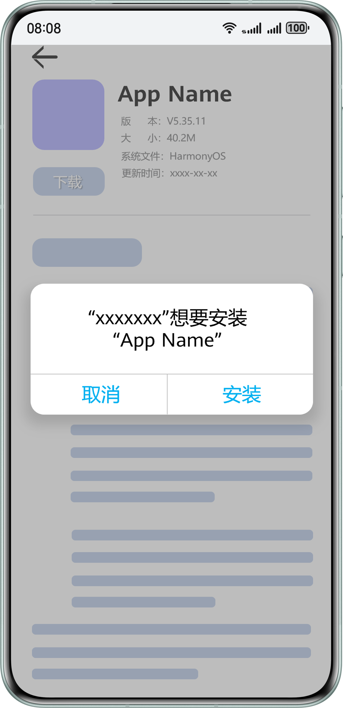
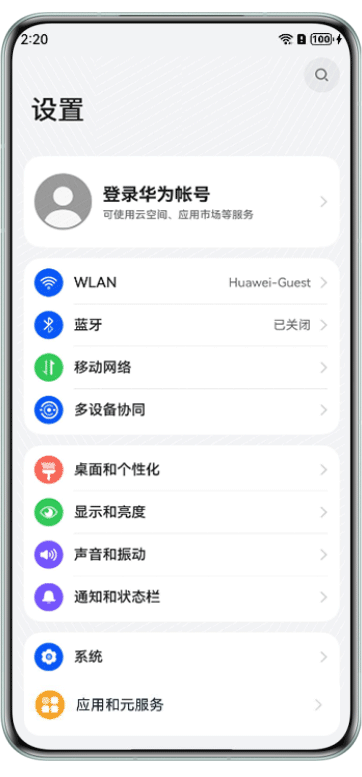

#### 适用场景

* In-house发布仅适用于在企业内部网络环境中分发专属应用给内部员工的场景，In-house应用不适合在任何公开渠道发布。使用In-house发布，您无需提交应用至华为应用市场，直接将应用发布上传至您的服务器或者第三方云上、内部用户直接下载安装即可，便于您更灵活控制版本发布节奏。
* In-house须具备完善的机制，确保仅限员工下载内部应用，并以私密、安全的方式向组织内员工分发。
* 当前In-house应用发布仅支持Stage模型开发的HarmonyOS应用，暂不支持元服务。
* 当前In-house应用暂不支持使用实况窗服务。

#### 准备工作

**使用In-house发布前，您需要分别完成账号和应用权限申请。我们将审核贵公司提交的申请信息，并确认[非公开发布](https://developer.huawei.com/consumer/cn/doc/app/agc-help-non-public-release-0000002278016482)、[定向应用发布](https://developer.huawei.com/consumer/cn/doc/app/agc-help-private-release-0000002353433008)、[指定设备发布](https://developer.huawei.com/consumer/cn/doc/app/agc-help-internal-test-0000002270709477)均无法满足您的需求。根据您提交的企业资质和申请理由，华为应用市场保留拒绝您申请的权利。**

1. 准备一个未实名认证过的华为开发者账号。如没有，请[注册一个](https://developer.huawei.com/consumer/cn/doc/start/registration-and-verification-0000001053628148)。

   

   为避免权限冲突，需要与原企业账号之间进行权限隔离，故不可使用已实名认证的账号。一个企业主体可以分别实名认证一个普通开发者账号和一个企业开发者（In-house应用分发）账号。一个手机号码或邮箱地址仅支持创建一个账号。
2. 用新注册的账号，完成[In-house应用分发资格申请](https://developer.huawei.com/consumer/cn/verified/enterpriseDistribute)。
3. 资格申请审核通过后，可参考[企业开发者（In-house应用分发）实名认证申请指导文档](https://developer.huawei.com/consumer/cn/doc/internal-distribution-guides/guidance-0000001935345821)为账号完成实名认证。


* In-house账号仅可用于以下场景：
  + 用于调试或发布In-house应用，不可用于调试或发布需上架华为应用市场的应用。
  + 用于指定设备发布。分别申请[In-house发布证书](https://developer.huawei.com/consumer/cn/doc/app/agc-help-inhouse-cert-0000002248337770)和[指定设备发布Profile](https://developer.huawei.com/consumer/cn/doc/app/agc-help-internaltest-profile-0000002283260129)即可，指定设备发布Profile有效期当前为180天。

* In-house应用不支持应用转移。
* 当您的In-house账号资格审核通过后，后续新增的每款In-house应用都需要先申请分发权限，才可以在AGC进行打包配置。

#### 发布流程

您可以将应用上传至您的服务器或者第三方云上，内部用户直接下载安装即可。具体发布流程如下：

**第一步：****[准备打包所需配置文件](#section16533105614395)**

在打包前，您需要为应用进行签名，从而保证应用的完整性和来源的真实性。签名时，需要配置相关信息，您需要提前做好准备。

**第二步：[编译打包应用](#section16967123194110)**

把应用编译打包成待测试版本，后续将包推送给团队成员进行测试。

**第三步：[构建Deeplink实现下载应用](#section74503017418)**

将编译的应用包上传至您的服务器或第三方云上，通过Deeplink的方式，使内部用户通过分发页面的下载按钮下载安装应用。

#### 准备打包所需配置文件

为保证应用的完整性和来源的真实性，在打包时，您需要为应用进行签名。签名时，需要配置如下相关信息：

* 密钥和证书请求文件：**密钥**格式为.p12，包含非对称加密中使用的公钥和私钥，存储在密钥库文件中，公钥和私钥用于数字签名和验证；**证书请求文件**格式为.csr，全称为Certificate Signing Request，包含密钥对中的公钥和公共名称、组织名称、组织单位等信息，用于申请发布证书。详细生成过程请参见[生成密钥和证书请求文件](https://developer.huawei.com/consumer/cn/doc/harmonyos-guides/ide-signing#section462703710326)。

  

  请务必保存好密钥文件，以及生成过程中设置的别名、密钥库和密钥的密码。
* In-house发布证书：格式为.cer，证书是由AGC颁发的数字证书，用于验证应用的身份和签名。[申请In-house发布证书](https://developer.huawei.com/consumer/cn/doc/app/agc-help-inhouse-cert-0000002248337770)后，请下载到本地保存。
* In-house发布Profile：格式为.p7b，包含了包名、数字证书信息、申请的权限列表等信息。[申请In-house发布Profile](https://developer.huawei.com/consumer/cn/doc/app/agc-help-inhouse-profile-0000002283340021)后，请下载到本地保存。

#### 编译打包应用

准备好打包所需配置文件后，即可准备编译打包应用。

1. 打开DevEco Studio，在顶部菜单栏选择“File > Project Structure”，进入“Project Structure”界面。
2. 导航选择“Project”，点击“Signing Configs”页签，取消“Automatically generate signature”勾选项，配置工程的签名信息，完成后点击“OK”。
   * Store file：密钥文件，选择之前准备好的密钥.p12文件。
   * Store password：密钥库密码，需与之前生成密钥设置的密钥库密码保持一致。
   * Key alias：密钥的别名信息，需与之前生成密钥设置的别名保持一致。
   * Key password：密钥的密码，需与之前生成密钥设置的密码保持一致。
   * Sign alg：固定设置为“SHA256withECDSA”。
   * Profile file：选择准备好的In-house发布Profile。
   * Certpath file：选择准备好的In-house发布证书.cer文件。

   
3. 分别将应用工程下的各个module进行编译打包。**In-house应用仅支持编译HAP和应用内HSP包。**
   * 编译HAP包
     1. 菜单栏选择“Build > Build Hap(s)/APP(s) > Build Hap(s)”。
     2. 等待编译构建。构建完成，在各模块的“build > default > outputs > default”目录下，获取到XXX-signed.hap文件。
   * 编译HSP包（仅支持应用内HSP包）
     1. 选中待编译共享包模块，菜单栏选择“Build > Make Module \\$`{libraryName}`”。
     2. 等待编译构建。构建完成，在共享包模块的“build > default > outputs > default”目录下，获取到\*.hsp文件。

#### 构建Deeplink实现下载应用

1. 将编译得到的各个HAP/HSP包上传至您的服务器或第三方云上，获取HAP/HSP包下载URL，下载URL建议以“https”开头。
2. 基于应用信息生成应用描述文件（例如：manifest.json5，文件名可自定义），代码如下：

   ```
   {
     "app": {
       "bundleName": "com.example.demo.a",
       "bundleType": "app",
       "versionCode": 1000000,
       "versionName": "1.0.0",
       "label": "DemoA",
       "deployDomain": "应用、图标以及描述文件部署域名",
       "icons": {
         "normal": "标准图标下载链接",
         "large": "大图标下载链接"
       },
       "minAPIVersion": "4.1.0(11)",
       "targetAPIVersion": "4.1.0(11)",
       "modules": [
         {
           "name": "module1",
           "type": "entry",
           "deviceTypes": [
             "tablet",
             "phone"
           ],
           "packageUrl": "HAP包下载链接",
           "packageHash": "HAP包sha256值"
         },
         {
           "name": "module2",
           "type": "feature",
           "deviceTypes": [
             "tablet",
             "phone"
           ],
           "packageUrl": "HAP包下载链接",
           "packageHash": "HAP包sha256值"
         },
         {
           "name": "module3",
           "type": "shared",
           "deviceTypes": [
             "tablet",
             "phone"
           ],
           "packageUrl": "HSP包下载链接",
           "packageHash": "HSP包sha256值"
         }
       ]
     }
   }
   ```

   配置的应用信息如下：

   | 属性 | 数据类型 | 必选(M)/可选(O) | 说明 |
   | --- | --- | --- | --- |
   | bundleName | 字符串 | M | 应用的Bundle名称。 |
   | bundleType | 字符串 | M | 应用的Bundle类型，用于区分HarmonyOS应用或元服务。  当前仅支持配置为“app”，表示HarmonyOS应用。 |
   | versionCode | 数值 | M | 应用的版本号。 |
   | versionName | 字符串 | M | 应用版本号的文字描述。 |
   | label | 字符串 | M | [应用的名称](https://developer.huawei.com/consumer/cn/doc/harmonyos-guides/application-component-configuration-stage)，建议与实际应用名称一致，否则会出现下载与安装过程中应用名不一致的问题。 |
   | deployDomain | 字符串 | M | 应用、图标及描述文件的部署域名，需要与icons、packageUrl以及描述文件自身下载URL中的域名一致，且不可包含协议头或端口号，否则会导致下载失败。 |
   | icons | 字符串 | M | [应用的图标](https://developer.huawei.com/consumer/cn/doc/harmonyos-guides/application-component-configuration-stage)，提供企业内部部署的图片下载地址，建议以“https”开头。 |
   | minAPIVersion | 字符串 | M | 应用运行所需SDK的API最小版本，用于判断是否与当前设备兼容。 |
   | targetAPIVersion | 字符串 | M | 应用运行所需的API目标版本，用于判断是否与当前设备兼容。 |
   | modules | 列表 | M | 应用分包module信息列表，以数组形态组织，其中至少包括一个entry module信息。 |
   | name | 字符串 | M | module的名称，该名称在整个应用须唯一。 |
   | type | 字符串 | M | 应用module的类型，取值范围：  * entry：应用的主模块 * feature：应用的动态特性模块 * shared：动态共享包模块（仅支持应用内共享包） |
   | deviceTypes | 字符串 | M | 当前module可以运行在哪类设备上，目前仅支持phone（手机）和tablet（平板）。 |
   | packageUrl | 字符串 | M | 当前module上传至服务器后生成的下载URL，建议以“https”开头。 |
   | packageHash | 字符串 | M | 当前module的SHA256值。例如，Windows系统下可通过**certutil -hashfile *包路径* SHA256**命令获取，Mac系统下可通过**shasum -a 256 *包路径***命令获取。  说明：  “包路径”指应用HAP/HSP包在本地的存储路径。 |
3. 将生成的应用描述文件上传至您的服务器或第三方云上，并获取该文件的下载URL。
4. 将应用描述文件URL构建成Deeplink用于下载应用。Deeplink需要满足如下条件：
   * 仅支持页面点击行为触发拉起，不支持地址栏输入DeepLink拉起或HTML头文件自动拉起。
   * 仅支持华为浏览器拉起，且从华为浏览器拉起的所有行为，均需判断是否有用户点击行为，确认用户点击才允许拉起。
   * DeepLink格式：store://enterprise/manifest?url=https://xxx.xxx/xxx.json5

   |  |  |
   | --- | --- |
   | Schema | store:// |
   | Host | enterprise |
   | Path | manifest |
   | 参数 | 应用描述文件上传至服务器后生成的下载URL，建议以“https”开头。  示例：url=https://xxx.xxx/xxx.json5  说明：  如下载URL内包含特殊字符，还需进行特殊字符编码：declare function encodeURIComponent(uriComponent: string | number | boolean): string; |
5. 配置服务器，需满足如下条件：
   1. 服务器提供应用描述文件和安装包的HTTPS下载链接，并且下载链接中的域名不支持IP地址。
   2. 应用描述文件和安装包的下载链接，均需要支持通过HEAD方式请求返回文件大小。
   3. 如果服务器提供的HTTPS下载链接使用了自签证书，还需满足以下条件：
      * 用户设备需要安装服务器自签证书对应的CA证书。
      * 自签证书有效期不超过13个月，超期请及时更换。
   4. 配置服务器支持分片下载能力。建议您在配置后进行验证：构造下载请求头包含range字段，返回码为206（如下方示例图），表示服务器支持分片下载；反之则不支持。

      
   5. 配置服务器返回的响应头（如下方示例图），使得应用描述文件和应用包可正确传输下载。

      
6. 在分发页面实现下载功能，使华为浏览器解析Deeplink，触发应用的下载安装流程。

   ```
   <html lang="en">
     <head>
       <meta charset="UTF-8">
       <title>Button Open DeepLink Example</title>
       <script>
         function openDeepLink() {
           let url ='store://enterprise/manifest?url=https://xxx.xxx/xxx.json5'
           window.open(url, '_parent')
         }
       </script>
     </head>
     <body>
       <button onclick="openDeepLink()">下载</button>
     </body>
   </html>
   ```

   下图为示例分发页面：

   

   对于应用更新场景，可以使用[openlink](https://developer.huawei.com/consumer/cn/doc/harmonyos-references/js-apis-inner-application-uiabilitycontext#openlink12)方式直接拉起下载安装。

   ```
   private openDeepLink(deeplink: string): void {
       // deeplink格式具体见开发者文档
       let context: common.UIAbilityContext = getContext(this) as common.UIAbilityContext;
       context.openLink(deeplink).then(() => {
           console.info('openlink success.')
       }).catch((error: BusinessError) => {
           console.error('openlink failed.')
       });
   }
   ```

   如果应用已安装成功，但被阻止运行，请在“设置 > 系统 > 企业设备和应用管理 > 企业应用管理”中找到您的In-house应用，点击“允许”。

   

   * 普通设备：若应用尚未进行联网验证，点击“允许”时检测到无网络或内网环境，会提示需要先联网验证才可运行。请检查网络设置后重试。
   * 纳管设备：若应用尚未进行联网验证，点击“允许”时检测到无网络或内网环境，应用可豁免联网验证，直接完成信任授权即可。

   

#### 错误码

#### [h2]接口错误码

| 错误码 | 描述 | 解决方案 |
| --- | --- | --- |
| 204144642 | the app does not have the in-house publishing capability enabled | 该应用未申请In-house发布权限，请先完成[In-house应用分发资格申请](https://developer.huawei.com/consumer/cn/verified/enterpriseDistribute)。 |

#### [h2]下载错误码

| 错误码 | 描述 | 解决方案 |
| --- | --- | --- |
| 10000 | DeepLink格式错误 | 请检查DeepLink格式，确保符合如下规则：   * DeepLink正确格式为：store://enterprise/manifest?url= encodeURIComponent（描述文件下载URL） * 描述文件下载URL使用HTTPS协议。 * 描述文件下载URL以“.json5”结尾。 * 描述文件下载URL的域名与描述文件内deployDomain字段值一致。 错误示例：描述文件下载URL“https://hosta/xxx/xxx.json5”的域名为hosta，而deployDomain字段值为hostb 。  正确示例：描述文件下载URL“https://host/xxx/xxx.json5”的域名为host，而deployDomain字段值为host 。 |
| 10001 | 描述文件大小超限 | 请检查描述文件大小，确保不超过1MB。 |
| 10002 | 描述文件下载出错 | 描述文件下载URL网络不可达，请检查描述文件下载URL是否可被正常访问。  您可将描述文件下载URL复制至浏览器中进行下载验证。 |
| 10003 | 描述文件解析出错 | 请检查描述文件内容格式，确保为JSON格式，具体可参见上文[描述文件内容示例](#ZH-CN_TOPIC_0000002281532696__li16711118193819)。 |
| 10004 | 描述文件存在空值字段 | 请检查描述文件内容，确保所有字段不为空。 |
| 10005 | bundleName字段值不符合规范 | 请检查bundleName字段值，确保符合如下规范：  * 必须为以点号（.）分隔的字符串，且至少包含三段，每段中仅允许使用英文字母、数字、下划线（\_），如“harmony\_11.huawei.com ”。 首段以英文字母开头，非首段以数字或英文字母开头，每一段以数字或者英文字母结尾，如“harmony99.huawei.11\_com”。  不允许多个点号（.）连续出现，如“harmony..huawei.com ”。 * 长度为7~128个字符，且不可包含敏感词，不能将保留字符作为独立段呈现。以保留字符harmony为例，包名不能为harmony.huawei.com、com.harmony.huawei、com.huawei.harmony。 保留字符包括如下：    + oh   + ohos   + harmony   + harmonyos   + openharmony   + system |
| 10006 | minAPIVersion和targetAPIVersion字段值不符合规则 | * 请确保字段值格式正确。可使用正则表达式自查：^\\d+\\.\\d+\\.\\d+\\(\\d+\\)$ 错误示例：     ```   "minAPIVersion": "5.0.0.12",   "targetAPIVersion": "5.0.0.12"   ```     正确示例：     ```   "minAPIVersion": "5.0.0(12)",   "targetAPIVersion": "5.0.0(12)"   ```  * 请检查设备SDK版本，确保设备SDK版本大于等于minAPIVersion的值。 |
| 10007 | bundleType字段值不符合规则 | 当前bundleType值固定为“app”（大小写敏感），请检查字段值拼写。 |
| 10008 | icons字段值不符合规则 | 请检查icons的URL，确保符合如下规则：  说明：  normal和large的URL规则相同。   * URL使用HTTPS协议。 * URL不带参数，且以png、webp、jpg、jpeg、gif、svg、bmp等后缀结尾。 * URL域名与deployDomain值一致。 错误示例：     ```   "deployDomain": "host",   "icons": {     "normal": "https://hostA/xxx",     "large": "https://hostA/xxx"   },	   ```     正确示例：     ```   "deployDomain": "host",   "icons": {     "normal": "https://host/xxx",     "large": "https://host/xxx"   },	   ``` |
| 10009 | modules字段值不符合规则 | 请检查modules字段值，确保符合如下规则：   * modules不为空，或数组长度不为0。 错误示例1：     ```   "modules": [],   ```     错误示例2：     ```   "modules":""   ```     正确示例：     ```   "modules": [     ````{       "name": "module",       "type": "entry",       "deviceTypes": [         "tablet",         "phone"      ],       "packageUrl": "https://host:port/uri",       "packageHash": "hash..."     }````   ],   ``` * 按设备类型过滤后，modules不为空，至少有一个可安装的module。例如，实际安装设备为手机，则必须至少有一个module的deviceType值包含phone。 * 按设备类型过滤后，modules下必须至少包含一个HAP包。例如，实际安装设备为手机，则deviceType值包含phone的modules中必须至少有一个是HAP包，不能全部是应用内HSP包。 |
| 10010 | deviceTypes字段值不符合规则 | 请检查deviceTypes与实际安装设备的类型是否匹配，确保deviceTypes的值包含实际安装设备的类型。  错误示例：  实际设备类型是手机，描述文件的deviceTypes配置为tablet   ``` "deviceTypes": [   "tablet", ], ```   正确示例：  实际设备类型是手机，描述文件的deviceTypes配置为tablet和phone  ``` "deviceTypes": [   "tablet",   "phone" ], ``` |
| 10011 | packageUrl字段值不符合规则 | 请检查packageUrl字段值，确保符合如下规则：   * packageUrl使用HTTPS协议。 * packageUrl不带参数，且以hap或hsp等后缀结尾。 错误示例：     ```   "packageUrl": "https://host/xxx/xxx/entry"   ```     正确示例：     ```   "packageUrl": "https://host/xxx/xxx/entry.hap"   ``` * packageUrl域名与deployDomain值一致。 错误示例：     ```   "deployDomain": "hostA",   "modules":[{     …     "packageUrl": "https://hostB/xxx",     …     }]   ```     正确示例：     ```   "deployDomain": "host",   "modules":[{     …     "packageUrl": "https://host/xxx",     …     }]   ``` |
| 10012 | modules中name字段不符合规则 | 请检查modules中各模块的name是否冲突，要求各模块名唯一。  错误示例：   ``` "modules": [   {      "name": "module",      ...    },    {      "name": "module",     ...    }  ], ```   正确示例：   ``` "modules": [   {      "name": "module1",      ...    },    {      "name": "module2",     ...    }  ], ``` |
| 10013 | 描述文件处理出错 | 系统错误，请稍后重试。 |
| 10014 | 描述文件验证出错 | 系统错误，请稍后重试。 |
| 10015 | 获取安装包信息出错 | packageUrl网络不可达，请检查packageUrl是否可被正常访问。  您可将packageUrl复制至浏览器中进行下载验证。 |
| 10016 | 安装包大小超限 | 请检查安装包大小，单个HAP/HSP限制大小4GB。 |
| 10017 | 安装包下载出错 | 若安装包较大，下载耗时较长，请保证下载过程中设备的网络正常。 |
| 10018 | 加载描述文件出错 | 系统错误，请稍后重试。 |
| 10019 | 描述文件验签失败 | * 请检查描述文件的签名密钥与安装包的签名密钥，确保二者保持一致。 * 请使用签名工具进行本地验证。 |
| 10020 | 安装包完整性校验失败 | * 请使用SHA256计算packageHash，并确保packageHash与对应安装包的Hash值一致。 * 若确认packageHash正确，可能是网络问题导致安装包下载不完整。请尝试重试。 |
| 10021 | 安装包证书校验失败 | 请检查是否使用了正确的[In-house发布证书](https://developer.huawei.com/consumer/cn/doc/app/agc-help-inhouse-cert-0000002248337770)和[In-house发布Profile](https://developer.huawei.com/consumer/cn/doc/app/agc-help-inhouse-profile-0000002283340021)打包安装包。 |
| 10022 | 安装包解压出错 | * 请确保安装包为HAP或应用内HSP。 * 请检查设备是否有足够可用的存储空间。 |
| 10023 | 安装包内文件读取出错 | 请确保安装包为HAP或应用内HSP。 |
| 10024 | 安装包信息与描述文件信息不一致 | * 请检查描述文件的bundleName值与安装包module.json文件内bundleName值是否一致。 错误示例：    + 描述文件：      ```     "bundleName": "com.huawei.enterprise.demoA"     ```   + module.json：      ```     "bundleName": "com.huawei.enterprise.demoB"     ``` 正确示例：    + 描述文件：      ```     "bundleName": "com.huawei.enterprise.demo"     ```   + module.json：      ```     "bundleName": "com.huawei.enterprise.demo"     ```  * 请检查描述文件的versionCode值与安装包module.json文件内versionCode是否一致。 错误示例：    + 描述文件：      ```     "versionCode": 1000001,     ```   + module.json：      ```     "versionCode": 1000000,     ``` 正确示例：    + 描述文件：      ```     "versionCode": 1000000,     ```   + module.json：      ```     "versionCode": 1000000,     ```  * 请检查描述文件的minAPIVersion值与安装包module.json中minAPIVersion是否一致。 错误示例：    + 描述文件：      ```     "minAPIVersion": 5.0.0(12)     ```   + module.json：      ```     "minAPIVersion": 50000011     ``` 正确示例：    + 描述文件：      ```     "minAPIVersion": 5.0.0(12)     ```   + module.json：      ```     "minAPIVersion": 50000012     ``` |
| 10025 | 安装包校验出错 | 系统错误，请稍后重试。 |
| 10027 | 任务状态不一致 | 已有任务在下载中，触发相同包名的下载任务，但新任务的描述文件与正在进行中的任务不一致，需要等待正在进行中的任务完成。 |
| 10028 | SSL证书校验失败 | * 请确保端侧已安装根证书。 * 如果端侧已安装根证书，请执行如下命令，校验端侧根证书是否正确：    ```   openssl verify -CAfile cacert.crt certificate.crt   ```     其中，cacert.crt为根证书，certificate.crt为服务端证书。 * 请检查服务器站点的证书是否正确： 根据日志定位到服务器IP地址，联系您的服务器开发人员确认该IP站点的证书是否有问题。 |
| 99999 | 系统未知错误 | 请稍后重试。 |
| 17700018 | 安装失败，依赖的模块不存在 | 在应用描述文件中配置应用安装所需的所有依赖模块。 |
| 17700048 | 代码签名校验失败 | * 请检查代码签名文件对应的module是否包含在安装包路径之中。 * 请检查提供的代码签名文件的路径是否合法。 * 请使用和安装包匹配的代码签名文件。 |
| 17700054 | 权限校验失败导致应用安装失败 | * 请排查是否申请了MDM类型的权限，MDM类型的权限仅针对应用类型为MDM的应用开放。 * 请排查申请的权限是否为开放权限。 |
| 17700015 | 多个HAP配置信息不同导致应用安装失败 | * 请确认多个HAP中配置文件app下面的字段是否一致，或者检查工程的signingConfigs配置是否一致。 * 请确认已安装版本和待安装版本HAP配置信息是否一致，如不一致请升级版本号。 |

#### [h2]安装错误码

请参见：`https://gitee.com/openharmony/docs/blob/master/zh-cn/application-dev/reference/apis-ability-kit/errorcode-bundle.md`
