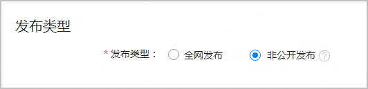
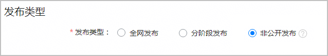
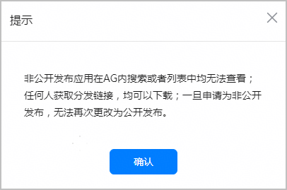

#### 简介

对于不适合面向所有用户公开分发的应用，您可以通过非公开发布的方式在华为应用市场上发布。非公开发布的应用不会出现在华为应用市场的任何类别、推荐、排行榜、搜索结果或其他列表中，仅通过分发链接被用户发现、下载和更新，且任何获取到分发链接的用户均可以下载应用。

非公开发布方式上架的应用，无法再更改为公开发布方式。

**使用非公开发布功能必须满足以下条件**：

* 账号类型：企业开发者账号

  查看[个人开发者与企业开发者的区别](https://developer.huawei.com/consumer/cn/doc/start/dbiae-0000001336403980)
* 您的操作账号必须是对应用拥有“提交版本”权限的账号持有者、管理员、APP管理员角色。

  关于账号角色与权限的详细信息，可参考[角色与权限](/docs/distribute/agc/agc-help-developid-0000002235870038/agc-help-rolepermission-0000002271930352)。
* 应用类型：API Level ≥ 10的HarmonyOS应用
* 应用不存在分阶段发布和公开测试版本。
* 您需要[填写报名申请](https://developer.huawei.com/consumer/cn/activity/101724324266937387/signup)，审核通过后方可使用非公开发布。申请完成后，可在[华为开发者联盟官网](https://developer.huawei.com/consumer/cn/)“我的 > 我的活动”模块查看您的报名状态、审核结果以及其他相关信息。

#### 未上架应用申请非公开发布

未上架应用可以直接上架为非公开发布应用。

1. 登录[AppGallery Connect](https://developer.huawei.com/consumer/cn/service/josp/agc/index.html)，点击“APP与元服务”。
2. 选择要发布的应用，参考[发布HarmonyOS应用](https://developer.huawei.com/consumer/cn/doc/app/agc-help-release-app-0000002271695230)完成应用信息和版本信息配置。

   

   按照法律法规要求，应用非公开上架同样需要提供相应的资质文档，具体要求请参见：[应用资质](https://developer.huawei.com/consumer/cn/doc/app/50104-10)、[配置备案信息](/docs/distribute/agc/agc-help-release-app-0000002271695230/agc-help-release-app-record-0000002319594705)。
3. 选择软件包后，“应用上架 > 版本信息”页面会展示“发布类型”区域，选择“非公开发布”。

   
4. 阅读弹框提示，确认无误后点击“确认”。

   
5. 点击“提交审核”，将应用提交至华为方进行发布审核。

   审核通过上架后，版本信息页面的“发布类型”区域展示应用分发链接，链接形式为：https://appgallery.huawei.com/app/detail?id=*包名* 。

   此后您便可将该分发链接分享给目标用户进行下载、安装或者更新了。

   

#### 全网在架应用申请非公开发布

已全网上架的应用，也可以通过升级版本的方式更新为非公开发布应用。非公开发布版本上架后，全网版本自动下架，后续也不支持再次转为全网发布版本。

1. 登录[AppGallery Connect](https://developer.huawei.com/consumer/cn/service/josp/agc/index.html)，点击“APP与元服务”。
2. 选择要申请非公开发布的应用，参考[升级版本](/docs/distribute/agc/agc-help-maintain-0000002270829401/agc-help-maintain-upgrade-0000002236494386)完成应用信息和版本信息配置。
3. 在版本信息页面的“发布类型”区域，选择“非公开发布”。

   
4. 阅读弹框提示，确认无误后点击“确认”。

   
5. 点击“提交审核”，将应用提交至华为方进行发布审核。

   审核通过上架后，版本信息页面的“发布类型”区域展示应用分发链接，链接形式为：https://appgallery.huawei.com/app/detail?id=*包名* 。

   此后您便可将该分发链接分享给目标用户进行下载、安装或者更新了。

   

#### FAQ

#### [h2]非公开发布申请已审批通过，为何仍看不见非公开发布入口？

请您按照以下步骤一一排查：

* 您申请非公开发布的应用与当前需发布的应用是否为同一个应用。
* 登录账号的角色是否为对应用拥有“提交版本”权限的账号持有者、管理员、APP管理员角色。

  关于账号角色与权限的详细信息，可参考[角色与权限](/docs/distribute/agc/agc-help-developid-0000002235870038/agc-help-rolepermission-0000002271930352)。

#### [h2]应用提交了非公开发布之后，能否再更改为公开发布？

一旦申请为非公开发布，无法再次更改为公开发布，请您务必谨慎操作。

#### [h2]非公开发布是否需要工信部备案？

需要备案。

#### [h2]非公开发布是否需要安全评估报告？

不需要安全评估报告。

#### [h2]非公开发布应用委托第三方上传时，需要提供什么材料？

1. 为了帮助您尽快顺利地通过审核，请您在提交上线前，提前准备好授权书及相关证明文件，具体请参考[应用资质审核要求](/docs/distribute/app-dist/app-market/x50000/x80301)。
2. 为保障用户体验，请补充提供客户的确认邮件，发送至developer@huawei.com。邮件中需包含应用名称，并需由实际使用该应用的企业客户发出，明确声明“认可该应用当前版本功能完整、可正常使用”，以证明鸿蒙版本的功能已通过实际使用方的验证，满足客户对体验的期待。
