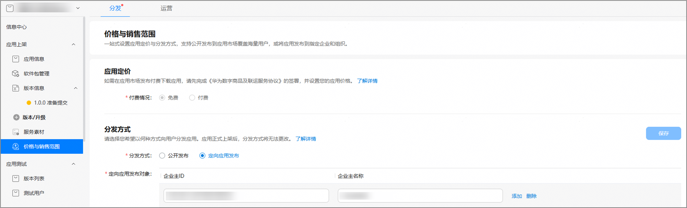
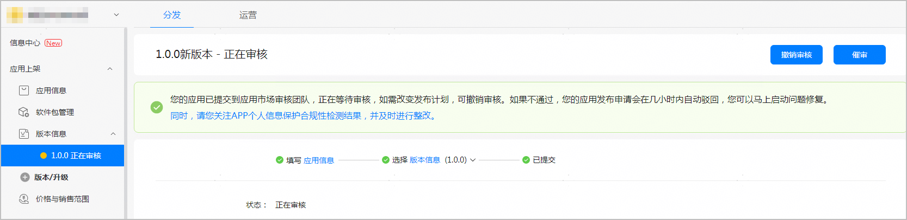
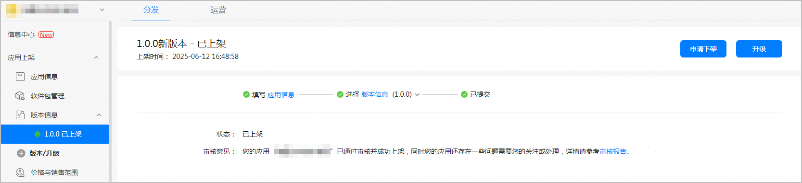
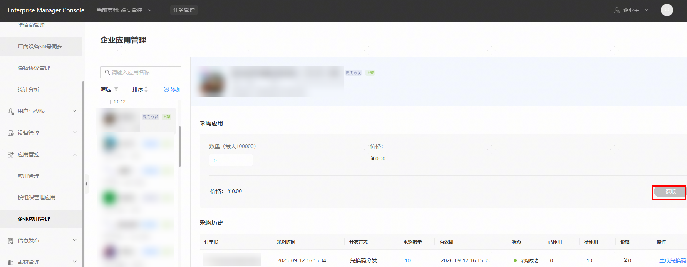
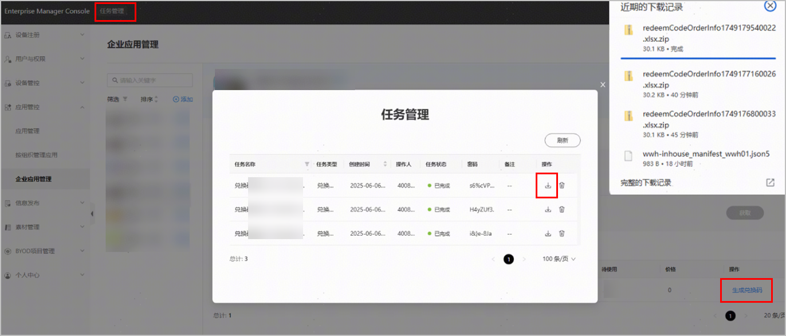
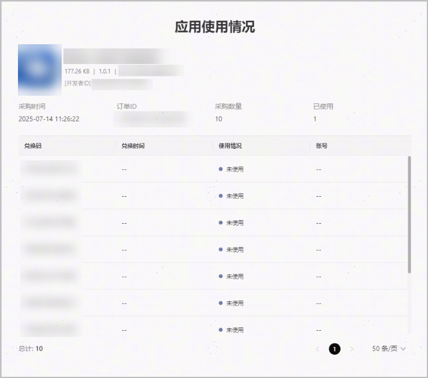
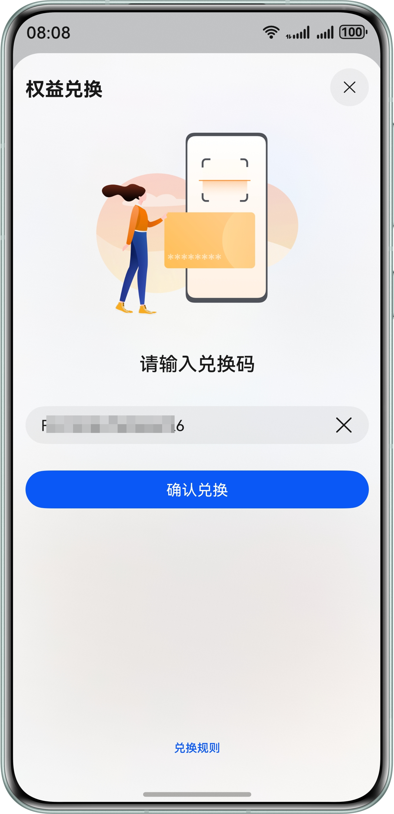
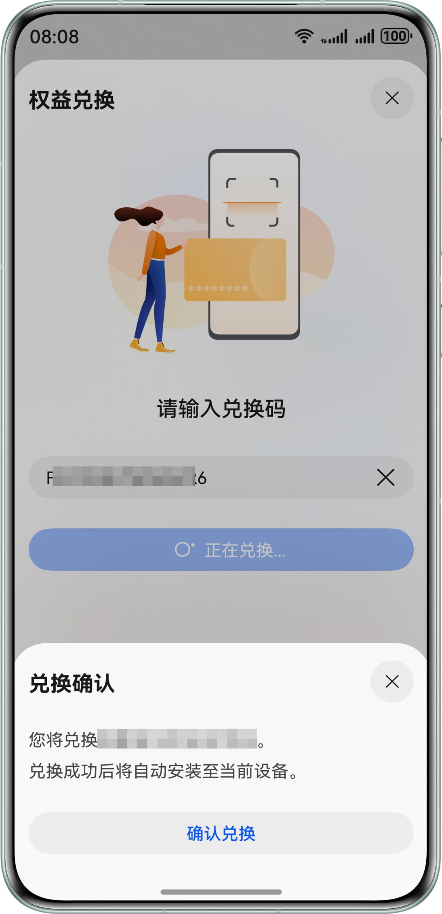
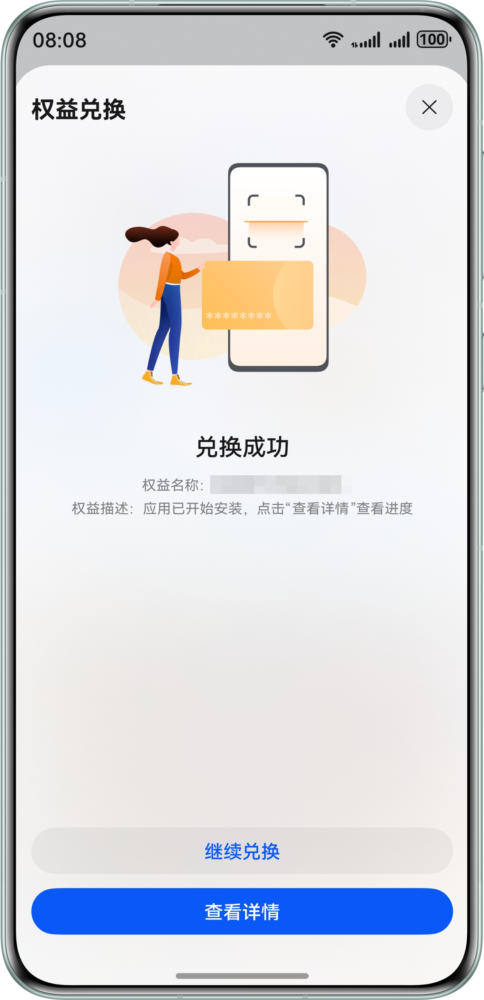
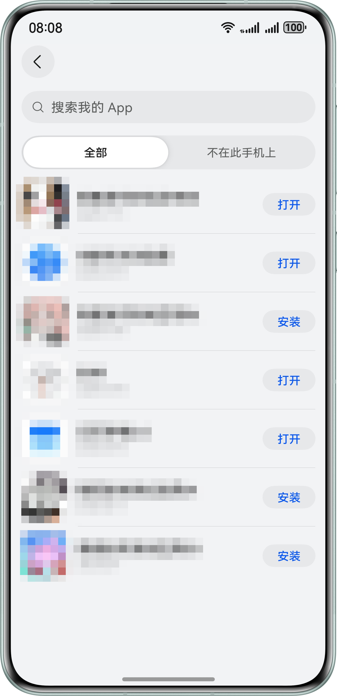

#### 概述

对于不适合面向所有用户公开分发，以及面向特定企业的私有化定制应用，您可以将应用的分发方式设置为“定向应用发布”，定向应用发布的应用不会出现在华为应用市场的任何类别、推荐、排行榜、搜索结果或其他列表中，仅能通过兑换码和链接供用户发现、下载和更新，且每个链接仅支持单次兑换下载。通过控制链接分发数量，实现安全可控分发。

#### 前提条件

* 您和企业主都已注册华为账号并完成企业开发者实名认证。
* 您的账号必须是团队账号的持有者。
* 您发布的HarmonyOS应用的API ≥10。
* 您的应用的设备类型仅包含手机、平板和PC/2in1。
* 您的应用的分发国家必须是仅中国大陆。
* 您的应用的软件包必须选择加密。
* 您的应用没有其他发布类型的在架版本（包含全网发布、分阶段发布、非公开发布、公开测试）。

#### 获取企业主ID

1. 企业主注册华为开发者联盟账号并完成[实名认证](https://developer.huawei.com/consumer/cn/doc/start/ht-edrna-0000001154848578)。
2. 企业主登录[HEM管理台](https://developer.huawei.com/business/console/)，角色认证“企业主”，具体参考[HEM角色认证](https://developer.huawei.com/business/cn/doc/HEM/hem_user-guide_certification_rhjsrz-0000001547976112)。
3. 通过审核后，在界面右边栏点击您的企业名称，点击复制您的HEM ID。
4. 企业主将HEM ID传递给App开发者，以便其将企业ID添加到应用分发列表。

#### 提交定向应用发布申请

1. 登录[AppGallery Connect](https://developer.huawei.com/consumer/cn/service/josp/agc/index.html)，点击“APP与元服务”。
2. 创建HarmonyOS应用，具体请参考[创建HarmonyOS应用](/docs/distribute/agc/agc-help-app-0000002235710234/agc-help-create-app-0000002247955506)。
3. 进入应用详情页，选择“分发 > 价格与销售范围”，进入定向应用发布配置页面。

   
4. 分发方式选择“定向应用发布”，填写“定向应用发布对象”信息，完成后点击“保存”。

   | 参数 | 说明 |
   | --- | --- |
   | 企业主ID | 长度不超过64位，上限100个。 |
   | 企业主名称 | 长度不超过256位。企业主名称必须与企业主ID一致。 |
5. 分发方式填写完成后，进入版本信息页面，完善其他相关信息，点击“提交审核”。提交成功后，应用版本状态更新为“正在审核”。

   
6. 应用审核通过后，版本状态更新为“已上架”。

   

* 上架过定向应用发布，不支持更改为公开发布。
* 付费应用不支持发布方式设置为定向应用发布。
* 设置为定向应用发布的应用不支持邀请测试功能，请通过正式上架流程供用户测试，或使用[调试](https://developer.huawei.com/consumer/cn/doc/harmonyos-guides/ide-debug-app)、[指定设备发布](https://developer.huawei.com/consumer/cn/doc/app/agc-help-internal-test-0000002270709477)测试。

#### 获取兑换码

定向发布应用上架成功后，企业用户可以到[HEM管理台](https://developer.huawei.com/business/cn/support)查看您上架的应用，并获取兑换码。

1. 进入HEM管理台，选择“应用管控> 企业应用管理”，选择您的定向发布应用，输入数量，点击“获取”按钮，即可生成兑换码。

   
2. 点击“生成兑换码”按钮，提示“获取兑换码成功”后，点击左上角“任务管理”按钮，点击下载包含兑换码以及兑换码链接的表格文件。生成兑换链接总数无上限，兑换链接有效期为1年内。

   
3. 企业用户获取到兑换码以后，可以通过线下渠道向实际用户分发兑换码及链接。
4. 支持查看应用兑换使用情况，点击“采购数量”，支持查看应用兑换时间、使用情况、兑换账号。

   

#### 下载安装定向发布应用

获得兑换码和链接后，用户在终端设备上打开链接，终端会自动进入华为应用市场的权益兑换页面，链接可自动填充兑换码，点击“确认兑换”即可获取应用。

1. 点击下载链接，自动进入华为应用市场。
2. 点击“同意”后，进入权益兑换页面。如果未登录华为账号，需先登录华为账号。

   
3. 点击“确认兑换”，弹窗“兑换确认”提示，确认信息无误后，点击“确认兑换”。

   
4. 点击“确认兑换”，页面提示“兑换成功”，应用已下载安装，可以点击“查看详情”查看进度。

   
5. 应用安装成功，可以打开您的定向发布应用。

   
6. 定向发布应用下载完成后，在华为应用市场“我的-App”页可查看，仅支持查看应用，点击此应用不支持查看详情。
7. 定向发布应用版本更新：应用发布更新后，可进入华为应用市场-我的-应用更新列表中更新下载。

#### FAQ

#### [h2]定向应用发布是否需要工信部备案？

需要备案。

#### [h2]使用定向应用发布是否收费？

目前政策为免费使用。

#### [h2]应用提交了定向应用发布之后，能否再改为公开发布？

一旦申请为定向应用发布，无法再次更改为公开发布，请您务必谨慎操作。

#### [h2]应用发布新版本用户如何更新？

应用发布版本更新，可在应用市场-我的-app点击应用更新，不需要再次点击链接

#### [h2]同一用户存在多设备场景，是否需要多个兑换链接下载应用？

用户兑换过一次后，和华为账号绑定，切换到其他设备登录，可在应用市场-我的-app重新下载，不需要多个兑换链接再次兑换。
