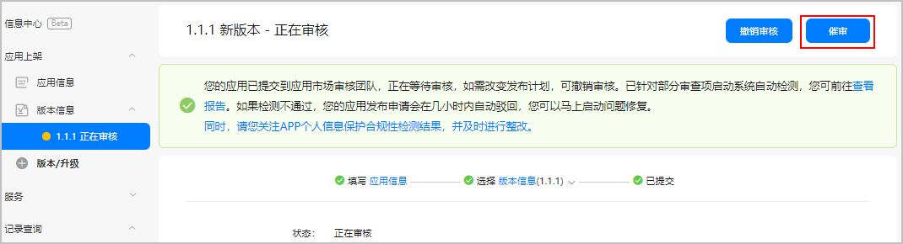
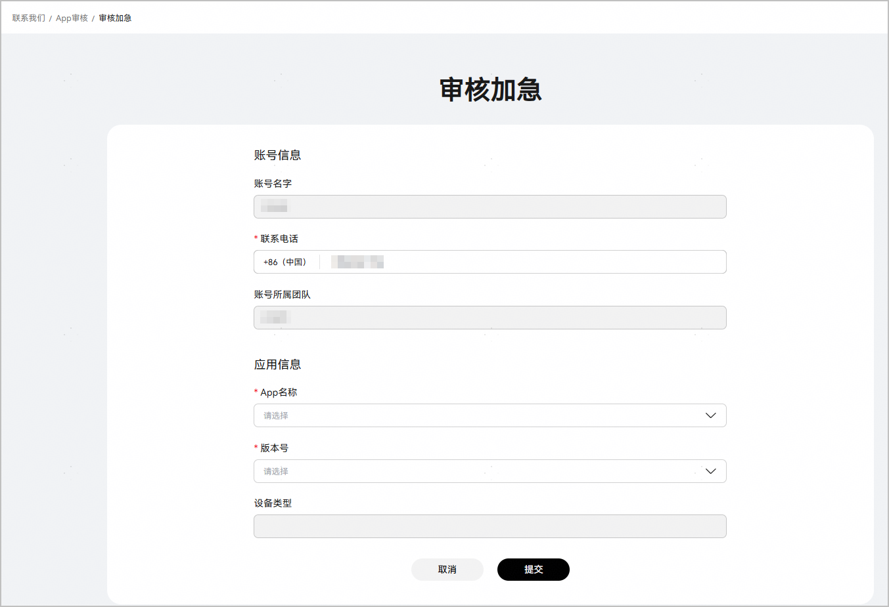
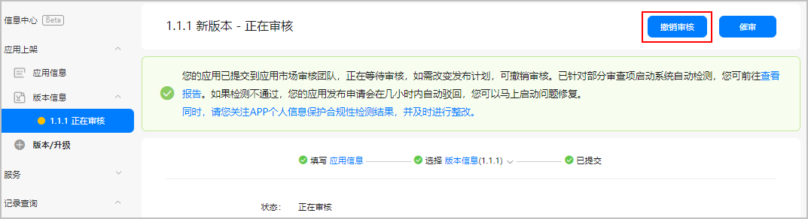

#### 催促审核

如果您等待了几天后发现提交审核的应用版本仍未被审核，可以在AppGallery Connect中督促华为审核人员进行审核。收到您的催审信息后，华为审核人员会尽快为您审核，请您耐心等待。

#### [h2]前提条件

您已在AppGallery Connect提交了应用上架申请。

#### [h2]操作步骤

1. 登录[AppGallery Connect](https://developer.huawei.com/consumer/cn/service/josp/agc/index.html)，选择“APP与元服务”。
2. 在应用列表中点击需要催促审核的应用版本链接，系统进入该版本的“版本信息”页面。
3. 点击右上方的“催审”。

   

4. 在弹出确认框中，点击“确定”。

#### 审核加急

多数应用的上架申请会在24小时内完成审核，如果遇到紧急情况，例如需要修复严重问题或者发布紧急活动，您可以申请[审核加急](https://developer.huawei.com/consumer/cn/service/apcs/aggrowth/chassis/developerService/expeditedReview)，加快上架进度。

* 审核加急操作需由账号持有者登录完成，只有账号持有者才可申请对应账号下的应用审核加急。
* 当前仅HarmonyOS应用或元服务支持申请审核加急，在申请审核加急之前，请确保您已提交应用上架审核申请。

* 在一个自然年内，每个应用可以申请3次审核加急，请您仅在必要的情况下申请，如果您多次提交审核加急请求，可能会不被审批。

* 若发生加急队列拥堵、版本变化较大或其他特殊情况，可能会导致审核时间延长。

#### [h2]前提条件

您已经在AppGallery Connect中提交过应用上架申请。

#### [h2]操作步骤

1. 点击[审核加急](https://developer.huawei.com/consumer/cn/service/apcs/aggrowth/chassis/developerService/expeditedReview)，进入“审核加急”申请页面。
2. 在“应用信息”区域选择需要审核加急的App名称和版本号。
3. 点击页面下方的“提交”。

   

#### 撤销审核

如果您发现提交审核的应用版本有问题，想暂停上架计划或是想修改相关的应用信息，您需要先在AppGallery Connect中撤销审核。撤销审核后，您的应用状态为“已撤销上架”。如果您想要再次上架应用，您需要重新提交应用上架申请。

您无法编辑更改处于审核状态下的应用版本的相关信息，您必须先撤销审核，然后才能进行相关操作。

#### [h2]前提条件

您已在AppGallery Connect提交了应用上架申请。

#### [h2]操作步骤

1. 登录[AppGallery Connect](https://developer.huawei.com/consumer/cn/service/josp/agc/index.html)，选择“APP与元服务”。
2. 在应用列表中点击需要撤销审核的应用版本链接，系统进入该版本的“版本信息”页面。
3. 点击右上方的“撤销审核”。

   

4. 在弹出确认框中，点击“确定”。
