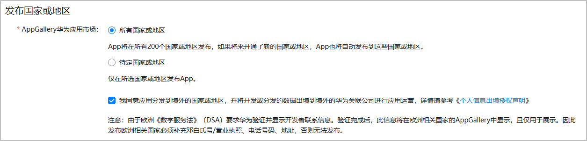

* 当前HarmonyOS NEXT应用仅为智能手表和运动手表设备提供全球地区的消费者服务。其他设备仅在中国大陆地区提供服务，发布至海外暂时无法提供客户端下载。
* 华为方在审核应用时会检查您的应用是否符合对应国家或地区的政策、宗教文化等要求，如不符合，会将该国家或地区从分发国家或地区中去除。应用审核通过后，您可在对应的应用版本信息界面的“发布国家或地区”位置查看最终分发范围。

设置应用分发的国家或地区后，对应国家或区域的用户即可发现获取您的应用。

1. 登录[AppGallery Connect](https://developer.huawei.com/consumer/cn/service/josp/agc/index.html)，点击“APP与元服务”。
2. 选择要发布的应用。
3. 左侧导航选择“应用上架 > 版本信息”下待发布的版本。
4. 进入“发布国家或地区”区域，勾选发布的国家或地区。
   * 选择“所有国家或地区”：应用将在所有国家或地区发布。如果未来新增了其他国家或地区，应用也将自动发布到这些国家或地区。
   * 选择“特定国家或地区”：应用仅在所选国家或地区发布。如您勾选下方的“新国家或区域”，华为应用市场会对未来新增的国家或地区自动发布您的应用。

   
5. 当您选择了“所有国家或地区”，或者“特定国家或地区”中选择了非中国大陆的国家或地区，则需要勾选“同意应用数据出境声明”，否则将导致您应用无法提交审核。声明的具体内容，请参见[个人信息出境授权声明](https://developer.huawei.com/consumer/cn/doc/app/20250303)。
