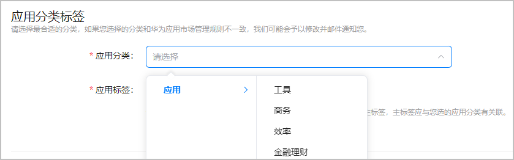
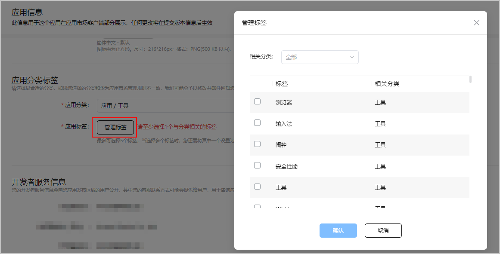

用户会通过应用市场上的类别来发现他们想要的应用，设置的类别将影响到应用的曝光度。

1. 登录[AppGallery Connect](https://developer.huawei.com/consumer/cn/service/josp/agc/index.html)，点击“APP与元服务”。
2. 选择要发布的应用。
3. 左侧导航选择“应用上架 > 应用信息”。
4. 进入“应用分类标签”区域，参考华为应用市场[应用分类规则](/docs/distribute/app-dist/app-services/classification-0000002068852289/classify-0000001960172909)，选择应用分类。

   
5. 点击“管理标签”，选择应用的标签。

   最多可以选择5个标签，且必须设置其中一个为主标签，主标签必须与您设置的二级分类相关联。选择标签时，可以根据二级分类进行筛选。

   

   运动手表设备只需设置分类，暂不支持设置标签。

   
