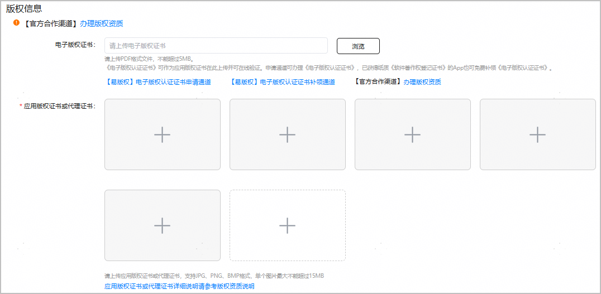
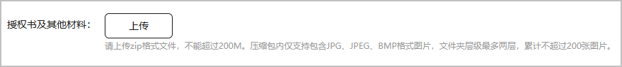

按照法律法规要求，应用上架需要提供相应的资质文档，具体要求请参见[应用资质审核要求](/docs/distribute/app-dist/app-market/x50000/x80301)。

1. 登录[AppGallery Connect](https://developer.huawei.com/consumer/cn/service/josp/agc/index.html)，点击“APP与元服务”。
2. 选择要发布的应用。
3. 左侧导航选择“应用上架 > 版本信息”下待发布的版本。
4. 进入“版权信息”区域，上传版权资质文件。如果您的版权资质图片超过了最大支持数量，建议您将图片进行拼接后再上传。

   版权资质文件根据发布区域和设备类型要求略有不同。

   | 发布区域 | 电子版权证书 | 应用版权证书或代理证书 |
   | --- | --- | --- |
   | 包含中国大陆 | 可选。  可上传PDF格式“电子版权证书”，大小不超过5MB。如果您上传了非PDF格式的文件或是将非PDF格式的文件的扩展名改为PDF，均会弹出错误提示。 | 手机应用必选。  支持JPG、PNG、BMP格式，默认展示五个图片上传框，您可点击虚线框内的“+”号继续添加。最多添加10张图片，每张图片不超过15MB。 |
   | 不包含中国大陆 | 可选。  可上传PDF格式“电子版权证书”，大小不超过5MB。如果您上传了非PDF格式的文件或是将非PDF格式的文件的扩展名改为PDF，均会弹出错误提示。 | 可选。  支持JPG、PNG、BMP格式，默认展示五个图片上传框，您可点击虚线框内的“+”号继续添加。最多添加10张图片，每张图片不超过15MB。 |

   
5. 如果还提供授权书或其他资质文件，可以在“授权书及其他材料”上传。

   

   上传包要求如下：

   * 仅支持上传zip格式的压缩包文件，包大小不能超过200MB。
   * 压缩包只能包含JPG、JPEG、BMP格式图片，文件夹层级最多三层，累计不能超过200张图片。

   压缩包文件上传后会进行文件安全校验，请耐心等待1-3分钟至文件校验完毕。如校验过程中出现如下错误提示，请参考对应解决方案修改文件后重新上传。

   | 错误提示 | 解决方案 |
   | --- | --- |
   | 压缩包内图片数量超过上限 | 压缩包内图片数量超过200张，请适当删减图片再重新上传。 |
   | 压缩包大小超过上限 | 压缩包大小超过200MB，请适当缩减压缩包体积后再重新上传。 |
   | 压缩包解压后的文件大小超过上限 | 压缩包解压后整体文件大小超过1GB上限。请适当删减图片后再重新上传。 |
   | 压缩包内文件格式错误 | 压缩包内存在非指定格式（JPG、JPEG、BMP）的文件。请删除非指定格式文件后再重新上传。 |
   | 压缩包内文件层级超过上限 | 压缩包内文件夹层级超出3层上限。请合理安排文件夹层级目录，使其符合要求后再重新上传。 |
   | 压缩包解析失败 | 请排查压缩包内是否存在其他格式文件（如Mac系统打包产生的部分缓存文件），请使用Windows系统打包或者手动删除非法文件。 |
