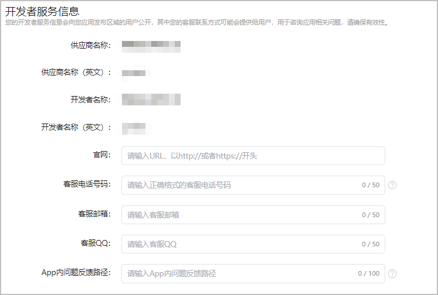

您作为开发者的相关信息将面向应用发布区域的用户公开，其中客服联系方式可能会提供给用户，用于咨询相关问题。

1. 登录[AppGallery Connect](https://developer.huawei.com/consumer/cn/service/josp/agc/index.html)，点击“APP与元服务”。
2. 选择要发布的应用。
3. 左侧导航选择“应用上架 > 应用信息”。
4. 进入“开发者服务信息”区域，编辑相关信息。
   * 供应商、开发者名称来自注册账号的信息，只读显示，无法修改。
   * 可编辑信息：
     + 官网：请输入以http://或https://开头的合法URL。此选项仅支持中国大陆企业/个人开发者、海外企业开发者的非游戏类应用 。
     + 客服电话号码：请使用“国际区号/国内区号-电话号码”的格式，如：0086-137xxxxxxxx、0755-xxxxxxxx。
     + 客服邮箱：请使用标准的邮箱格式。
     + 客服QQ：请使用正确的QQ。
     + App内问题反馈路径：请填写App内用户反馈问题的路径，如“华为应用市场 > 我的 > 帮助与客服”。

   

   

   
