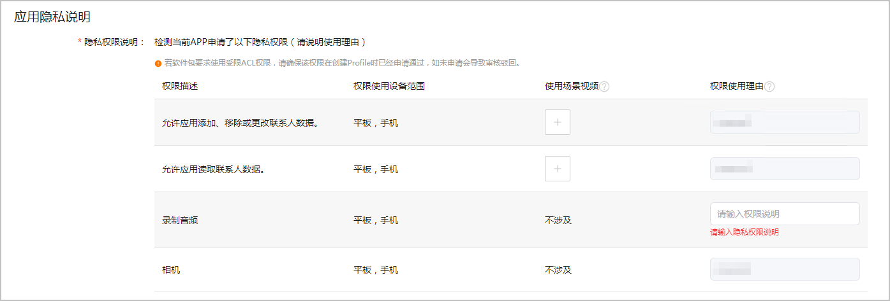

如果检测到您的应用中涉及获取敏感隐私权限或者使用受限开放权限，您需要填写“应用隐私说明”。

如果您软件包中声明使用了受限开放权限，请确保您创建的发布Profile也申请了对应权限，否则您的应用审核时将会被驳回。若申请不一致，请重新[申请发布Profile](/docs/distribute/agc/agc-help-profile-0000002270709473/agc-help-release-profile-0000002248341090)，签名打包后重新[上传软件包](/docs/distribute/agc/agc-help-release-app-0000002271695230/agc-help-release-app-upload-pkg-0000002277983368)。

1. 登录[AppGallery Connect](https://developer.huawei.com/consumer/cn/service/josp/agc/index.html)，点击“APP与元服务”。
2. 选择要发布的应用。
3. 左侧导航选择“应用上架 > 版本信息”下待发布的版本。
4. 进入“应用隐私说明”区域，根据检测结果填写相关内容。
   * 涉及获取敏感隐私权限：需要为每个权限项说明权限使用理由，无需上传使用场景视频。

     权限使用理由请参考软件包中module.json5文件的[reason字段内容规范](/docs/dev/app-dev/system/system-security/access-control/app-permission-mgmt/request-app-permissions/declare-permissions#权限使用理由的文案内容规 范)填写，如果系统已自动填充了reason中的内容，则无需再次填写。
   * 涉及获取受限开放权限：需要为每个权限项说明权限使用理由，并上传使用场景视频。
     + 使用场景视频：支持.mov,.mp4,.MOV,.MP4格式（编码格式为h.264），大小不超过500MB。
     + 权限使用理由：参考软件包中module.json5文件的[reason字段内容规范](/docs/dev/app-dev/system/system-security/access-control/app-permission-mgmt/request-app-permissions/declare-permissions#权限使用理由的文案内容规 范)填写，如果系统已自动填充了reason中的内容，则无需再次填写。权限使用理由不超过500个字符。

   
