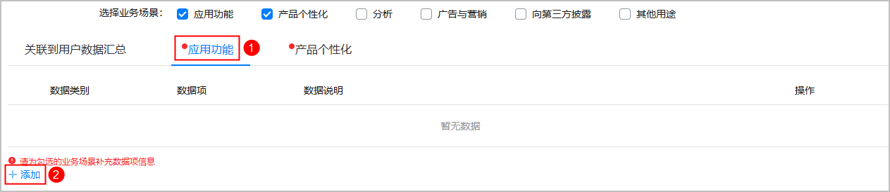
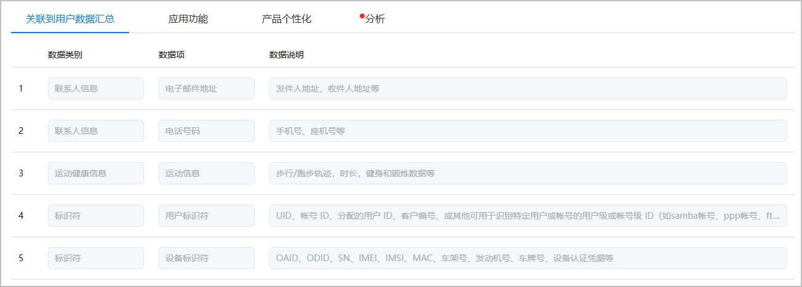

隐私标签将展示在应用详情页面，帮助用户提前了解应用使用个人数据的情况。

只有支持手机、平板、PC/2in1或智慧屏的HarmonyOS应用才需要配置此信息。

1. 登录[AppGallery Connect](https://developer.huawei.com/consumer/cn/service/josp/agc/index.html)，点击“APP与元服务”。
2. 选择要发布的应用。
3. 左侧导航选择“应用上架 > 版本信息”下待发布的版本。
4. 进入“隐私标签信息录入”区域，根据实际情况配置内容。
   * 如果不涉及收集用户的信息数据，“是否涉及个人信息收集”选择“否”，配置结束。
   * 如果涉及收集用户的信息数据，“是否涉及个人信息收集”选择“是”，继续配置。

   
5. 选择业务场景，最多支持同时勾选六种业务场景。

   

   如果您的应用中不涉及广告与营销的相关内容，请勿在业务场景中勾选“广告与营销”。

   
6. 依次选择业务场景对应的页签，点击左下角的“+添加”，配置相关数据项。业务场景和数据项具体内容参见[AppGallery隐私标签介绍](/docs/distribute/app-dist/app-market/privacy-label)。

   
7. 配置完所有业务场景的数据项后，可到“关联到用户数据汇总”页签查看全部数据。

   

   每个业务场景下的数据项不能为空，如果存在未配置数据项的业务场景，相应业务场景页签左上角将有红点提示。

   
