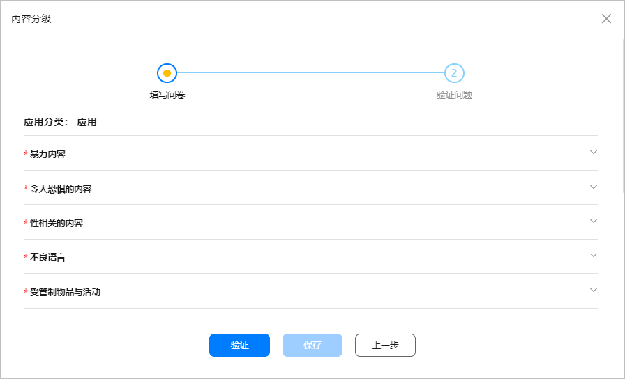

内容分级用于标识您的应用适宜用户的年龄段。年龄分级作为应用的重要属性，在华为应用市场的应用详情页展示给用户，帮助用户找到适合其年龄段的应用，从而为未成年人用户打造纯净的使用环境。

AGC提供了调查问卷，根据您回答的内容，自动生成年龄分级结果。请根据实际情况如实填写。

1. 登录[AppGallery Connect](https://developer.huawei.com/consumer/cn/service/josp/agc/index.html)，点击“APP与元服务”。
2. 选择要发布的应用。
3. 左侧导航选择“应用上架 > 版本信息”下待发布的版本。
4. 进入“内容分级”区域，点击“设置”。

   
5. 在弹出窗口点击“填写调查问卷”。

   
6. 填写问卷中的问题，中途可点击“保存”保存已完成的内容。全部填写完成，点击“验证”，获取年龄分级结果。

   

   * 请务必据实填写问卷中的问题，对应用内容虚假陈述可能会导致应用的下架或冻结。
   * 如果点击“验证”，结果显示“拒绝评级”，请查看拒绝评级的详细原因，修改不当内容后重新上传符合规范的应用。

   
7. 基于计算的最低年龄分级结果，结合应用情况，选择合适的年龄分级，然后点击“提交”。

   例如计算结果是“12+”或者更低龄，但您认为内容更适合18+的用户，可选择您预期的年龄。发布后，在华为应用市场将展示您设置的“18+”。

   
8. 如果您最终选择的年龄分级为3、8或者12，点击“提交”后，您还需再次确认您的应用是否仅面向儿童。
   * 选择“是”：如果应用分类是儿童类，点击“确认”成功提交分级；如果应用分类不是儿童类，则需要前往“应用信息”页面[配置应用分类](/docs/distribute/agc/agc-help-release-app-0000002271695230/agc-help-release-app-class-tag-0000002271695234)为儿童类。
   * 选择“否”：点击“确认”成功提交分级。

   
9. 提交分级后，即可查看详细的年龄分级结果。

   

   

   * 年龄分级问卷可能会不定期更新。如果年龄分级问卷内容发生变更，系统会提醒您“问卷已更新，请重新填写调查问卷”，您需重新填写年龄分级问卷，才可以提交应用上架申请。
   * 更新应用版本时，如果新版本会影响调查问卷中的答案，您需要重新作答提交问卷；如果没有影响，则无需重新作答，系统将继承之前的年龄分级结果。
