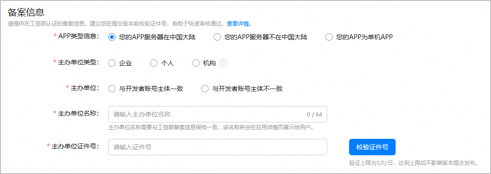

根据[《工业和信息化部关于开展移动互联网应用程序备案工作的通知》](https://www.miit.gov.cn/zwgk/zcwj/wjfb/tz/art/2023/art_920db564162e4312916a01bed6540ad8.html)要求，APP主办者应当依照[《中华人民共和国反电信网络诈骗法》](https://www.miit.gov.cn/jgsj/zfs/fl/art/2022/art_d30139b442a141f48f05775d8c0b3cee.html)第二十三条“设立移动互联网应用程序应当按照国家有关规定向电信主管部门办理许可或者备案手续”相关规定履行核准（备案）手续。未履行核准（备案）手续，不得从事APP互联网信息服务。

请参考[APP核准（APP备案）指引](https://developer.huawei.com/consumer/cn/doc/app/50130)，填写应用在工信部认证的核准（备案）信息。

