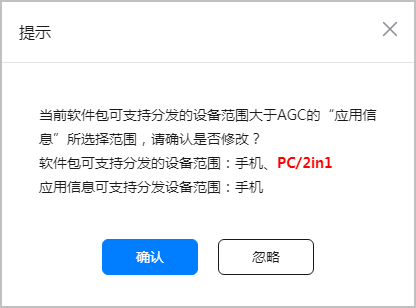
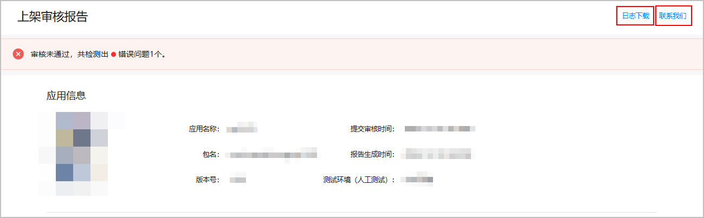
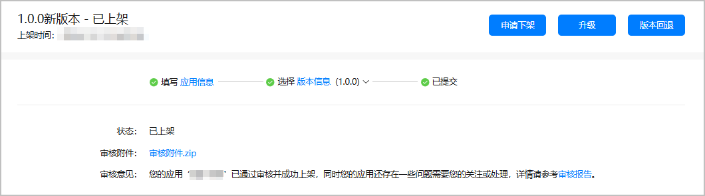

完成所有应用信息和版本信息的配置后，您即可将应用提交至华为方进行发布审核。

1. 登录[AppGallery Connect](https://developer.huawei.com/consumer/cn/service/josp/agc/index.html)，点击“APP与元服务”。
2. 选择要发布的应用。
3. 左侧导航选择“应用上架 > 版本信息”下待发布的版本。
4. 点击右上角的“提交审核”。
5. 在弹出的窗口中确认版本号无误后，点击“确认”。

   如果软件包中支持的设备类型范围大于配置支持设备时选择的设备范围，并且软件包支持PC/2in1设备而配置设备未勾选PC/2in1设备时，将提示您修改配置的支持设备。

   * 如需修改，点击“确认”前往应用信息页面[修改支持设备](https://developer.huawei.com/consumer/cn/doc/app/agc-help-release-app-devicetype-0000002271592112)。
   * 如不需要修改，点击“忽略”即可，不会影响应用的审核。

   
6. 提交成功后，可前往“应用上架 > 版本信息”下待发布的版本界面查看审核状态。
   * 未通过审核：在“审核意见”栏查看审核结果。点击“审核报告”，可查看详细内容并根据报告内容修复问题。

     

     若审核报告中的问题点涉及日志，可点击右上角“日志下载”，下载日志来帮助定位问题。

     若仍有疑问，可点击右上角“联系我们”，选择与华为客服在线互动，或通过邮箱反馈疑问。

     
   * 通过审核，但仍存在需要优化或修复的问题：在“审核意见”栏查看审核结果。点击“审核报告”，可查看详细内容并根据报告内容修复问题。为不影响版本后续正常发布，请在下个版本修复问题。

     
