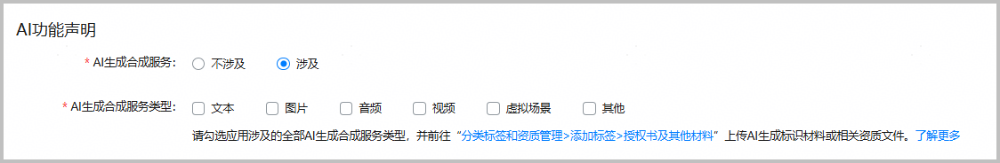

按照法律法规要求，应用程序在上架或者上线审核时，应用程序服务提供者应说明是否提供人工智能生成合成服务。详细内容参见[人工智能生成合成内容标识常见问题](/docs/distribute/app-dist/app-market/x50000/x50111/x50111-10)。

1. 登录[AppGallery Connect](https://developer.huawei.com/consumer/cn/service/josp/agc/index.html)，点击“快速开始”中的“元服务一站式平台”卡片。

   
2. 在左上角下拉列表选择要发布的元服务。

   
3. 左侧导航选择“元服务上架 > 版本信息”下待发布的版本。
4. 进入“AI功能声明”区域，根据实际情况配置内容。
   * 如果软件包中不包含人工智能生成合成内容，“AI生成合成服务”选择“不涉及”，配置结束。
   * 如果软件包中包含人工智能生成合成内容，“AI生成合成服务”选择“涉及”，继续配置，选择涉及的AI生成合成服务类型并前往“分类标签和资质管理 > 添加标签 > 授权书及其他材料”上传AI生成标识材料或相关资质文件，具体要求请参见[配置应用分类、标签和资质信息](/docs/distribute/agc/agc-help-release-atomic-0000002327731065/agc-help-release-atomic-class-tag-0000002293651518)。

   
