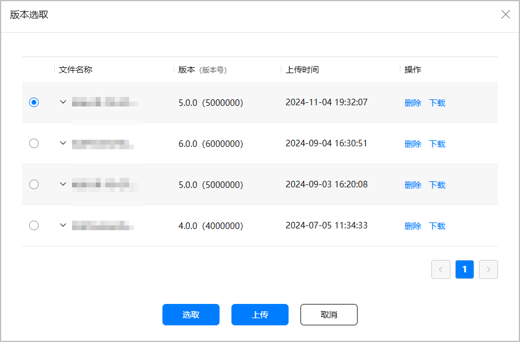
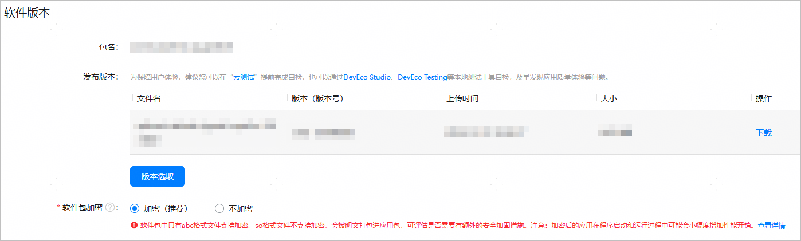

从上传的版本中选择需要发布的软件包。

#### 前提条件

已[上传软件包](https://developer.huawei.com/consumer/cn/doc/app/agc-help-release-atomic-upload-pkg-0000002293811142)，且软件包同时满足如下条件：

* “使用场景”为“测试和正式上架”。
* [合法性检测](https://developer.huawei.com/consumer/cn/doc/app/agc-help-release-atomic-upload-pkg-0000002293811142#section161521438134716)结果为“已达标”。

#### 操作步骤

1. 登录[AppGallery Connect](https://developer.huawei.com/consumer/cn/service/josp/agc/index.html)，点击“快速开始”中的“元服务一站式平台”卡片。

   
2. 在左上角下拉列表选择要发布的元服务。

   
3. 左侧导航选择“元服务上架 > 版本信息”下待发布的版本。
4. 进入“软件版本”区域，点击“版本选取”。

   
5. 弹出窗口将展示已上传的、通过合法性检测的软件包，选择待发布的软件包，点击“选取”。

   
6. 当您发布软件包的API Level ≥ 11时，可以设置是否对软件包进行加密。加密的影响、效果详细参见[应用加密](https://developer.huawei.com/consumer/cn/doc/harmonyos-guides/code-protect)。
   * 加密：用户在客户端安装的软件包为加密的，安全性较高。
   * 不加密：用户在客户端安装的软件包为不加密的，应用的启动速率较快。

   

   如果元服务的设备仅包含运动手表，则不支持加密。

   
7. 当您的元服务正式版本下架之后，再次上架时，选取软件包的版本号要高于历史发布过的全网版本号。不满足要求的软件包无法选择，如下图：

   
