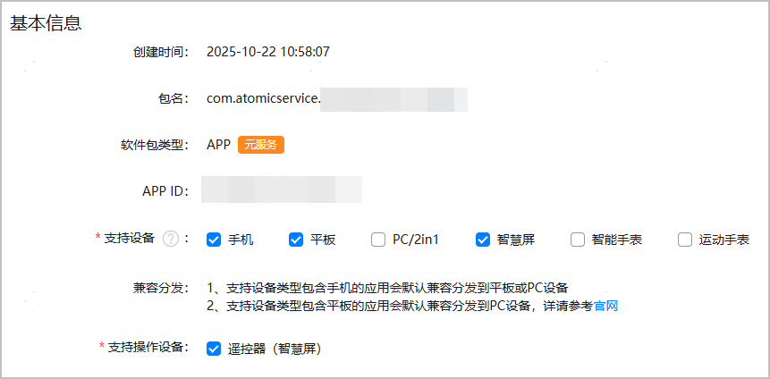

发布时，您可以为元服务配置分发至多种设备，默认发布设备为您创建元服务时选择的设备类型，您可以根据实际情况进行修改。您只需发布一次，用户即可在多种设备上使用您的元服务。

1. 登录[AppGallery Connect](https://developer.huawei.com/consumer/cn/service/josp/agc/index.html)，点击“快速开始”中的“元服务一站式平台”卡片。

   
2. 在左上角下拉列表选择要发布的元服务。

   
3. 左侧导航选择“元服务上架 > 应用信息”。
4. 进入“基本信息”区域，根据您软件包里声明的设备（即module.json5配置文件中[“deviceTypes”标签](https://developer.huawei.com/consumer/cn/doc/harmonyos-guides/module-configuration-file#devicetypes标 签)的枚举值）勾选对应的支持设备，确保软件包里声明的设备范围大于等于此处勾选的支持设备范围。

   

   * 在元服务提交上架前，您可随时修改设备，支持由单设备改为多设备，或多设备改为单设备。但是一旦发布，升级版本只支持增加设备，无法删除已选择的设备。
   * 当设备类型包含手机时，即便包里未声明平板，元服务也会默认以兼容的方式分发到HarmonyOS NEXT平板。若您已在包中声明了平板设备，请直接在“支持设备”栏勾选“平板”。
   * 手机和平板元服务经过测试后会默认发布到PC/2in1，为了提供更好的用户体验，请了解PC/2in1设备相对其他设备的[差异](https://developer.huawei.com/consumer/cn/doc/best-practices/bpta-pc-guide#section1650910471918)。如有疑问，请联系华为接口人或者[客服](https://developer.huawei.com/consumer/cn/support/feedback/#/)。
   * 智慧屏设备还支持选择遥控器作为操作设备。

   
