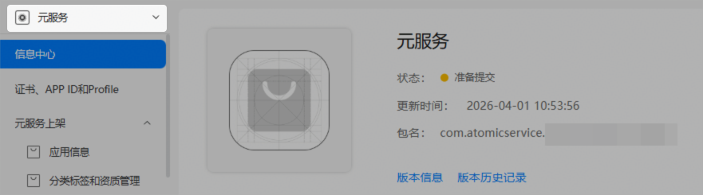

发布元服务时，您需要提供隐私政策，便于用户了解元服务的数据收集和使用情况。

元服务必须先使用AGC的隐私声明托管服务生成自己的隐私声明，才能在版本信息页面选择到。详细内容参见[配置隐私政策（元服务）](/docs/distribute/agc/agc-help-privacy-policy-0000002316794885/agc-help-privacy-policy-atomic-0000002317135133)和[配置用户协议](/docs/distribute/agc/agc-help-privacy-policy-0000002316794885/agc-help-privacy-user-agreement-0000002282265450)。

1. 登录[AppGallery Connect](https://developer.huawei.com/consumer/cn/service/josp/agc/index.html)，点击“快速开始”中的“元服务一站式平台”卡片。

   
2. 在左上角下拉列表选择要发布的元服务。

   
3. 左侧导航选择“元服务上架 > 版本信息”下待发布的版本。
4. 进入“隐私声明”区域，选择您生成的隐私政策和用户协议。

   
