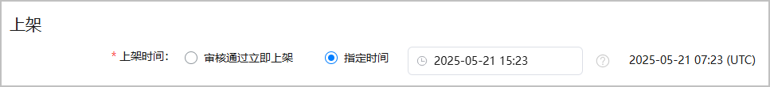
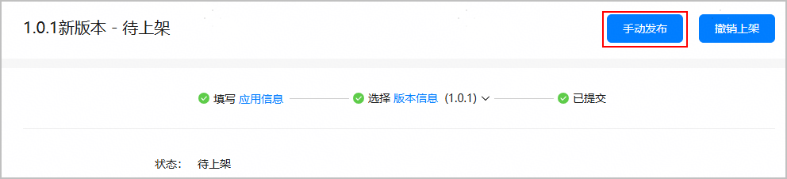

#### 设置上架时间

您可以选择让元服务审核通过后立即上架，也可以指定一个特定时间上架。

1. 登录[AppGallery Connect](https://developer.huawei.com/consumer/cn/service/josp/agc/index.html)，点击“快速开始”中的“元服务一站式平台”卡片。

   
2. 在左上角下拉列表选择要发布的元服务。

   
3. 左侧导航选择“元服务上架 > 版本信息”下待发布的版本。
4. 进入“上架”区域，设置上架时间。

   指定时间：选择时为您的本地时间，设置完成后，系统将自动转换成UTC标准时间，并显示在时间框后。

   

   如果后续需要在指定时间前上架，可以[手动发布待上架元服务](#section0726113812279)。

   

#### 手动发布待上架元服务

如果您之前设置了指定时间上架，审核通过后您又想在设定时间之前上架，则可以手动发布上架。

1. 登录[AppGallery Connect](https://developer.huawei.com/consumer/cn/service/josp/agc/index.html)，点击“快速开始”中的“元服务一站式平台”卡片。

   
2. 在左上角下拉列表选择要发布的元服务。

   
3. 左侧导航选择“元服务上架 > 版本信息”下待发布的版本。
4. 点击右上角的“手动发布”。

   
5. 点击“确认”。

   手动发布一般在几分钟内生效。
