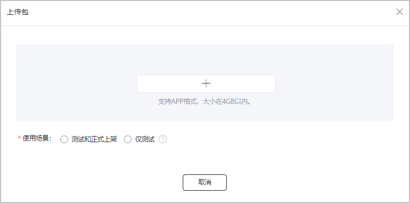
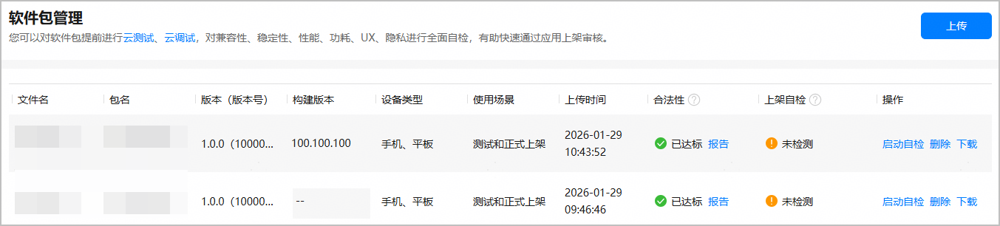
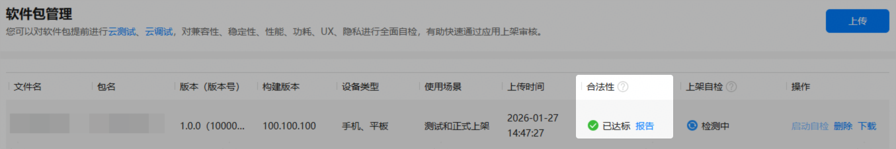
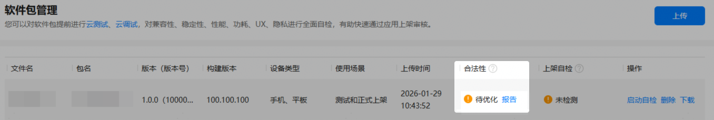
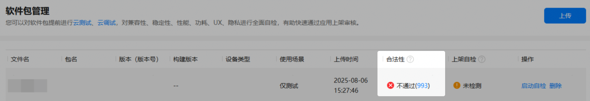
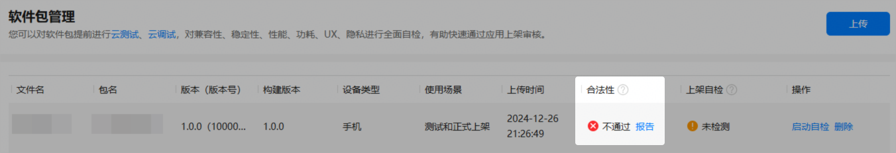
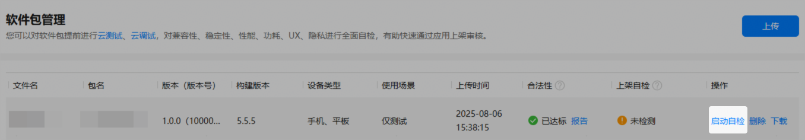
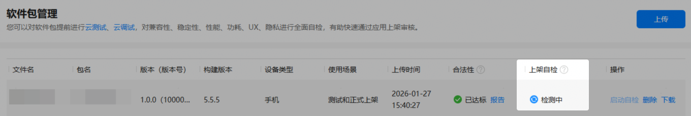
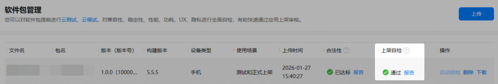
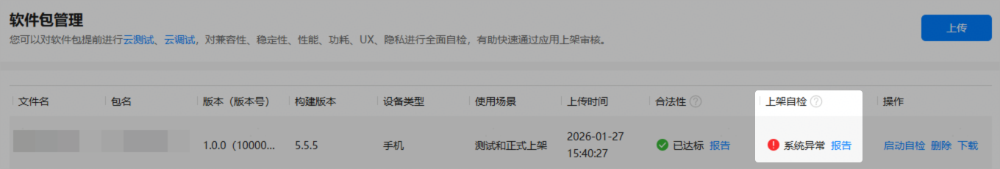

您需要先上传待发布的正式版本，以便在发布时能选择到对应的版本。上传时，AppGallery Connect会对上传的包进行合法性检测，同时还提供了上架自检功能来助您提高应用审核通过率。

#### 提交软件包

1. 登录[AppGallery Connect](https://developer.huawei.com/consumer/cn/service/josp/agc/index.html)，点击“快速开始”中的“元服务一站式平台”卡片。

   
2. 在左上角下拉列表选择要发布的元服务。

   
3. 左侧导航选择“元服务上架 > 软件包管理”，点击页面右上角的“上传”。
4. 在“上传包”窗口，先选择“使用场景”，然后点击“+”上传软件包。

   若上传的软件包只用于测试发布，可以选择“仅测试”。若软件包需要在全网正式发布，请选择“测试和正式上架”。

   

上传完成后，软件包管理页面会生成一条记录，展示软件包基本信息。

* 文件名：软件包文件名。
* 包名：元服务包名，对应包内的bundleName字段。
* 版本（版本号）：版本名称与版本号，分别对应包内的versionNumber和versionCode字段。
* 构建版本：构建版本号，用于区分同一主版本下的不同测试子版本，对应包内的buildVersion字段。如包内无buildVersion字段，则显示“--”。
* 设备类型：支持的设备类型，对应包内的deviceTypes字段。
* 使用场景：传包时选择的使用场景。
* 上传时间：上传包的时间。
* 合法性：合法性检测结果，具体请参见[合法性检测](#section161521438134716)。
* 上架自检：上架自检结果，具体请参见[上架自检](#section15203163921310)。

#### 合法性检测

AppGallery Connect会对每个上传的包进行合法性检测，检测不通过的软件包不允许发布。您可以在软件包记录中查看合法性检测结果。

1. 登录[AppGallery Connect](https://developer.huawei.com/consumer/cn/service/josp/agc/index.html)，点击“快速开始”中的“元服务一站式平台”卡片。

   
2. 在左上角下拉列表选择要发布的元服务。

   
3. 左侧导航选择“元服务上架 > 软件包管理”，查看软件包对应的“合法性”栏。
   * 已达标：表示软件包完全满足鸿蒙生态规范要求，可以提交上架。

     

     点击“报告”，可查看检测结果详情。如下图示例，已达标的软件包各个检查项结果均为“通过”。

     
   * 待优化：表示软件包允许提交上架，但仍存在一些问题可能导致后续被审核驳回，或者影响应用体验，建议进一步优化软件包。

     

     点击“报告”，可查看检测结果详情。如下图示例，“结果”列显示“告警”的检查项即为可优化项，“修改意见”列提供了解决措施。

     

     以上图鸿蒙生态规则检测项为例，按“修改意见”列提示，点击“详情”链接，打开错误详情报告页，根据建议修改即可。

     
   * 不通过：表示软件包不满足上架基本要求，不允许上架。
     + 若“不通过”后显示错误码，如下图“993”，可点击错误码链接查看相关FAQ，根据FAQ提供的原因与建议进行修改。

       
     + 若“不通过”后显示“报告”，可点击“报告”打开检测结果详情页。

       

       如下图示例，“结果”列显示“不通过”的检查项即为必改问题，请根据“修改意见”列修改包。

       

#### （推荐）上架自检

为提高元服务审核通过率，建议您使用上架自检功能。该功能使用热门移动终端设备，按照华为应用市场上架标准对元服务进行兼容性、稳定性、性能、功耗、UX、隐私等测试，可帮助您提前发现和解决问题。

1. 登录[AppGallery Connect](https://developer.huawei.com/consumer/cn/service/josp/agc/index.html)，点击“快速开始”中的“元服务一站式平台”卡片。

   
2. 在左上角下拉列表选择要发布的元服务。

   
3. 左侧导航选择“元服务上架 > 软件包管理”，点击软件包“操作”列“启动自检”。

   

   每个元服务同时只能进行1个上架自检任务。若您在启动自检后删除了软件包，自检任务将继续执行，需等待自检任务结束才可以执行新的自检任务。

   
4. 在“上架自检”栏查看检测进度与结果。检测完成后，AGC将发送邮件通知您，您可以点击邮件中的“软件包管理”链接前往“软件包管理”页面查看检测结果。
   * 检测中：表示正在检测软件包。检测时长可能受终端设备数量和排队情况影响，请耐心等待。

     
   * 通过：表示检测通过，可以提交上架。点击“报告”可查看详细的检测报告。

     
   * 待优化：表示检测未通过。点击“报告”可查看详细的异常信息与日志等。若合法性检测通过、但上架自检未通过，不影响元服务提交上架申请，但存在被审核驳回的风险，推荐您基于报告定位和修改问题。

     
   * 系统异常：表示系统发生错误。点击“报告”可查看详细原因。如不展示“报告”，请点击“启动自检”重试。若还有疑问，请[联系客服](https://developer.huawei.com/consumer/cn/service/josp/agc/index.html#/interactive/feedback/1/)。

     
