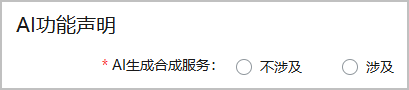
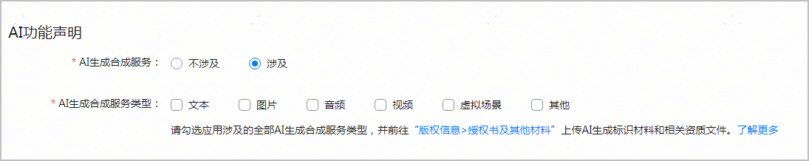

按照法律法规，游戏在提交上架时，需要声明是否在游戏中使用人工智能生成合成服务。

请根据[人工智能生成合成内容标识常见问题](https://developer.huawei.com/consumer/cn/doc/app/50111-10)，识别并上传AI生成标识材料和相关资质材料。

1. 登录[AppGallery Connect](https://developer.huawei.com/consumer/cn/service/josp/agc/index.html)，点击“APP与元服务”，选择待发布的游戏。
2. 左侧导航栏选择“应用上架 > 版本信息”下待发布的版本。
3. 进入右侧页面的“AI功能声明”区域，根据实际情况配置：
   * 若游戏中不包含AI生成合成内容：“AI生成合成服务”选择“不涉及”，配置结束。
   * 若游戏中包含AI生成合成内容，“AI生成合成服务”选择“涉及”，继续配置。

   
4. 选择游戏中涉及AI生成合成的服务类型，并在[上传版权材料](https://developer.huawei.com/consumer/cn/doc/app/agc-help-release-game-copyright-0000002401259413)的“授权书及其他材料”上传AI生成标识材料和相关资质文件。

   
