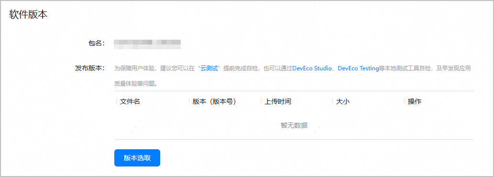

请选择待发布的游戏软件包，并设置是否加密游戏软件包。

#### 前提条件

[已上传软件包](https://developer.huawei.com/consumer/cn/doc/app/agc-help-release-game-upload-pkg-0000002399249081)，且游戏软件包同时满足如下条件：

* 游戏软件包的“使用场景”是“测试和正式上架”。
* [检测软件包的合法性](https://developer.huawei.com/consumer/cn/doc/app/agc-help-release-game-upload-pkg-0000002399249081#section965714815550)结果为“已达标”。

#### 操作步骤

1. 登录[AppGallery Connect](https://developer.huawei.com/consumer/cn/service/josp/agc/index.html)，点击“APP与元服务”，选择待上架的游戏。
2. 左侧导航栏选择“应用上架 > 版本信息”下待发布的版本。
3. 进入右侧页面的“软件版本”区域，点击“版本选取”。

   
4. 在弹出的“版本选取”窗口中选择用于正式上架的游戏软件包，点击“选取”完成选择。

   
5. 若游戏软件包API Level ≥ 11，要求设置是否加密软件包：
   * （推荐）加密：玩家在手机设备上安装的是加密后的游戏软件包，安全性较高。加密游戏软件包的影响和效果请参见[应用加密](https://developer.huawei.com/consumer/cn/doc/harmonyos-guides/code-protect)。
   * 不加密：玩家在手机设备上安装的是不加密的游戏软件包，游戏的启动速度较快。

   
