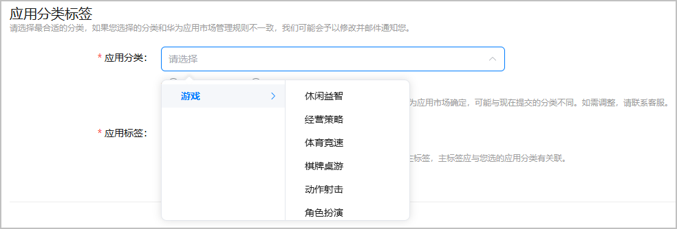
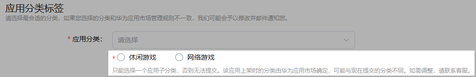
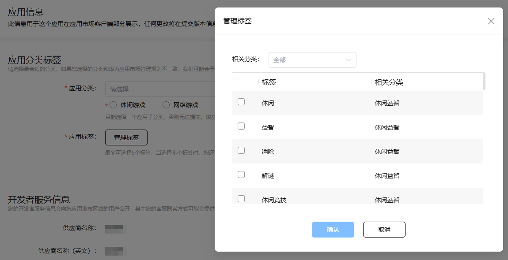

因游戏分类标签规则有调整，请未配置新分类标签的游戏重新选择游戏分类和游戏标签。

请选择正确的游戏分类、游戏标签，玩家可以通过应用市场的分类搜索游戏。

1. 登录[AppGallery Connect](https://developer.huawei.com/consumer/cn/service/josp/agc/index.html)，点击“APP与元服务”，选择待上架的游戏。
2. 左侧导航栏选择“应用上架 > 应用信息”。
3. 进入右侧页面的“应用分类标签”区域，根据游戏玩法选择游戏分类。

   全部游戏分类请参见[游戏分类](/docs/distribute/app-dist/app-services/classification-0000002068852289/classify-0000001960172909#section1164316401147)。

   
4. 根据版号类型圈选“休闲游戏”或“网络游戏”：
   * 休闲游戏：主要指以休闲娱乐为主的游戏，如休闲竞技、体育竞速、塔防、沙盒、模拟经营、动作肉鸽和独立游戏等。
   * 网络游戏：包含多人在线实时对战或协作的射击、MOBA、角色扮演、卡牌策略、战争策略（SLG）及二次元题材游戏，具备社交、养成、PVP/PVE等玩法，强调联网互动与持续内容更新。

   
5. 选择游戏标签。

   点击“管理标签”，请选择与游戏内容强相关的标签，最多选择5个，要求至少选择1个与游戏分类相关的标签。

   若选择多个标签时，请选择其中一个标签为主标签，要求主标签与游戏分类相关。

   全部游戏标签请参见[游戏分类](/docs/distribute/app-dist/app-services/classification-0000002068852289/classify-0000001960172909#section1164316401147)。

   

   “运动手表”仅需设置分类，暂不支持设置标签。

   
