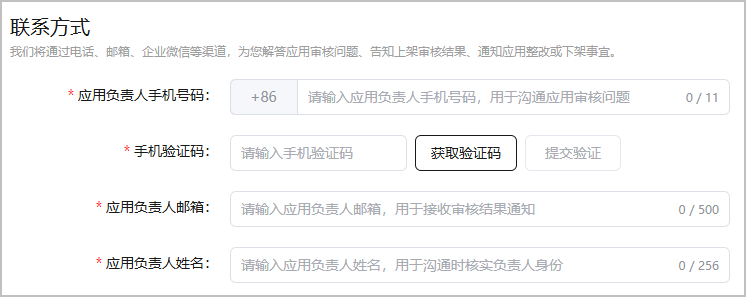

若账号归属地为中国大陆，请填写游戏负责人的联系方式，方便审核人员与您沟通游戏上架的审核问题。

1. 登录[AppGallery Connect](https://developer.huawei.com/consumer/cn/service/josp/agc/index.html)，点击“APP与元服务”，选择待上架的游戏。
2. 左侧导航栏选择“应用上架 > 版本信息”下待发布的版本。
3. 进入右侧页面的“联系方式”区域，根据提示填写信息。

   

   | 配置项 | 说明 |
   | --- | --- |
   | 应用负责人手机号码 | 请输入游戏负责人的手机号码。  该手机号将用于沟通游戏上架审核问题。 |
   | 手机验收码 | 请输入手机验证码。  要求验证通过。 |
   | 应用负责人邮箱 | 请输入游戏负责人的邮箱。  该邮箱用于接收游戏上架审核结果、游戏整改、或游戏下架等通知。 |
   | 应用负责人姓名 | 请输入游戏负责人的姓名。  用于沟通问题时核实负责人身份。 |
