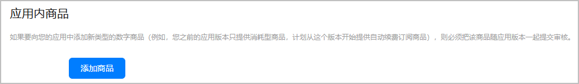

数字商品类型分为如下：

| 商品类型 | 说明 |
| --- | --- |
| 消耗型 | 随着使用减少，需要再次购买的商品，例如游戏货币，游戏道具。 |
| 非消耗型 | 只需购买一次，这类商品不会过期或随着使用而减少，例如去广告，升级专业版。 |
| 自动续期订阅 | 支持自动续期购买的商品，例如月度会员。 |
| 非续期订阅 | 在一段时间内，应用中可以使用的某项服务或内容，且到期不会自动续订。例如订阅一年的杂志内容。 |

首次提审或追加新类型的数据商品时，必须同时提交新的游戏版本，不能单独提交商品审核。

例如，老版本游戏内仅有“消耗型”类型的数字商品，新版本游戏内追加了“自动续期订阅”类型的数字商品，要求再次提审游戏版本，并关联本次新增类型下的商品。

* 若在已通过审核的数字商品类型下追加新的数字商品，可以单独在商品管理页面提交审核，具体操作请参见[提交已生效类型的数字商品](/docs/dev/game-dev/games-center-effective-digital-products-for-review-0000002320646005)。
* 若有多个商品共用计费点的情况（按档位计费），需要进行备注。

#### 前提条件

已根据[创建数字商品](/docs/dev/game-dev/games-center-create-digital-products-0000002286076724)，提前追加新类型的数字商品，且数字商品状态为“待审核”。

#### 操作步骤

1. 登录[AppGallery Connect](https://developer.huawei.com/consumer/cn/service/josp/agc/index.html)，点击“APP与元服务”，选择待上架的游戏。
2. 左侧导航栏选择“应用上架 > 版本信息”下待发布的版本.
3. 进入右侧页面的“应用内商品”区域，点击“添加商品”选择“待审核”状态的数字商品。

   
