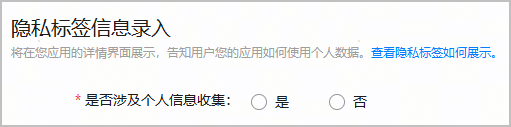
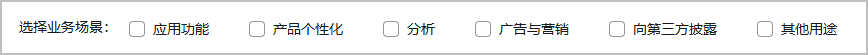
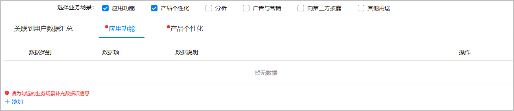

游戏发布设备类型包括手机、平板、PC/2in1、智慧屏时，要求配置隐私标签信息。

隐私标签帮助玩家提前了解游戏使用玩家个人数据的情况。隐私标签展示效果请参见[客户端展示效果](/docs/distribute/app-dist/app-market/privacy-label#h1-1683516845797-0)。

1. 登录[AppGallery Connect](https://developer.huawei.com/consumer/cn/service/josp/agc/index.html)，点击“APP与元服务”，选择待上架的游戏。
2. 左侧导航栏选择“应用上架 > 版本信息”下待发布的版本。
3. 进入右侧页面的“隐私标签信息录入”区域，根据实际情况勾选是否涉及个人信息收集：
   * 如果不涉及收集用户的信息数据，“是否涉及个人信息收集”选择“否”，配置结束。
   * 如果涉及收集用户的信息数据，“是否涉及个人信息收集”选择“是”，继续配置。

   
4. 请选择与游戏相关联的业务场景，最多支持同时勾选6种业务场景。

   

   若您的游戏中不涉及广告与营销的相关内容，请勿在业务场景中勾选“广告与营销”。

   
5. 依次在已勾选的业务场景下添加对应的数据项。

   业务场景和数据项具体内容参见[AppGallery隐私标签服务说明](/docs/distribute/app-dist/app-market/privacy-label)。

   
6. 配置完业务场景的数据项后，可在“关联到用户数据汇总”页签查看全部数据。

   

   业务场景页签下的数据项不能为空。若存在未配置数据项的业务场景，对应业务场景页签的左上角将有红点提示。

   
