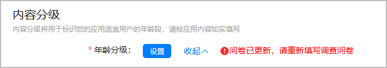
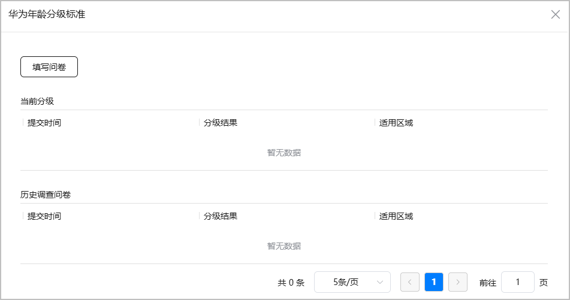
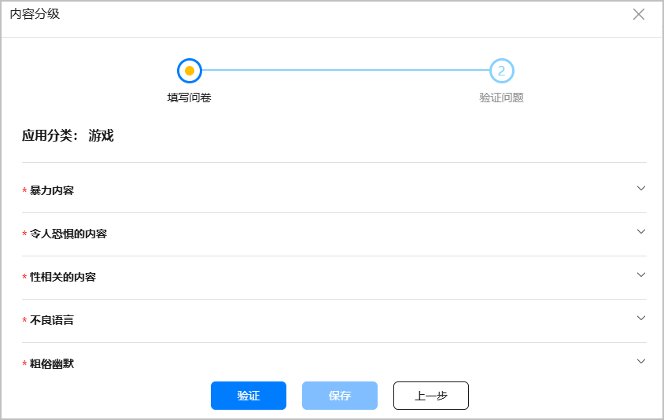
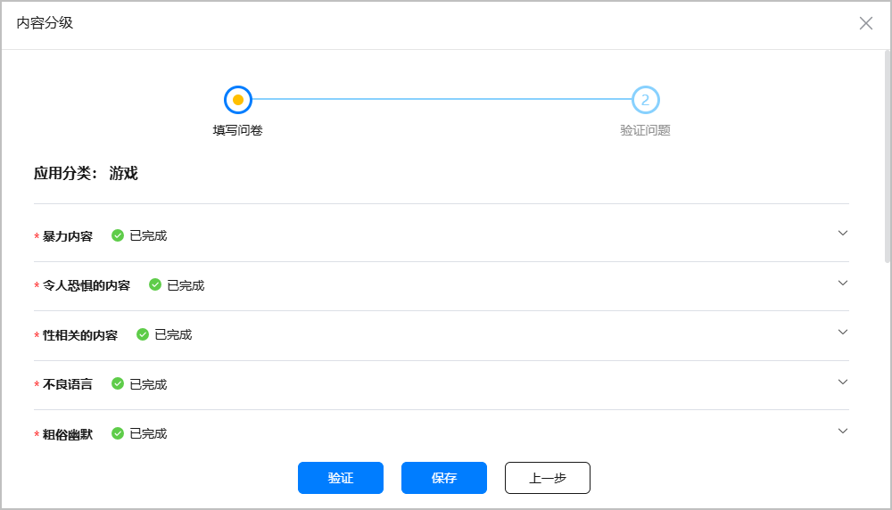
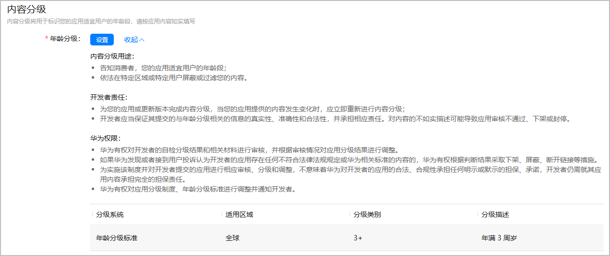

* 年龄分级问卷可能会不定期更新。如果年龄分级问卷内容发生变更，系统会提醒您“问卷已更新，请重新填写调查问卷”，您需重新填写年龄分级问卷，才可以提交游戏上架申请。
* 更新游戏版本时，如果新版本会影响调查问卷中的答案，您需要重新作答提交问卷；如果没有影响，则无需重新作答，系统将继承之前的年龄分级结果。

内容分级用于标识游戏适宜的年龄分级，年龄分级在应用市场的游戏详情页向玩家展示，帮助玩家找到适合其年龄段的游戏，从而为未成年人玩家打造纯净的游戏环境。

AppGallery Connect提供了调查问卷，根据游戏实际情况如实填写后自动生成年龄分级，并结合游戏内基于《网络游戏适龄提示》团体标准标注的适龄提示标识，最终选择游戏的年龄分级。

#### 前提条件

您的游戏已选择[游戏分类](https://developer.huawei.com/consumer/cn/doc/app/agc-help-release-game-class-0000002398530749)。

#### 操作步骤

1. 登录[AppGallery Connect](https://developer.huawei.com/consumer/cn/service/josp/agc/index.html)，点击“APP与元服务”，选择待上架的游戏。
2. 左侧导航栏选择“应用上架 > 版本信息”下待发布的版本。
3. 进入右侧页面的“内容分级”区域，点击“设置”。

   
4. 在弹出的“华为年龄分级标准”窗口中，点击“填写问卷”。

   
5. 在弹出的“内容分级”窗口上如实填写问卷。

   中途可点击“保存”保存已完成的内容。

   

   务必如实填写问卷中的问题，虚假陈述游戏内容可能会下架或冻结您的游戏。

   

   全部填写完成后，点击“验证”，获取年龄分级结果。

   若点击“验证”显示“拒绝评级”，请查看详细原因，并在修改不当内容后重新上传符合规范的游戏。

   
6. 根据问卷计算出的最低年龄分级结果，且不低于游戏内基于《网络游戏适龄提示》团体标准标注的适龄提示标识年龄段，重新选择适合游戏的年龄分级，完成后点击“提交”。

   例如，问卷结果的年龄分级是“3+”，但游戏内的适龄提示为“8+”，应重新选择“中国区年满8周岁，其它区域年满7周岁”年龄分级。在游戏上架后，华为应用市场将展示游戏适合的玩家年龄为“8+”。

   
7. 成功提交分级后，即可查看年龄分级结果。

   
