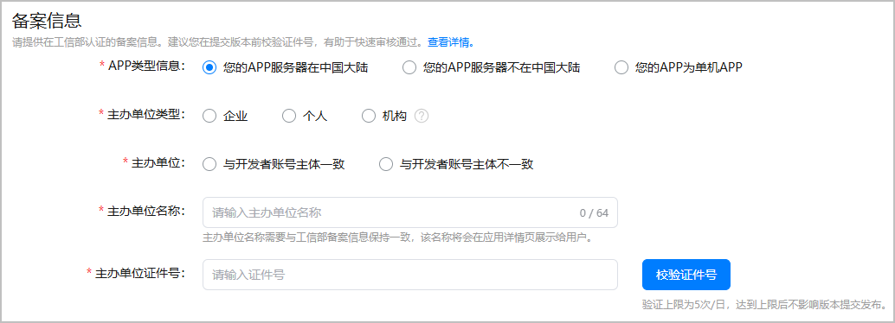

根据[《工业和信息化部关于开展移动互联网应用程序备案工作的通知》](https://www.miit.gov.cn/zwgk/zcwj/wjfb/tz/art/2023/art_920db564162e4312916a01bed6540ad8.html)要求，APP主办者应当依照[《中华人民共和国反电信网络诈骗法》](https://www.miit.gov.cn/jgsj/zfs/fl/art/2022/art_d30139b442a141f48f05775d8c0b3cee.html)第二十三条“设立移动互联网应用程序应当按照国家有关规定向电信主管部门办理许可或者备案手续”相关规定履行核准（备案）手续。未履行核准（备案）手续，不得从事APP互联网信息服务。

#### 前提条件

* 若您的APP服务器在中国大陆，您的游戏需要根据[APP核准（APP备案）指引](https://developer.huawei.com/consumer/cn/doc/App/50130)完成核准（备案）。
* 若您的APP服务器不在中国大陆，或者您的APP为单机APP，您的游戏无需核准（备案）。

#### 操作步骤

1. 登录[AppGallery Connect](https://developer.huawei.com/consumer/cn/service/josp/agc/index.html)，点击“APP与元服务”，选择待上架的游戏。
2. 左侧导航栏选择“应用上架 > 版本信息”下待发布的版本。
3. 进入右侧页面的“备案信息”区域，根据实际情况如实填写。

   信息填写指导请参见[APP核准（APP备案）指引](https://developer.huawei.com/consumer/cn/doc/app/50130)。

   
