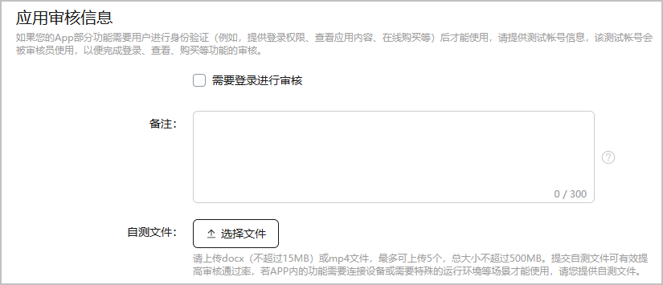

审核人员需要测试您的游戏。

若游戏的部分功能需要玩家通过身份验证后才能使用，例如登录权限、在线购买。请为审核人员提供测试账号，以便审核人员使用测试账号测试受限功能。

#### 前提条件

已根据[准备游戏信息和素材](https://developer.huawei.com/consumer/cn/doc/app/agc-help-release-game-prepare-0000002406557837#section1266325574712)准备应用审核信息的自测文件。

#### 操作步骤

1. 登录[AppGallery Connect](https://developer.huawei.com/consumer/cn/service/josp/agc/index.html)，点击“APP与元服务”，选择待上架的游戏。
2. 左侧导航栏选择“应用上架 > 版本信息”下待发布的版本。
3. 进入右侧页面的“应用审核信息”区域，根据提示填写信息。

   

   | 配置项 | 说明 |
   | --- | --- |
   | 需要登录进行审核 | 若游戏的部分功能要求登录后才能使用，需要勾选“需要登录进行审核”，并为审核人员提供测试账号。 |
   | 备注 | 为审核人员提供更准确、高效测试游戏的额外信息，例如使用受限功能时的特别设置。 |
   | 自测文件 | 若您的游戏存在特殊情况，例如，您的游戏在测试过程中需要连接设备、或您的游戏需要运行在特殊环境，请点击“上传文件”，上传提前准备好的测试录屏（.mp4）或指导文档（.docx）。 |
