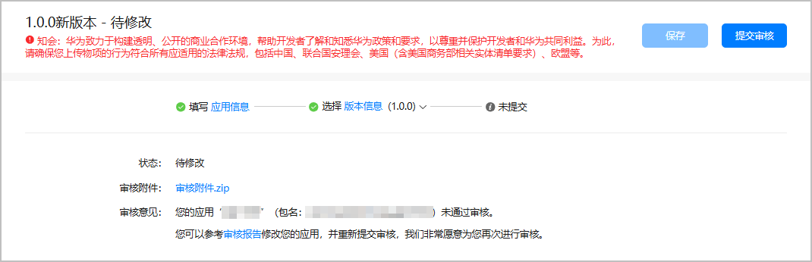
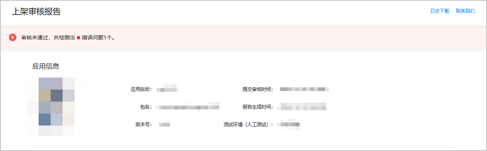

完成应用信息和版本信息的所有配置项后，您可以将游戏提交至审核人员。

1. 登录[AppGallery Connect](https://developer.huawei.com/consumer/cn/service/josp/agc/index.html)，点击“APP与元服务”，选择待上架的游戏。
2. 左侧导航栏选择“应用上架 > 版本信息”下待发布的版本，在右侧页面点击右上角的“提交审核”。
3. 在弹出的窗口中确认版本号无误后，点击“确认”。

   若游戏软件包中支持的设备范围大于在AppGallery Connect选择的设备范围，并且软件包支持PC/2in1设备而配置设备未勾选PC/2in1设备时，将提示修改设备类型。

   * 若修改，点击“确认”，前往“应用信息”页面[修改设备类型](/docs/distribute/agc/agc-help-release-game-0000002364930906/agc-help-release-game-devicetype-0000002398650613)。
   * 若不修改，点击“忽略”，不会影响游戏的上架审核。

   
4. 提交成功后，可前往“应用上架 > 版本信息”下待发布的版本界面查看审核状态。
   * **未通过审核****。**

     在“审核意见”栏查看审核结果。点击“审核报告”，可查看详细内容并根据报告内容修复问题。

     

     若审核报告中的问题点涉及日志，可点击右上角“日志下载”，下载日志来帮助定位问题。

     若还有疑问，可点击右上角“联系我们”，选择与华为客服在线互动，或通过邮箱反馈疑问。

     
   * **通过审核，但仍存在需要优化或修复的问题。**

     在“审核意见”栏点击“审核报告”，查看详细内容并根据报告内容修复问题。为不影响版本后续正常发布，请在下个版本修复问题。

     
