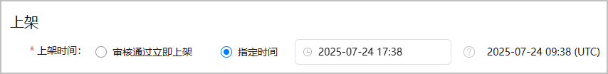

#### 设置上架时间

您的游戏可以在审核通过后立即上架，也可以指定一个特定时间进行上架。

1. 登录[AppGallery Connect](https://developer.huawei.com/consumer/cn/service/josp/agc/index.html)，点击“APP与元服务”，选择待上架的游戏。
2. 左侧导航栏选择“应用上架 > 版本信息”下待发布的版本。
3. 进入右侧页面的“上架”区域，设置游戏的上架时间：
   * **审核通过立即上架**：游戏审核通过后立即上架至华为应用市场。
   * **指定时间**：选择您的本地时间后，系统将自动转换成UTC标准时间，并显示在时间框后。若后续需要在指定时间前上架，可以[手动发布待上架游戏](#section9890195515586)。

   

#### 手动发布游戏

之前已设置在指定时间上架游戏，在游戏审核通过后，希望在指定时间前上架游戏。

此时，您可以选择手动发布游戏。

1. 登录[AppGallery Connect](https://developer.huawei.com/consumer/cn/service/josp/agc/index.html)，点击“APP与元服务”，选择要手动发布的游戏。
2. 左侧导航栏选择“应用上架 > 版本信息”下待发布的版本，在右侧页面点击右上角的“手动发布”。

   
