您需要先上传待发布的正式版本，以便在发布时能选择到对应的版本。上传时，AppGallery Connect会对上传的包进行合法性检测，同时还提供了上架自检功能来助您提高应用审核通过率。

#### 前提条件

确保游戏软件包已符合上架要求。软件包要求请参见[准备游戏软件包](https://developer.huawei.com/consumer/cn/doc/app/agc-help-release-game-prepare-0000002406557837#section24731651195720)。

#### 提交软件包

1. 登录[AppGallery Connect](https://developer.huawei.com/consumer/cn/service/josp/agc/index.html)，点击“APP与元服务”，选择待上架的游戏。
2. 左侧导航栏选择“应用上架 > 软件包管理”，在右侧页面点击“上传”。
3. 在弹出的“上传包”窗口中，先选择使用场景，再点击“+”上传游戏软件包。
   * 若上传的游戏软件包用于全网正式发布，请选择“测试和正式上架”。
   * 若上传的游戏软件包仅用于测试发布，请选择“仅测试”。

   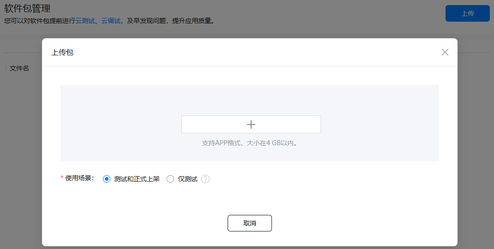

#### 检测软件包的合法性

AppGallery Connect会对每个上传的软件包进行合法性检测，检测不通过的游戏软件包不允许发布。

游戏软件包上传成功后，软件包管理页面会生成一条记录，您可以在“应用上架 > 软件包管理”的“合法性”列查看合法性检测结果。

主要有如下3种检测结果。

#### [h2]已达标

表示游戏软件包满足规范要求，可以用于正式上架。

您可以点击“报告”查看详细的检测指标。

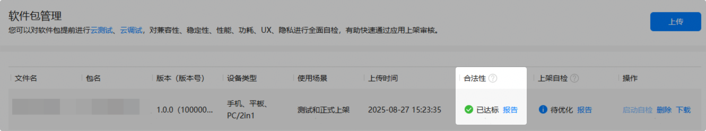

如下图示例，已达标的软件包各个检查项结果均为“通过”。

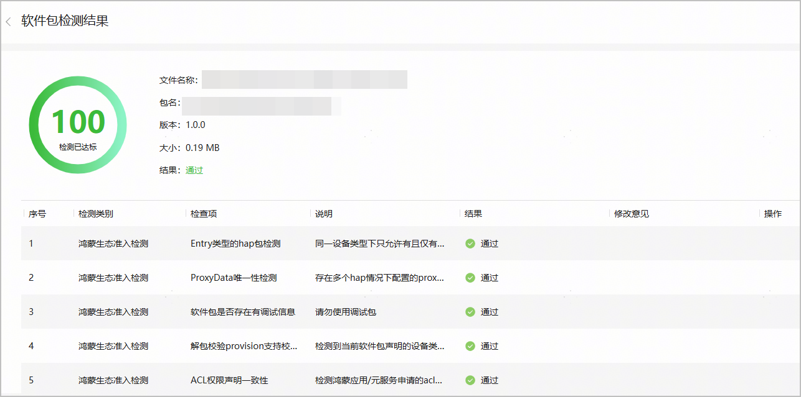

#### [h2]待优化

表示游戏软件包可以用于正式上架，但仍存在一些问题可能导致后续审核被驳回，或者影响游戏体验。

建议点击“报告”查看详细的检测报告。

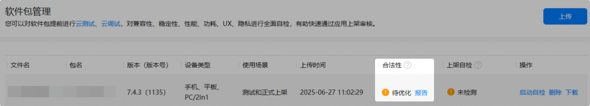

如下图所例，“结果”列显示“告警”的检查项即为可优化项，“修改意见”列提供了解决措施。

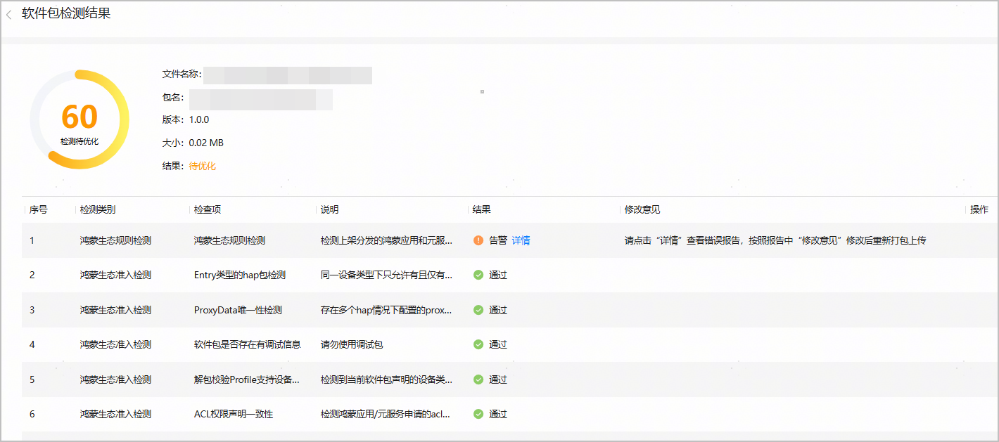

以“鸿蒙生态规则检测”项为例，按“修改意见”列提示，点击“详情”链接，打开错误详情报告页，根据建议修改即可。

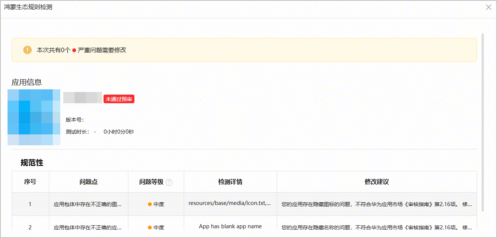

#### [h2]不通过

表示游戏软件包不满足上架要求，不允许用于正式上架。

* 情况一：“不通过”后展示错误码，请点击错误码查看对应FAQ，并根据FAQ提供的原因与建议进行修改。

  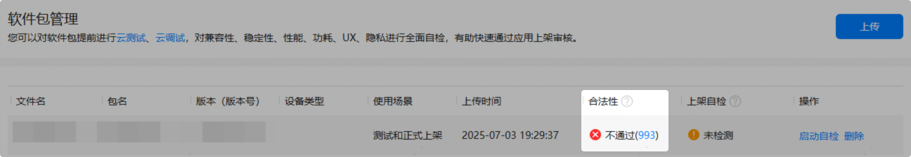
* 情况二：“不通过”后展示“报告”，请点击“报告”查看详细的检测报告。

  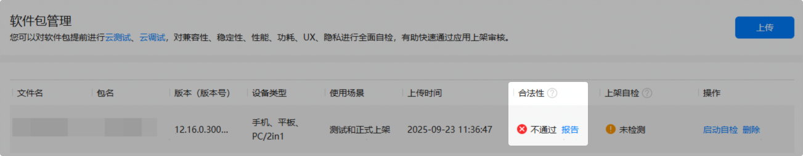

  如下图所示，根据检测报告进一步修改游戏软件包，并在修改后重新上传游戏软件包。

  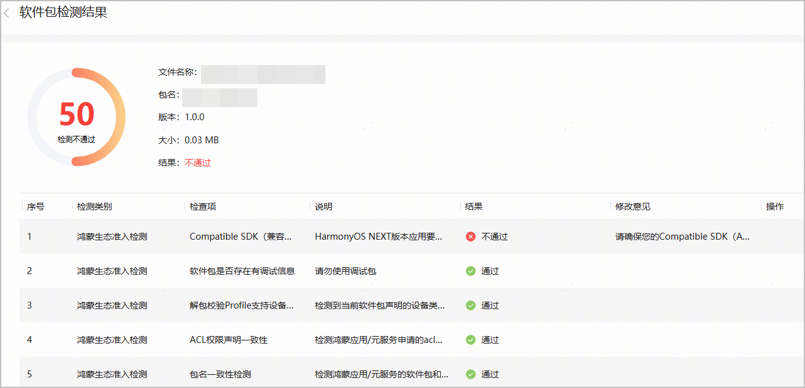

#### （推荐）使用上架自检功能

为了提高游戏审核的通过率，建议使用“上架自检”检测功能，该功能按照华为应用市场的上架标准，在热门移动终端设备上测试游戏软件包的兼容性、稳定性、性能、功耗、UX等，可帮助游戏软件包提前发现问题。

每个游戏同时只能进行1个自检任务。若您在启动自检后删除了软件包，该自检任务依旧计入次数额度，直至自检任务结束。

1. 点击“操作”列的“启动自检”，执行“上架自检”检测功能。

   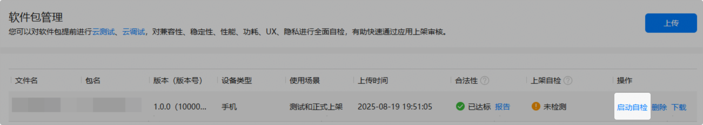
2. 启动检测后，可在“上架自检”列查看检测进度与结果。
   * **检测中**

     表示正在检测游戏软件包。检测时长可能受终端设备数量和排队情况影响，请耐心等待。

     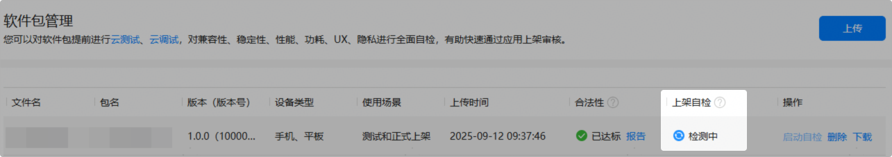
   * **通过**

     表示游戏软件包检测通过，可以用于正式上架。

     您可以点击“报告”查看详细的检测报告。

     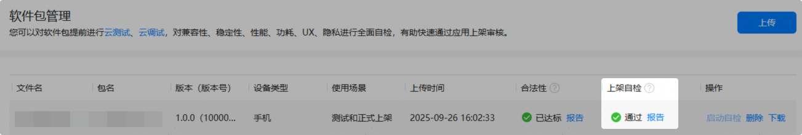
   * **待优化**

     表示检测未通过。

     若“合法性”检测通过，但“上架自检”检测未通过，该游戏软件包可以用于正式上架，但存在审核被驳回的风险。

     建议点击“报告”查看详细的检测报告，进一步优化游戏软件包，并在优化后重新上传软件包。

     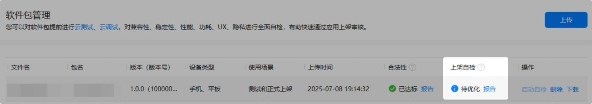
   * **系统异常**

     表示系统发生错误。

     您可以点击“报告”查看详细原因。若不展示“报告”，请点击“启动自检”重试。若还有疑问请[联系客服](https://developer.huawei.com/consumer/cn/service/josp/agc/index.html#/interactive/feedback/1/)。

     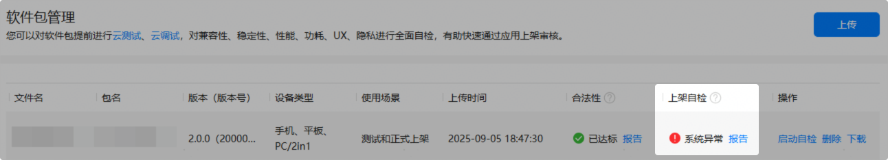
