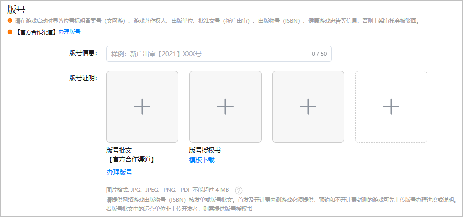

根据法律法规，要求游戏上架时提供对应的游戏版号材料。

#### 前提条件

已根据[游戏版权、版号要求](https://developer.huawei.com/consumer/cn/doc/80301#h1-1584931854487-2)提前准备游戏版号材料。

#### 操作步骤

1. 登录[AppGallery Connect](https://developer.huawei.com/consumer/cn/service/josp/agc/index.html)，点击“APP与元服务”，选择待上架的游戏。
2. 左侧导航栏选择“应用上架 > 版本信息”下待发布的版本。
3. 进入右侧页面的“版号”区域，根据提示上传提前准备好的版号材料。

   
