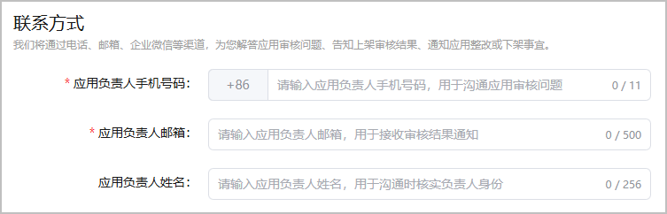

若账号归属地为中国大陆，请填写小游戏负责人的联系方式，方便华为审核人员与您沟通小游戏上架的审核问题。

1. 登录[AppGallery Connect](https://developer.huawei.com/consumer/cn/service/josp/agc/index.html)，点击“APP与元服务”，选择待上架的小游戏。
2. 左侧导航栏选择“应用上架 > 版本信息”，右侧页面进入“联系方式”区域，根据提示填写信息。

   

   | 配置项 | 必填/选填 | 说明 |
   | --- | --- | --- |
   | 应用负责人手机号码 | 必填 | 若有小游戏上架的审核问题需要与您沟通，上架审核人员将致电该号码。 |
   | 应用负责人邮箱 | 必填 | 用于接收小游戏上架审核结果、小游戏整改、小游戏下架等通知。 |
   | 应用负责人姓名 | 选填 | 用于沟通相关信息时核实负责人身份。 |
