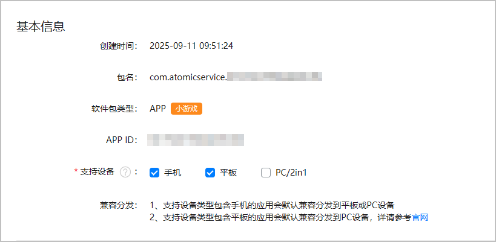

请为小游戏选择发布设备，在小游戏成功上架至华为应用市场后，玩家可以在支持的设备上体验小游戏。

1. 登录[AppGallery Connect](https://developer.huawei.com/consumer/cn/service/josp/agc/index.html)，点击“APP与元服务”，在游戏列表选择待上架的小游戏。左侧导航栏选择“应用上架 > 应用信息”，右侧页面进入“基本信息”区域。

   
2. 请根据小游戏软件包module.json5配置文件中[deviceTypes标签](https://developer.huawei.com/consumer/cn/doc/harmonyos-guides/module-configuration-file#devicetypes标 签)的枚举值勾选对应的设备类型。

   

   * 小游戏上架前，请谨慎选择设备类型。小游戏成功上架后，仅支持增加设备，不支持删除已选择的设备。
   * 若设备类型包含“手机”设备，即使module.json5配置文件中未声明“平板”设备，小游戏也会默认兼容发布到“平板”设备。
