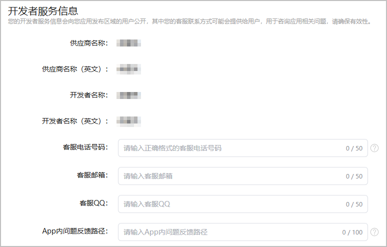

填写开发者服务信息，方便玩家咨询或反馈小游戏相关问题。

1. 登录[AppGallery Connect](https://developer.huawei.com/consumer/cn/service/josp/agc/index.html)，点击“APP与元服务”，选择待上架的小游戏。
2. 左侧导航栏选择“应用上架 > 应用信息”，右侧页面进入“开发者服务信息”区域，根据提示填写信息。

   

   | 配置项 | 说明 |
   | --- | --- |
   | 客服电话号码 | 请填写“国际区号/国内区号-电话号码”格式的电话号码。例如，0086-12345678987、0755-12345678987。  该电话号码可能会向玩家提供，用于玩家直接向开发者咨询小游戏相关问题。 |
   | 客服邮箱 | 请填写标准格式的邮箱。 |
   | 客服QQ | 请填写正确的联系方式。 |
   | App内问题反馈路径 | 请指定玩家在小游戏内反馈问题的路径。例如，华为应用市场 > 我的 > 帮助与客服。 |
