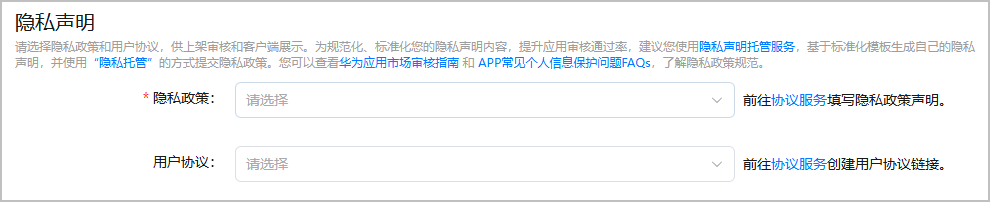

发布小游戏时，您需要提供隐私政策，便于玩家了解小游戏收集、使用隐私数据的情况。

#### 前提条件

* 已参考[配置隐私政策（元服务）](https://developer.huawei.com/consumer/cn/doc/app/agc-help-privacy-policy-atomic-0000002317135133)，生成小游戏的隐私政策。
* 已参考[配置用户协议](https://developer.huawei.com/consumer/cn/doc/app/agc-help-privacy-user-agreement-0000002282265450)，生成小游戏的用户协议。

#### 操作步骤

1. 登录[AppGallery Connect](https://developer.huawei.com/consumer/cn/service/josp/agc/index.html)，点击“APP与元服务”，选择待上架的小游戏。
2. 左侧导航栏选择“元服务上架 > 版本信息”，右侧页面进入“隐私声明”区域，选择您生成的隐私政策和用户协议。

   
