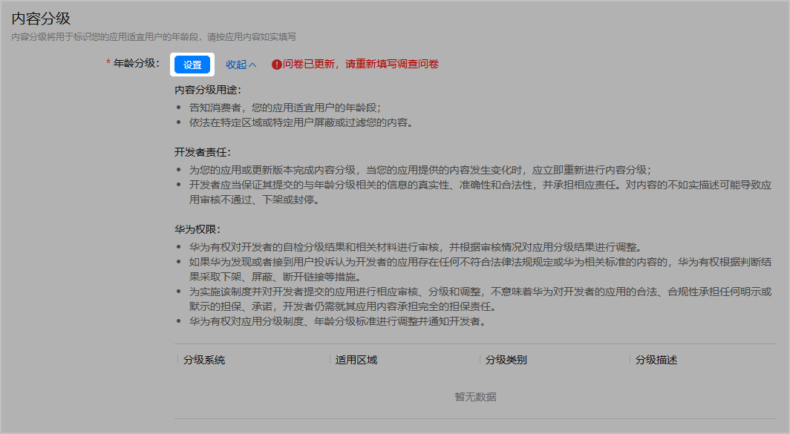
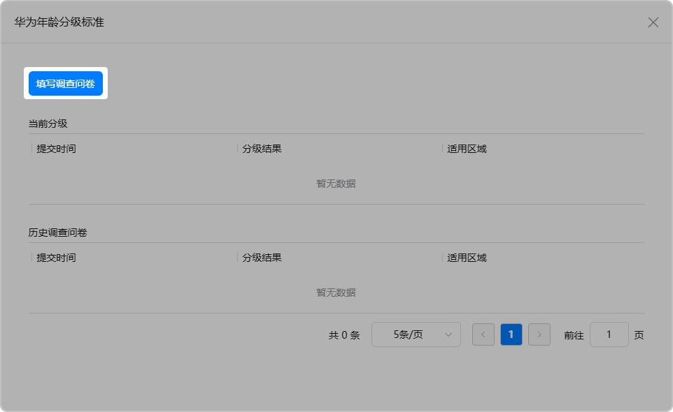
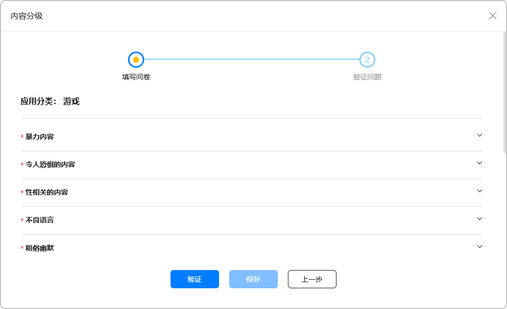
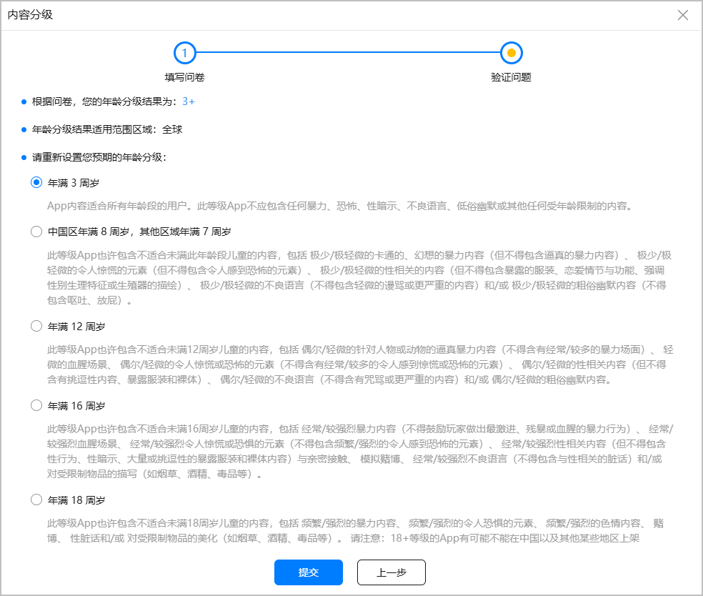
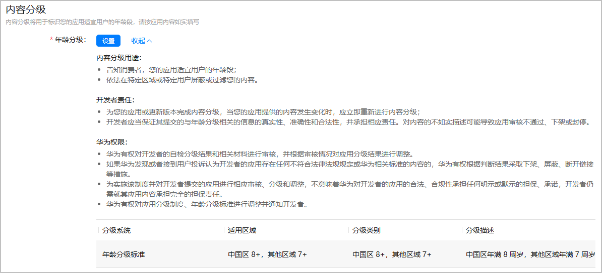

内容分级用于标识小游戏适宜的年龄分级，年龄分级在应用市场的游戏详情页向玩家展示，帮助玩家找到适合其年龄段的小游戏，从而为未成年人玩家打造纯净的游戏环境。

AppGallery Connect平台提供了调查问卷，根据小游戏实际情况如实填写后自动生成年龄分级，并结合小游戏内基于《网络游戏适龄提示》团体标准标注的适龄提示标识，最终选择小游戏的年龄分级。

1. 登录[AppGallery Connect](https://developer.huawei.com/consumer/cn/service/josp/agc/index.html)，点击“APP与元服务”，选择待上架的小游戏。左侧导航栏选择“应用上架 > 版本信息”，右侧页面进入“内容分级”区域，点击“设置”。

   
2. 在弹出的“华为年龄分级标准”窗口中，点击“填写调查问卷”。

   
3. 在弹出的“内容分级”窗口上如实填写问卷，完成后点击“验证”。

   

   务必如实填写问卷中的问题，否则可能导致下架/冻结小游戏。

   

   若点击“验证”显示“拒绝评级”，请查看详细原因，并在修改不当内容后重新上传符合规范的小游戏。
4. 根据问卷计算出的最低年龄分级结果，且不低于小游戏内基于《网络游戏适龄提示》团体标准标注的适龄提示标识年龄段，重新选择适合小游戏的年龄分级，完成后点击“提交”。

   例如，问卷结果的年龄分级是“3+”，但小游戏内的适龄提示为“8+”，应重新选择“中国区年满8周岁，其它区域年满7周岁”年龄分级。在小游戏上架后，华为应用市场将展示小游戏适合的玩家年龄为“8+”。

   
5. 成功提交分级后，即可查看年龄分级结果。

   
