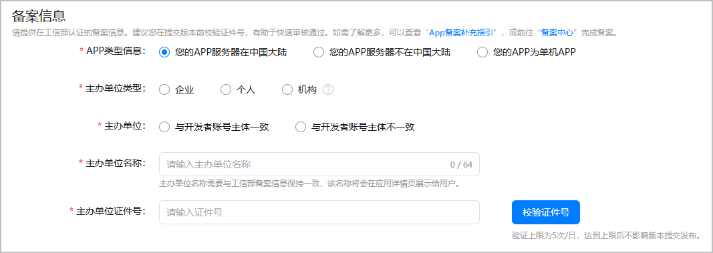

根据[《工业和信息化部关于开展移动互联网应用程序备案工作的通知》](https://www.miit.gov.cn/zwgk/zcwj/wjfb/tz/art/2023/art_920db564162e4312916a01bed6540ad8.html)要求，APP主办者应当依照[《中华人民共和国反电信网络诈骗法》](https://www.miit.gov.cn/jgsj/zfs/fl/art/2022/art_d30139b442a141f48f05775d8c0b3cee.html)第二十三条“设立移动互联网应用程序应当按照国家有关规定向电信主管部门办理许可或者备案手续”相关规定履行备案手续。未履行备案手续，不得从事APP互联网信息服务。

#### 前提条件

已根据[元服务备案](https://developer.huawei.com/consumer/cn/doc/atomic-guides/atomic-service-filing)和[国产游戏小程序备案准备](https://developer.huawei.com/consumer/cn/doc/games-guides/quickgame-filing-chinese-preparation-0000001979934858)完成小游戏备案，并保存好备案信息。

#### 操作步骤

登录[AppGallery Connect](https://developer.huawei.com/consumer/cn/service/josp/agc/index.html)，点击“APP与元服务”，选择待上架的小游戏。左侧导航栏选择“应用上架 > 版本信息”，右侧页面进入“备案信息”区域，根据备案信息如实填写。

建议提交版本审核前点击“校验证件号”，AppGallery Connect平台将根据填写的证件号进行备案信息核验。若“主办单位证件号”或备案的小游戏包名、小游戏名称、主办单位名称有误，均可能导致验证不通过。
