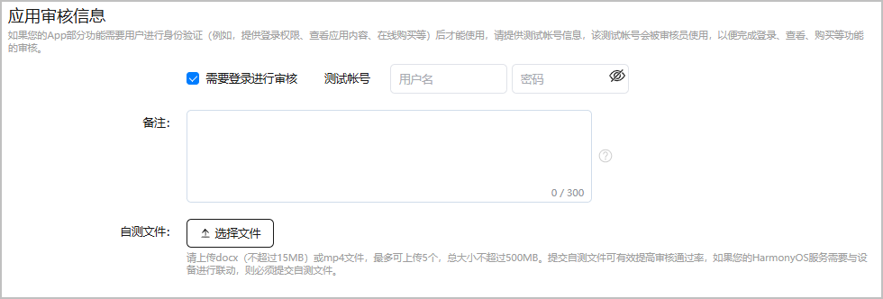

若小游戏的部分功能限制玩家通过身份验证后才能使用，例如，登录权限、在线购买，请为上架审核员提供测试账号，以便审核人员使用测试账号测试受限功能。

1. 登录[AppGallery Connect](https://developer.huawei.com/consumer/cn/service/josp/agc/index.html)，点击“APP与元服务”，选择待上架的小游戏。
2. 左侧导航栏选择“应用上架 > 版本信息”，右侧页面进入“应用审核信息”区域，根据提示填写信息。

   

   | 配置项 | 说明 |
   | --- | --- |
   | 需要登录进行审核 | 若小游戏的部分功能要求玩家登录后才能使用，需要勾选“需要登录进行审核”，并为上架审核员提供测试账号。 |
   | 备注 | 为审核员提供更准确、高效测试小游戏的额外信息，例如，使用受限功能时的特别设置。 |
   | 自测文件 | 小游戏需要与设备联动时需要提交。自测文件必须为.docx（不超过15MB）或.mp4文件，最多可上传5个，总大小不超过500MB。 |
