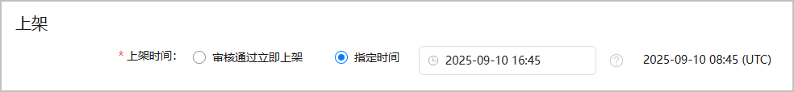
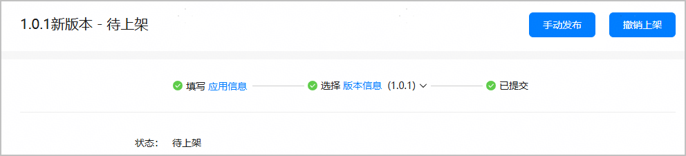

#### 设置上架时间

支持小游戏通过审核后立即上架，也支持小游戏在指定时间上架。

1. 登录[AppGallery Connect](https://developer.huawei.com/consumer/cn/service/josp/agc/index.html)，点击“APP与元服务”，选择待上架的小游戏。
2. 左侧导航栏选择“应用上架 > 版本信息”，右侧页面进入“上架”区域，根据实际情况指定小游戏的上架时间。

   

#### 手动发布上架

若已设置在指定时间上架，小游戏通过审核后如希望在指定时间前上架，您还可以手动发布上架。

1. 登录[AppGallery Connect](https://developer.huawei.com/consumer/cn/service/josp/agc/index.html)，点击“APP与元服务”，选择要手动发布的小游戏。
2. 左侧导航栏选择“应用上架 > 版本信息”下待发布的版本，右侧页面点击右上角的“手动发布”。

   
